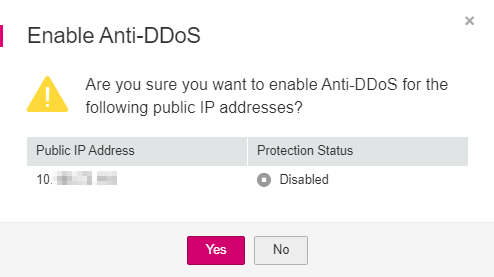

# Enabling Anti-DDoS

## Scenarios

The Anti-DDoS protection is automatically enabled for the public IP addresses you purchased. If protection is not enabled for any IP address, enable it by following the instructions provided in this topic. The Anti-DDoS service then protects your IP addresses against DDoS attacks.

## Prerequisites

-   You have obtained an account and its password to log in to the management console.
-   You have not enabled Anti-DDoS for your IP addresses.

## Procedure

1.  Log in to the management console.
2.  Click    in the upper left corner and select the desired region or project.
3.  Under  **Security**, choose  **Anti-DDoS**. The  **Security Console**  is displayed.
4.  Click the  **Public IP Addresses**  tab, locate the row that contains the unprotected IP address, and click  **Enable Anti-DDoS**  in the  **Operation**  column, as shown in  [Figure 1](#fig193873431206).

    **Figure  1**  Public IP Addresses  
    

5.  In the displayed  **Enable Anti-DDoS**  dialog box, click  **Yes**.

    **Figure  2**  Enabling Anti-DDoS  
    

