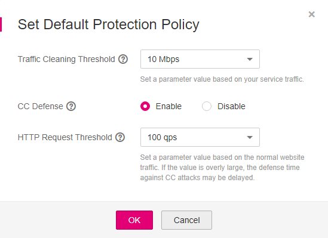
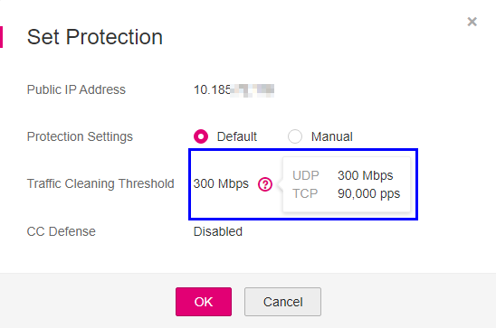

# How to Use Anti-DDoS

Description:

-   Anti-DDoS defends IP addresses against DDoS attacks after you enable it.
    -   Anti-DDoS can automatically enable the protection
    -   Before purchasing a public IP address, you can log in to the Anti-DDoS management console and click  **Set Default Protection Policy**  on the  **Public IP Addresses**  tab page to set the default protection policy for the new public IP address. Then, DDoS protection that implements the configured default protection policy is automatically enabled for the newly purchased public IP addresses.

        **Figure  1**  Setting the default protection policy  
        

    -   If you do not set a default protection policy for the newly purchased public IP addresses, the  **Protection Settings**  in  **Default**  mode apply to the IP addresses, as shown in  [Figure 2](#fig1187371918561).

        > **NOTE:** 
        >-   When the service UDP traffic is greater than  **300 Mbps**  or the TCP traffic is greater than  **90000 pps**, traffic scrubbing is triggered and Anti-DDoS will automatically intercept the attack traffic.
        >-   Mbps = Mbit/s \(short for 1,000,000 bit/s\). It is a unit of transmission rate and refers to the number of bits transmitted per second.
        >-   PPS, short for Packets Per Second, is a measure of throughput for network devices. It means the number of packets sent per second.

        **Figure  2**  Default protection settings  
        

    -   If protection is not enabled for an elastic IP address, enable the protection by referring to  [Enabling Anti-DDoS](enabling-anti-ddos.md).
    -   If you delete an elastic IP address, Anti-DDoS automatically disables the protection for the IP address, which is recorded in Cloud Trace Service \(CTS\).

-   Enable alarm notification, which sends notifications by SMS or email when an IP address is under a DDoS attack.
-   Adjust security settings based on service needs during defense.
-   View monitoring and interception reports after the defense is enabled to check network security situations.

