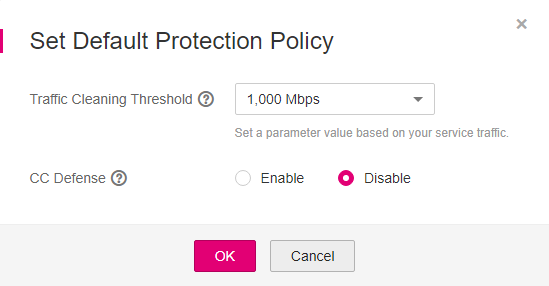

# Setting a Default Protection Policy for Newly Purchased Public IP Addresses

After you set a default protection policy, the newly purchased public IP addresses will be protected based on the default protection policy.

## Prerequisites

You have obtained an account and its password to log in to the management console.

## Procedure

1.  Log in to the management console.
2.  Click    in the upper left corner and select the desired region or project.
3.  Choose  **Security**  \>  **Anti-DDoS**. The Anti-DDoS service management page is displayed.
4.  The  **Public IP Addresses**  tab page is displayed by default. Click  **Set Default Protection Policy**.

    **Figure  1**  Setting a default protection policy for newly purchased public ip addresses  
    

5.  Configure the default protection policy.

    **Figure  2**  Configuring the default protection policy  
    

    **Table  1**  Parameter description

    
    <table><thead align="left"><tr id="ree2ae48f896d4ec2bede69c7f3faa943"><th class="cellrowborder" valign="top" width="20.39%" id="mcps1.2.3.1.1">
<strong id="b10104174220432">Parameter</strong>

    </th>
    <th class="cellrowborder" valign="top" width="79.61%" id="mcps1.2.3.1.2">
<strong id="b1757813433435">Description</strong>

    </th>
    </tr>
    </thead>
    <tbody><tr id="row462471113516"><td class="cellrowborder" valign="top" width="20.39%" headers="mcps1.2.3.1.1 ">
Traffic Cleaning Threshold

    </td>
    <td class="cellrowborder" valign="top" width="79.61%" headers="mcps1.2.3.1.2 ">
Anti-DDoS scrubs traffic when detecting that the incoming traffic of an IP address exceeds the threshold.

    
Configure this parameter based on your actual needs. You are advised to set the threshold to a value closest to the purchased bandwidth but not greater than the purchased bandwidth.

    
If <strong id="b78681410124619">Traffic Cleaning Threshold</strong> is set to <strong id="b8566213124610">Unlimited</strong>, your public IP addresses get almost no protection from DDoS attacks.

    </td>
    </tr>
    <tr id="row13123900172033"><td class="cellrowborder" valign="top" width="20.39%" headers="mcps1.2.3.1.1 ">
CC Defense

    </td>
    <td class="cellrowborder" valign="top" width="79.61%" headers="mcps1.2.3.1.2 "><ul id="ul937993715513"><li><strong id="b1535524712474">Disable</strong>: disables the defense.</li><li><strong id="b1375875711472">Enable</strong>: enables the defense.
 NOTE: 

CC defense is available only for clients supporting the full HTTP protocol stack because CC defense works in redirection or redirection+verification code mode. If your client does not support the full HTTP protocol stack, you are advised to disable CC defense.

    

    </li><li><strong id="b18153154104820">HTTP Request Threshold</strong>
This option is available only when CC defense is enabled.

    
You are advised to set this parameter to the maximum number of HTTP requests that can be processed by the deployed service. Anti-DDoS automatically scrubs traffic if the total number of detected requests exceeds this threshold. If the value is too large, CC defense will not be triggered promptly.

    <ul id="en-us_topic_0204851514_ul1623789311289"><li>If the actual HTTP request rate is smaller than the configured value, the deployed service is able to process all HTTP requests, and Anti-DDoS does not need to be involved.</li><li>If the actual HTTP request rate is greater than or equal to the configured value, Anti-DDoS triggers CC defense to analyze and check each request, which affects responses to normal requests.</li></ul>
    </li></ul>
    </td>
    </tr>
    </tbody>
    </table>

6.  Click  **OK**.

    After the default protection policy is set, the newly purchased public IP addresses are protected based on the default protection policy. For details about how to adjust a configured protection policy, see  [Adjusting Security Settings](adjusting-security-settings.md).

