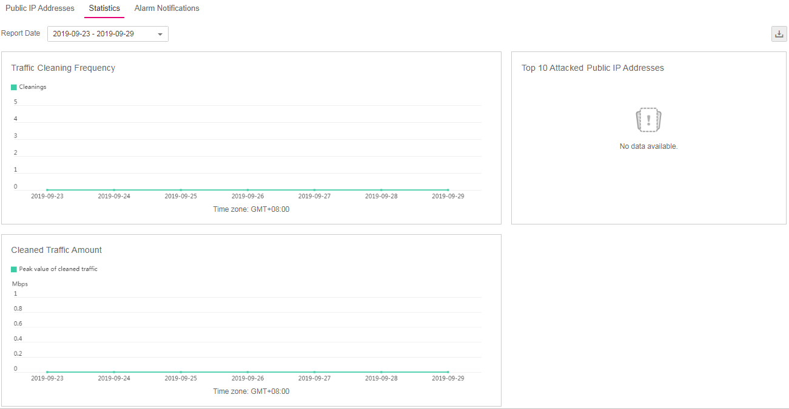

# Viewing an Interception Report

## Scenarios

This topic describes how to view the protection statistics, including the traffic cleaning frequency, cleaned traffic amount, weekly top 10 attacked public IP addresses, and total number of intercepted attacks of all public IP addresses of a user.

## Prerequisites

You have obtained an account and its password to log in to the management console.

## Procedure

1.  Log in to the management console.
2.  Click    in the upper left corner and select the desired region or project.
3.  Under  **Security**, choose  **Anti-DDoS**. The  **Security Console**  is displayed.
4.  Select the  **Statistics**  tab and view the protection statistics of all public IP addresses of a user, as shown in  [Figure 1](#fig1644131633612).

    You can set  **Report Date**  to view the security report within a specified time range \(one week long\). You can query statistics of the last four weeks, including the number of cleaning times, cleaned traffic volume, top 10 attacked public IP addresses, and total number of intercepted attacks.

    **Figure  1**  Interception report  
    

    > **NOTE:** 
    >On the  **Statistics**  page, click    to download monitoring reports to view protection statistics of a certain period of time.

