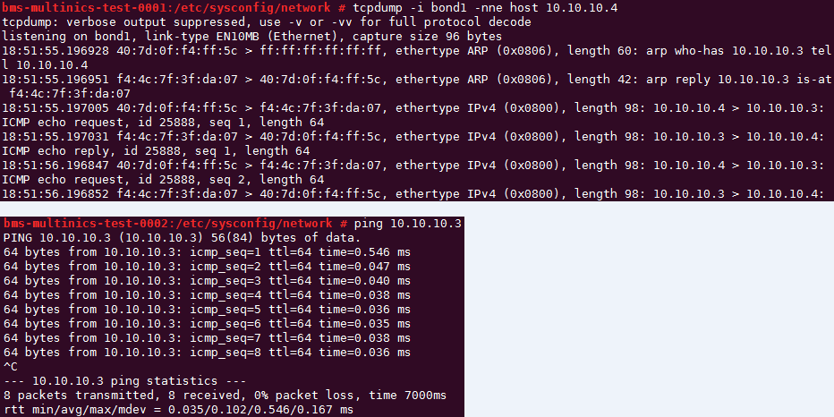

# Configuring a User-defined VLAN \(Red Hat, CentOS, Oracle Linux, and EulerOS\)<a name="EN-US_TOPIC_0095251846"></a>

This section uses CentOS 6.8 \(x86\_64\) as an example to describe how to configure a user-defined VLAN for BMSs.

> **NOTE:**   
>The configuration methods of Red Hat, Oracle Linux, EulerOS, and CentOS are similar.  

1.  Use a key or password to log in to the BMS as user  **root**.
2.  <a name="li0616194735713"></a>On the BMS CLI, run the following command to check the NIC information:

    **ip** **link**

    Information similar to the following is displayed.

    

    > **NOTE:**   
    >Among the devices, eth0 and eth1 bear the VPC, and eth3 and eth5 bear the user-defined VLAN.  

3.  Run the following command to check whether the  **/etc/udev/rules.d/**  directory contains the  **80-persistent-net.rules**  file:

    **ll** **/etc/udev/rules.d/** **|** **grep** **80-persistent-net.rules**

    -   If yes, and the file contains all NICs except  **bond0**  and  **lo**  obtained in step  [2](#li0616194735713)  and their MAC addresses, go to step  [6](#li1437634425719).
    -   If no, go to step  [4](#li116366367312).

4.  <a name="li116366367312"></a>Run the following command to copy the  **/etc/udev/rules.d/70-persistent-net.rules**  file and name the copy as  **/etc/udev/rules.d/80-persistent-net.rules**.

    **cp** **-p** **/etc/udev/rules.d/70-persistent-net.rules** **/etc/udev/rules.d/80-persistent-net.rules**

5.  Configure the udev rules:

    Write the MAC addresses and names of NICs except eth0 and eth1 obtained in step  [2](#li0616194735713)  \(those not contained in the  **/etc/udev/rules.d/70-persistent-net.rules**  file\) to the  **/etc/udev/rules.d/80-persistent-net.rules**  file so that the names and sequence of NICs do not change after the BMS is restarted.

    > **NOTE:**   
    >Ensure that the NIC MAC address and name are lowercase letters.  

    **vim** **/etc/udev/rules.d/80-persistent-net.rules**

    The modification result is as follows:

    

    After the modification, press  **Esc**, enter  **:wq**, save the configuration, and exit.

6.  <a name="li1437634425719"></a>Run the following commands to copy the network configuration file  **/etc/sysconfig/network-scripts/ifcfg-bond0**  to generate the  **/etc/sysconfig/network-scripts/ifcfg-bond1**  file, and copy the  **/etc/sysconfig/network-scripts/ifcfg-eth0**  file to generate the  **/etc/sysconfig/network-scripts/ifcfg-eth3**  and  **/etc/sysconfig/network/ ifcfg-eth5**  files:

    **cp** **-p** **/etc/sysconfig/network-scripts/ifcfg-bond0** **/etc/sysconfig/network-scripts/ifcfg-bond1**

    **cp** **-p** **/etc/sysconfig/network-scripts/ifcfg-eth0** **/etc/sysconfig/network-scripts/ifcfg-eth3**

    **cp** **-p** **/etc/sysconfig/network-scripts/ifcfg-eth0** **/etc/sysconfig/network-scripts/ifcfg-eth5**

7.  Run the following commands to edit the  **/etc/sysconfig/network-scripts/ifcfg-eth3**  and  **/etc/sysconfig/network-scripts/ifcfg-eth5**  files:
    -   **vim** **/etc/sysconfig/network-scripts/ifcfg-eth3**

        Edit the eth3 network configuration file as follows:

        ```
        USERCTL=no
        MTU=8888
        NM_CONTROLLED=no
        BOOTPROTO=static
        DEVICE=eth3
        TYPE=Ethernet
        ONBOOT=yes
        MASTER=bond1
        SLAVE=yes
        ```

        Change the value of  **BOOTPROTO**  to  **static**, that of  **DEVICE**  to the network device name  **eth3**, and that of  **MASTER**  to the port name of the user-defined VLAN \(**bond1**\). Retain values of other parameters.

    -   **vim** **/etc/sysconfig/network-scripts/ifcfg-eth5**

        Edit the eth5 network configuration file as follows \(similar to eth3\):

        ```
        USERCTL=no
        MTU=8888
        NM_CONTROLLED=no
        BOOTPROTO=static
        DEVICE=eth5
        TYPE=Ethernet
        ONBOOT=yes
        MASTER=bond1
        SLAVE=yes
        ```

8.  Run the following command to edit the  **/etc/sysconfig/network-scripts/ifcfg-bond1**  file:

    **vim** **/etc/sysconfig/network-scripts/ifcfg-bond1**

    Edit the file as follows:

    ```
    MACADDR=f4:4c:7f:3f:da:07
    BONDING_MASTER=yes
    USERCTL=no
    ONBOOT=yes
    NM_CONTROLLED=no
    BOOTPROTO=static
    BONDING_OPTS="mode=1 miimon=100"
    DEVICE=bond1
    TYPE=Bond
    IPADDR=10.10.10.3
    NETMASK=255.255.255.0
    MTU=8888
    ```

    Where,

    -   Change the value of  **MACADDR**  to the MAC address of eth3 or eth5.
    -   Change the value of  **BOOTPROTO**  to  **static**.
    -   Change the value of  **DEVICE**  to  **bond1**.
    -   Change the value of  **IPADDR**  to the IP address to be allocated to bond1. If the IP address planned for the user-defined VLAN does not conflict with the VPC network segment, you can plan the IP address as needed, only to ensure that BMSs communicating through the user-defined VLAN are in the same network segment as the user-defined VLAN. An example value is  **10.10.10.3**.
    -   Set the value of  **NETMASK**  to the subnet mask of the IP address configured for bond1.

    Retain values of other parameters.

    After the modification, press  **Esc**, enter  **:wq**, save the configuration, and exit.

9.  Run the following command to enable port group bond1 of the user-defined VLAN:

    **ifup** _bond1_

    ```
    Determining if ip address 10.10.10.3 is already in use for device bond1...
    ```

10. Perform the preceding operations to configure other BMSs.
11. After all BMSs are configured, ping the IP addresses of other BMSs from each BMS.

    


