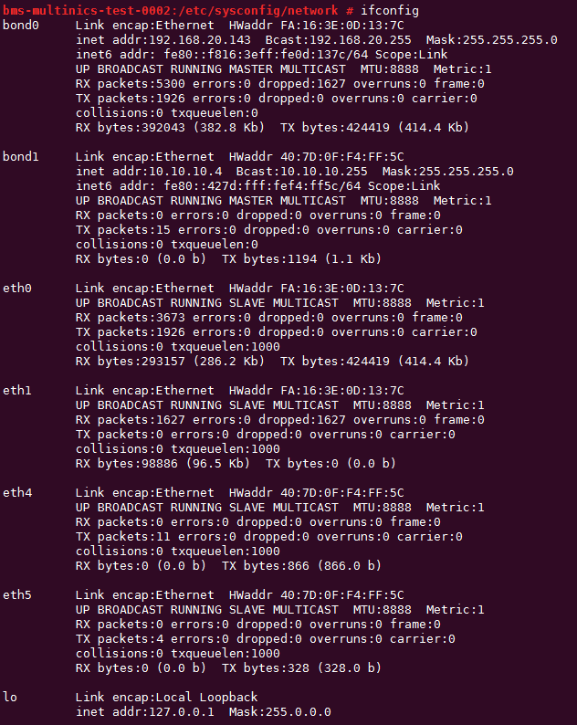
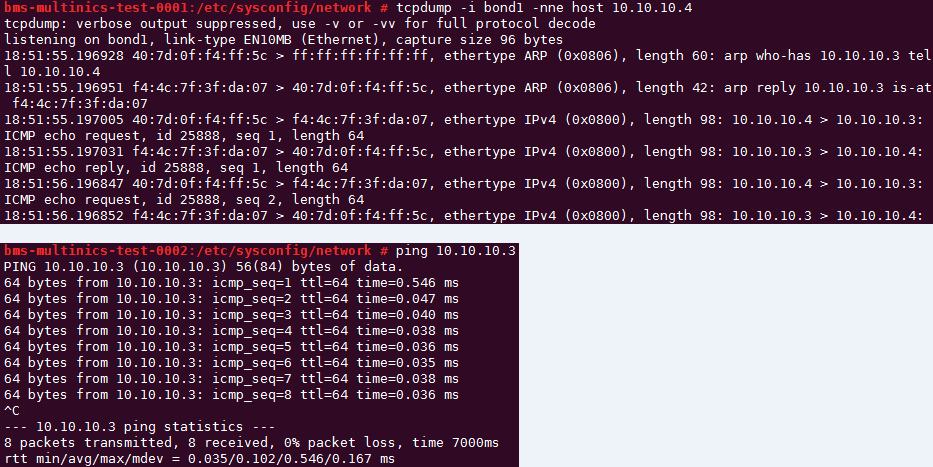

# Configuring a User-defined VLAN \(SUSE Linux Enterprise Server 11\)<a name="EN-US_TOPIC_0095251845"></a>

This section uses SUSE Linux Enterprise Server 11 SP4 as an example to describe how to configure a user-defined VLAN for BMSs.

1.  Use a key or password to log in to the BMS as user  **root**.
2.  <a name="li158599132113"></a>On the BMS CLI, run the following command to check the NIC information:

    **ip** **link**

    Information similar to the following is displayed:

    ```
    1: lo: <LOOPBACK,UP,LOWER_UP> mtu 16436 qdisc noqueue state UNKNOWN 
        link/loopback 00:00:00:00:00:00 brd 00:00:00:00:00:00
    2: eth0: <BROADCAST,MULTICAST,SLAVE,UP,LOWER_UP> mtu 8888 qdisc mq master bond0 state UP qlen 1000
        link/ether fa:16:3e:0d:13:7c brd ff:ff:ff:ff:ff:ff
    3: eth1: <BROADCAST,MULTICAST,SLAVE,UP,LOWER_UP> mtu 8888 qdisc mq master bond0 state UP qlen 1000
        link/ether fa:16:3e:0d:13:7c brd ff:ff:ff:ff:ff:ff
    4: eth4: <BROADCAST,MULTICAST> mtu 1500 qdisc noop state DOWN qlen 1000
        link/ether 40:7d:0f:f4:ff:5c brd ff:ff:ff:ff:ff:ff
    5: eth5: <BROADCAST,MULTICAST> mtu 1500 qdisc noop state DOWN qlen 1000
        link/ether 40:7d:0f:f4:ff:5d brd ff:ff:ff:ff:ff:ff
    6: bond0: <BROADCAST,MULTICAST,MASTER,UP,LOWER_UP> mtu 8888 qdisc noqueue state UP 
        link/ether fa:16:3e:0d:13:7c brd ff:ff:ff:ff:ff:ff
    ```

    > **NOTE:**   
    >Among the devices, eth0 and eth1 bear the VPC, and eth4 and eth5 bear the user-defined VLAN.  

3.  Run the following command to check whether the  **/etc/udev/rules.d/**  directory contains the  **80-persistent-net.rules**  file:

    **ll** **/etc/udev/rules.d/** **|** **grep** **80-persistent-net.rules**

    -   If yes, and the file contains all NICs except  **bond0**  and  **lo**  obtained in step  [2](#li158599132113)  and their MAC addresses, go to step  [6](#li79913241686). 
    -   If no, go to step  [4](#li116366367312).

4.  <a name="li116366367312"></a>Run the following command to copy the  **/etc/udev/rules.d/70-persistent-net.rules**  file and name the copy as  **/etc/udev/rules.d/80-persistent-net.rules**.

    **cp** **-p** **/etc/udev/rules.d/70-persistent-net.rules** **/etc/udev/rules.d/80-persistent-net.rules**

5.  Configure the udev rules:

    Add the NICs and their MAC addresses obtained in step  [2](#li158599132113), except  **lo**,  **eth0**,  **eth1**, and  **bond0**, to the  **/etc/udev/rules.d/80-persistent-net.rules**  file. This ensures that the names and sequence of NICs will not change after the BMS is restarted.

    > **NOTE:**   
    >Ensure that NIC MAC addresses and names are lowercase letters.  

    **vim** **/etc/udev/rules.d/80-persistent-net.rules**

    The modification result is as follows:

    ```
    SUBSYSTEM=="net", ACTION=="add", DRIVERS=="?*", ATTR{address}=="e8:4d:d0:c8:99:67", NAME="eth0"
    SUBSYSTEM=="net", ACTION=="add", DRIVERS=="?*", ATTR{address}=="e8:4d:d0:c8:99:68", NAME="eth1"
    SUBSYSTEM=="net", ACTION=="add", DRIVERS=="?*", ATTR{address}=="40:7d:0f:f4:ff:5c", NAME="eth4"
    SUBSYSTEM=="net", ACTION=="add", DRIVERS=="?*", ATTR{address}=="40:7d:0f:f4:ff:5d", NAME="eth5"
    ```

    After the modification, press  **Esc**, enter  **:wq**, save the configuration, and exit.

6.  <a name="li79913241686"></a>Run the following commands to copy the network configuration file  **/etc/sysconfig/network/ifcfg-bond0**  to generate the  **/etc/sysconfig/network/ifcfg-bond1**  file, and copy the  **/etc/sysconfig/network/ifcfg-eth0**  file to generate the  **/etc/sysconfig/network/ifcfg-eth4**  and  **/etc/sysconfig/network/ifcfg-eth5**  files:

    **cp** **-p** **/etc/sysconfig/network/ifcfg-bond0** **/etc/sysconfig/network/ifcfg-bond1**

    **cp** **-p** **/etc/sysconfig/network/ifcfg-eth0** **/etc/sysconfig/network/ifcfg-eth4**

    **cp** **-p** **/etc/sysconfig/network/ifcfg-eth0** **/etc/sysconfig/network/ifcfg-eth5**

7.  <a name="li1497118353312"></a>Run the following commands to edit the  **/etc/sysconfig/network/ifcfg-eth4**  and  **/etc/sysconfig/network/ifcfg-eth5**  files:
    -   **vim** **/etc/sysconfig/network/ifcfg-eth4**

        Edit the eth4 network configuration file as follows:

        ```
        STARTMODE=auto
        MTU=8888
        NM_CONTROLLED=no
        BOOTPROTO=static
        DEVICE=eth4
        USERCONTRL=no
        LLADDR=40:7d:0f:f4:ff:5c
        TYPE=Ethernet
        ```

        Change the value of  **BOOTPROTO**  to  **static**, that of  **DEVICE**  to  **eth4**, and that of  **LLADDR**  to the MAC address of eth4, which you can obtain in step  [2](#li158599132113). Retain values of other parameters.

    -   **vim** **/etc/sysconfig/network/ifcfg-eth5**

        Edit the eth5 network configuration file as follows \(similar to eth4\):

        ```
        STARTMODE=auto
        MTU=8888
        NM_CONTROLLED=no
        BOOTPROTO=static
        DEVICE=eth5
        USERCONTRL=no
        LLADDR=40:7d:0f:f4:ff:5d
        TYPE=Ethernet
        ```

8.  Run the following command to edit the  **/etc/sysconfig/network/ifcfg-bond1**  file:

    **vim** **/etc/sysconfig/network/ifcfg-bond1**

    Edit the file as follows:

    ```
    BONDING_MASTER=yes
    TYPE=Bond
    STARTMODE=auto
    BONDING_MODULE_OPTS="mode=1 miimon=100"
    NM_CONTROLLED=no
    BOOTPROTO=static
    DEVICE=bond1
    USERCONTRL=no
    LLADDR=40:7d:0f:f4:ff:5c
    BONDING_SLAVE1=eth4
    BONDING_SLAVE0=eth5
    IPADDR=10.10.10.4
    NETMASK=255.255.255.0
    MTU=8888
    ```

    Where,

    -   Change the value of  **BOOTPROTO**  to  **static**.
    -   Change the value of  **DEVICE**  to  **bond1**.
    -   Change the value of  **LLADDR**  to the MAC address of a network device in step  [7](#li1497118353312), for example,  **40:7d:0f:f4:ff:5c**.
    -   Change the values of  **BONDING\_SLAVE1**  and  **BONDING\_SLAVE0**  to the device names in step  [7](#li1497118353312), that is,  **eth4**  and  **eth5**.
    -   Change the value of  **IPADDR**  to the IP address to be allocated to bond1. If the IP address planned for the user-defined VLAN does not conflict with the VPC network segment, you can plan the IP address as needed, only to ensure that BMSs communicating through the user-defined VLAN are in the same network segment as the user-defined VLAN. An example value is  **10.10.10.4**.
    -   Set the value of  **NETMASK**  to the subnet mask of the IP address allocated to bond1.
    -   Change the value of  **MTU**  to  **8888**.

    Retain values of other parameters.

    After the modification, press  **Esc**, enter  **:wq**, save the configuration, and exit.

9.  Run the following commands to restart the network:

    **ifup** _eth4_

    **ifup** _eth5_

    **ifup** _bond1_

    

    > **NOTE:**   
    >eth4 and eth5 are the network ports bear the user-defined VLAN and bond1 is the port group of the user-defined VLAN.  

10. Run the following commands to check the NIC device status and whether the  **bond1**  configuration file takes effect:

    **ip** **link**

    

    **ifconfig**

    

11. Perform the preceding operations to configure other BMSs.
12. After all BMSs are configured, ping the IP addresses of other BMSs from each BMS.

    


