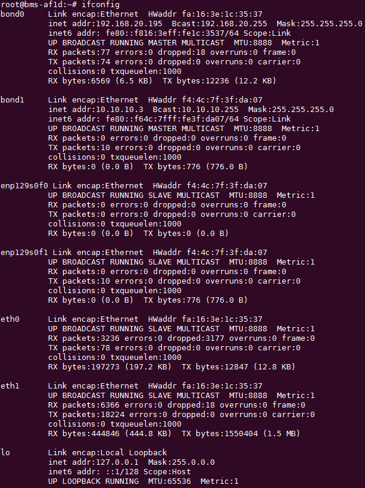
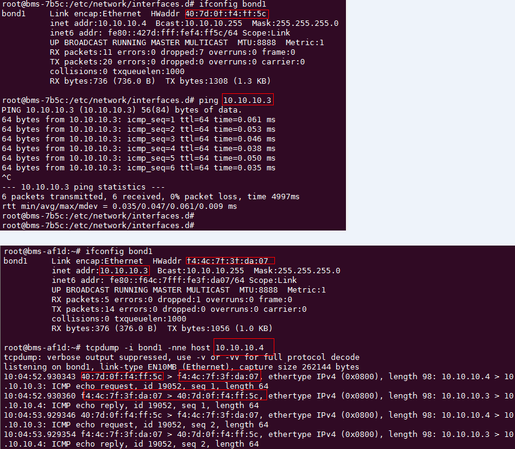

# Configuring a User-defined VLAN \(Ubuntu\)<a name="EN-US_TOPIC_0095251847"></a>

This section uses Ubuntu 16.04 LTS \(Xenial Xerus x86\_64\) as an example to describe how to configure a user-defined VLAN for BMSs.

> **NOTE:**   
>The configuration methods of other Ubuntu OSs are similar to that of Ubuntu 16.04 LTS \(Xenial Xerus x86\_64\).  

1.  Use a key or password to log in to the BMS as user  **root**.
2.  <a name="li0616194735713"></a>On the BMS CLI, run the following command to check the NIC information:

    **ip** **link**

    Information similar to the following is displayed:

    ```
    1: lo: <LOOPBACK,UP,LOWER_UP> mtu 65536 qdisc noqueue state UNKNOWN mode DEFAULT group default qlen 1
        link/loopback 00:00:00:00:00:00 brd 00:00:00:00:00:00
    2: eth0: <BROADCAST,MULTICAST,SLAVE,UP,LOWER_UP> mtu 8888 qdisc mq master bond0 state UP mode DEFAULT group default qlen 1000
        link/ether fa:16:3e:1c:35:37 brd ff:ff:ff:ff:ff:ff
    3: eth1: <BROADCAST,MULTICAST,SLAVE,UP,LOWER_UP> mtu 8888 qdisc mq master bond0 state UP mode DEFAULT group default qlen 1000
        link/ether fa:16:3e:1c:35:37 brd ff:ff:ff:ff:ff:ff
    4: enp129s0f0: <BROADCAST,MULTICAST> mtu 1500 qdisc noop state DOWN mode DEFAULT group default qlen 1000
        link/ether f4:4c:7f:3f:da:07 brd ff:ff:ff:ff:ff:ff
    5: enp129s0f1: <BROADCAST,MULTICAST> mtu 1500 qdisc noop state DOWN mode DEFAULT group default qlen 1000
        link/ether f4:4c:7f:3f:da:08 brd ff:ff:ff:ff:ff:ff
    6: bond0: <BROADCAST,MULTICAST,MASTER,UP,LOWER_UP> mtu 8888 qdisc noqueue state UP mode DEFAULT group default qlen 1000
        link/ether fa:16:3e:1c:35:37 brd ff:ff:ff:ff:ff:ff
    ```

    > **NOTE:**   
    >Among the devices, eth0 and eth1 bear the VPC, and enp129s0f0 and enp129s0f1 bear the user-defined VLAN. In the following steps, enp129s0f0 and enp129s0f1 are used to configure a user-defined VLAN.  

3.  Run the following command to check whether the  **/etc/udev/rules.d/**  directory contains the  **80-persistent-net.rules**  file:

    **ll** **/etc/udev/rules.d/** **|** **grep** **80-persistent-net.rules**

    -   If yes, and the file contains all NICs except  **bond0**  and  **lo**  obtained in step  [2](#li0616194735713)  and their MAC addresses, go to step  [6](#li283725272415).
    -   If no, go to step  [4](#li116366367312).

4.  <a name="li116366367312"></a>Run the following command to copy the  **/etc/udev/rules.d/70-persistent-net.rules**  file and name the copy as  **/etc/udev/rules.d/80-persistent-net.rules**.

    **cp** **-p** **/etc/udev/rules.d/70-persistent-net.rules** **/etc/udev/rules.d/80-persistent-net.rules**

5.  Configure the udev rules:

    Add the NICs and their MAC addresses obtained in step  [2](#li0616194735713), except  **lo**,  **eth0**,  **eth1**, and  **bond0**, to the  **/etc/udev/rules.d/80-persistent-net.rules**  file. This ensures that the names and sequence of NICs will not change after the BMS is restarted.

    > **NOTE:**   
    >Ensure that the NIC MAC address and names are lowercase letters.  

    **vim** **/etc/udev/rules.d/80-persistent-net.rules**

    The modification result is as follows:

    ```
    SUBSYSTEM=="net", ACTION=="add", DRIVERS=="?*", ATTR{address}=="e8:4d:d0:c8:99:5b", NAME="eth0"
    SUBSYSTEM=="net", ACTION=="add", DRIVERS=="?*", ATTR{address}=="e8:4d:d0:c8:99:5c", NAME="eth1"
    SUBSYSTEM=="net", ACTION=="add", DRIVERS=="?*", ATTR{address}=="f4:4c:7f:3f:da:07", NAME="enp129s0f0"
    SUBSYSTEM=="net", ACTION=="add", DRIVERS=="?*", ATTR{address}=="f4:4c:7f:3f:da:08", NAME="enp129s0f1"
    ```

    After the modification, press  **Esc**, enter  **:wq**, save the configuration, and exit.

6.  <a name="li283725272415"></a>Run the following command to copy the  **/etc/network/interfaces.d/50-cloud-init.cfg**  file to generate the  **/etc/network/interfaces.d/60-cloud-init.cfg**  file:

    **cp** **-p** **/etc/network/interfaces.d/50-cloud-init.cfg** **/etc/network/interfaces.d/60-cloud-init.cfg**

    > **NOTE:**   
    >If the  **/etc/network/interfaces.d/50-cloud-init.cfg**  file does not exist, copy the  **/etc/network/interfaces**  file and run the following commands:  
    >**mkdir** **/etc/network/interfaces.d**  
    >**cp** **-p** **/etc/network/interfaces** **/etc/network/interfaces.d/60-cloud-init.cfg**  

7.  Run the following command to edit the  **/etc/network/interfaces.d/60-cloud-init.cfg**  file of devices  **enp129s0f0**  and  **enp129s0f1**:

    **vim** **/etc/network/interfaces.d/60-cloud-init.cfg**

    Edit the file as follows:

    ```
    auto enp129s0f0
    iface enp129s0f0 inet manual
    bond_mode 1
    bond-master bond1
    bond_miimon 100
    mtu 8888
    auto enp129s0f1
    iface enp129s0f1 inet manual
    bond_mode 1
    bond-master bond1
    bond_miimon 100
    mtu 8888
    auto bond1
    iface bond1 inet static
    bond_miimon 100
    bond-slaves none
    bond_mode 1
    address 10.10.10.3
    netmask 255.255.255.0
    hwaddress f4:4c:7f:3f:da:07
    mtu 8888
    ```

    Where,

    -   **enp129s0f0**  and  **enp129s0f1**  are the NICs that bear the user-defined VLAN.
    -   **hwaddress**  is the MAC address of enp129s0f0.
    -   Change the value of  **address**  to the IP address allocated to bond1. If the IP address planned for the user-defined VLAN does not conflict with the VPC network segment, you can plan the IP address as needed, only to ensure that BMSs communicating through the user-defined VLAN are in the same network segment as the user-defined VLAN.
    -   Set the value of  **netmask**  to the subnet mask of the IP address configured for bond1.

    Set values of other parameters. For example, set  **mtu**  to  **8888**,  **bond\_miimon**  to  **100**, and  **bond\_mode**  to  **1**.

    After the modification, press  **Esc**, enter  **:wq**, save the configuration, and exit.

8.  Run the following commands to restart the network:

    **ifup** _enp129s0f0_

    **ifup** _enp129s0f1_

    > **NOTE:**   
    >**enp129s0f0**  and  **enp129s0f1**  are the NICs that bear the user-defined VLAN.  

9.  Run the following commands to check the NIC device status and whether the  **bond1**  configuration file takes effect:

    **ip** **link**

    

    **ifconfig**

    

10. Perform the preceding operations to configure other BMSs.
11. After all BMSs are configured, ping the IP addresses of other BMSs from each BMS.

    


