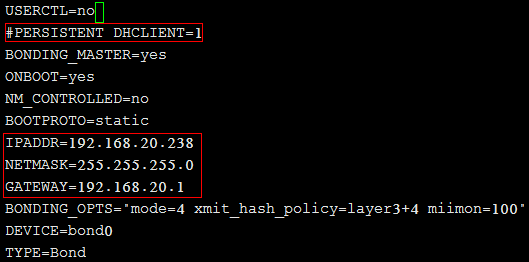

# How Can I Configure a Static IP Address for a BMS?

## Scenarios

To customize the DNS server information of a BMS, you need to configure a static IP address for the BMS. If you change the IP address assignment mode from DHCP to the static mode, the IP address and gateway must be consistent with those when the BMS is provisioned. Otherwise, network disconnections may occur. This section takes CentOS 7 as an example to describe how to configure a static IP address for a BMS.

## Procedure

1.  Query the IP address and gateway of the BMS.

    Run the following command to query the IP address of the BMS:

    **ifconfig bond0**

    

    Run the following command to query the gateway address of the BMS:

    **ip ro**

    

2.  Modify the network configuration file.

    Run the  **vi /etc/sysconfig/network-scripts/ifcfg-bond0**  command to open the  **/etc/sysconfig/network-scripts/ifcfg-bond0**  file, change the network information from DHCP to static, or delete  **PERSISTENT\_DHCLIENT=1**  and add configuration items  **IPADDR**,  **NETMASK**, and  **GATEWAY**  \(indicating the IP address, subnet mask, and gateway\).

    **Figure  1**  Modifying the network configuration file  
    

    > **NOTE:**   
    >The IP address, subnet mask, and gateway must be consistent with those when the BMS is provisioned. Otherwise, network disconnections may occur.  

3.  Run the  **systemctl disable bms-network-config.service**  command to disable the bms-network-config network script.
4.  Restart the BMS to make the network configuration take effect, or run the  **kill dhclient**  command to restart the network service to make the configuration take effect.

