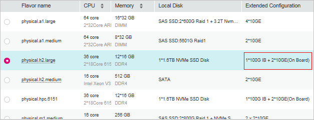

# Overview<a name="EN-US_TOPIC_0122234356"></a>

## IB Network<a name="section349975925113"></a>

The IB network features low latency and high bandwidth and is used in a number of High Performance Computing \(HPC\) projects. It uses the 100 Gbit/s Mellanox IB NIC, dedicated IB switch, and controller software UFM to ensure network communication and management, and uses the Partition Key to isolate IB networks of different tenants \(similar to VLANs in the Ethernet\). The IB network supports two communication modes, RDMA and IPoIB.

To create an IB network, you must select a flavor that supports the IB network during BMS creation. After an IB network is provisioned, BMSs can communicate with each other in RDMA mode. In the IPoIB communication mode, you need to configure IP addresses on the IB network port. You can use static IP addresses or IP addresses dynamically assigned by DHCP. Examples of static IP addresses are as follows:

```
#/etc/sysconfig/network/ifcfg-ib0
DEVICE=ib0
TYPE=InfiniBand
ONBOOT=yes
HWADDR=80:00:00:4c:fe:80:00:00:00:00:00:00:f4:52:14:03:00:7b:cb:a1
BOOTPROTO=none
IPADDR=172.31.0.254
PREFIX=24
NETWORK=172.31.0.0
BROADCAST=172.31.0.255
IPV4_FAILURE_FATAL=yes
IPV6INIT=no
MTU=65520
CONNECTED_MODE=yes
NAME=ib0
```

> **NOTE:**   
>For more information about the IPoIB communication mode, see  [https://www.kernel.org/doc/Documentation/infiniband/ipoib.txt](https://www.kernel.org/doc/Documentation/infiniband/ipoib.txt).  

## View IB Networks<a name="section10294132575216"></a>

IB networks are presented to you through the BMS specifications shown in  [Figure 1](#fig1680973135611). You need to configure and plan the VLANs and IP addresses.

**Figure  1**  BMS extended configuration<a name="fig1680973135611"></a>  


