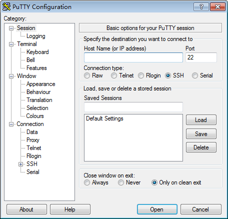
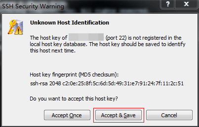

# Logging In to a BMS Using an SSH Key Pair

## Prerequisites

-   The BMS must be in  **Running**  state.
-   You have obtained the private key file used during BMS creation.
-   You have bound an EIP to the BMS. For details, see  [Binding an EIP to a BMS](binding-an-eip-to-a-bms.md).
-   You have configured the inbound rules of the security group. For details, see section  [Adding Security Group Rules](adding-security-group-rules.md).
-   The network connection between the login tool \(such as PuTTY\) and the target BMS is normal. For example, the default port 22 is not blocked by the firewall.

## Logging In to the Linux BMS from a Windows Computer

You can use the following methods to log in to a Linux BMS from a local PC running Windows:

**Method 1: Use PuTTY to log in to the BMS.**

Before logging in to the BMS using PuTTY, ensure that the private key file has been converted to .ppk format.

1.  Check whether the private key file has been converted to  **.ppk**  format.
    -   If yes, go to step  [7](#li693703913264).
    -   If no, go to step  [2](#li11816141811202).

2.  Visit the following website and download PuTTY and PuTTYgen:

    [https://www.chiark.greenend.org.uk/\~sgtatham/putty/latest.html](https://www.chiark.greenend.org.uk/~sgtatham/putty/latest.html)

    > **NOTE:**   
    >PuTTYgen is a private key generator, which is used to create a key pair that consists of a public key and a private key for PuTTY.  

3.  Run PuTTYgen.
4.  In the  **Actions**  area, click  **Load**  and import the private key file that you stored when creating the BMS.

    Ensure that the private key file is in the format of  **All files \(\*.\*\)**.

5.  Click  **Save private key**.
6.  Save the converted private key to the local PC, for example,  **kp-123.ppk**, to the local computer.
7.  Double-click  **PUTTY.EXE**. The  **PuTTY Configuration**  page is displayed.

    **Figure  1**  PuTTY Configuration  
    

8.  Choose  **Connection**  \>  **Data**. Enter the image username in  **Auto-login username**.

    > **NOTE:**   
    >Contact the administrator to obtain the image username.  

9.  Choose  **Connection**  \>  **SSH**  \>  **Auth**. In the last configuration item  **Private key file for authentication**, click  **Browse**  and select the .ppk private key in step  [6](#li194442401260).
10. Choose  **Session**  and enter the EIP of the BMS in the box under  **Host Name \(or IP address\)**.
11. Click  **Open**.

    Log in to a BMS.

**Method 2: Use Xshell to log in to the BMS.**

1.  Start the Xshell tool.
2.  Run the following command to remotely log in to the BMS through SSH:

    **ssh** _Username_**@**_EIP_

    Example:

    **ssh** **root@192.168.0.1**

3.  \(Optional\) If the system displays the  **SSH Security Warning**  dialog box, click  **Accept & Save**.

    **Figure  2**  SSH Security Warning  
    

4.  Select  **Public Key**  and click  **Browse**  beside the user key text box.
5.  In the user key dialog box, click  **Import**.
6.  Select the locally stored key file and click  **Open**.
7.  Click  **OK**  to log in to the BMS.

## Logging In to the Linux BMS from a Linux Computer

Perform the following operations to log in to a Linux BMS from a local PC running Linux: The following procedure uses private key file  **KeyPair-ee55.pem**  as an example to describe how to log in to the BMS.

1.  On the Linux CLI, run the following command to change operation permissions:

    **chmod** **400** **/**_path_/_KeyPair-ee55_

    > **NOTE:**   
    >In the preceding command,  **_path_ **refers to the path under which the key file is stored.  

2.  Run the following command to log in to the BMS:

    **ssh** **-i** **/**_path_/_KeyPair-ee55_ _xxx_**@**_EIP of the BMS_

    > **NOTE:**   
    >-   In the preceding command,  **_path_**  refers to the path under which the key file is stored.  
    >-   _xxx_  indicates the username of the BMS image. Contact the administrator to obtain the username.  

