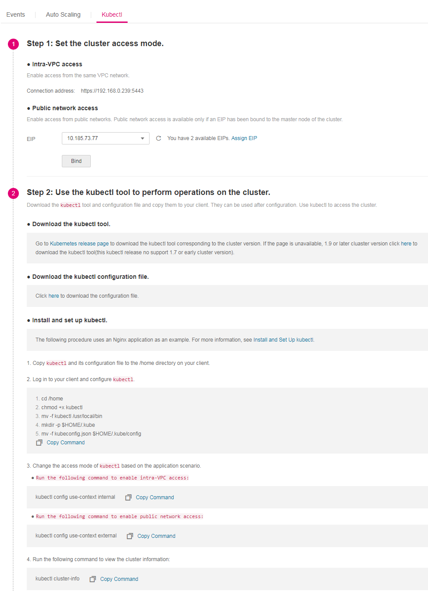

# Connecting to a Kubernetes Cluster Using kubectl

To access a Kubernetes cluster from a client, you can use the Kubernetes command-line tool \(kubectl\).

This section takes hybrid clusters as an example. The operations for bare metal clusters are the same.

## Preparation

CCE allows you to access a cluster through a VPC network or a public network.

-   Intra-VPC access: You need to apply for an ECS on the  **ECS**  console and ensure that the ECS is in the same VPC as the current cluster.
-   Public network access: You need to prepare an ECS that can connect to a public network.

## Produre

1.  Log in to the CCE console. In the navigation pane, choose  **Resource Management**  \>  **Clusters**, and click  **Kubectl**  under the cluster to be connected.
2.  Follow on-screen prompts to connect to the cluster.

    **Figure  1**  Connecting to a Kubernetes cluster using kubectl  
    

    > **NOTE:** 
    >-   CCE allows a master account and its member accounts to download the config file \(kubeconfig.json\) separately. The config file downloaded by the member account is valid only for 30 days, whereas the one downloaded by the master account is valid permanently.
    >-   The Kubernetes permissions of the config file downloaded by the member account are the same as those of the member account on the CCE console.

## Related Operations

After connecting to the cluster, you can use Kubernetes to manage workloads. For details, see  [kubectl Usage Guide](kubectl-usage-guide.md).

