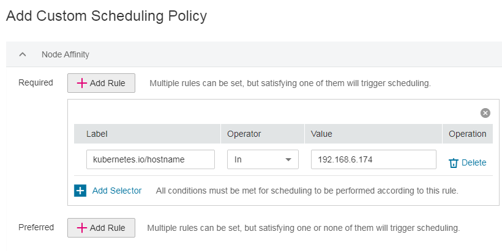

# Node Affinity<a name="cce_01_0232"></a>

## Using the CCE Console<a name="section14975195565810"></a>

1.  Log in to the CCE console. In the navigation pane, choose** Workloads**  \>  **Deployments**  or  **Workload**  \>  **StatefulSets**.
2.  Click a workload name in the Deployment or StatefulSet list. On the displayed workload details page, click the  **Scheduling Policies**  tab and then click  **Add Custom Scheduling Policy**.
3.  In the  **Node Affinity**  area, configure scheduling rules using node labels.

    > **NOTE:** 
    >Node affinity scheduling rules can be  **Required**  or  **Preferred**, and the label operators include In, NotIn, Exists, DoesNotExist, Gt, and Lt.
    >-   **Required**: This is a hard rule that must be met for scheduling. It corresponds to  **requiredDuringSchedulingIgnoredDuringExecution**  in Kubernetes. Multiple required rules can be set, and scheduling will be performed if only one of them is met.
    >-   **Preferred**: This is a soft rule specifying preferences that the scheduler will try to enforce but will not guarantee. It corresponds to  **preferredDuringSchedulingIgnoredDuringExecution**  in Kubernetes. Multiple required rules can be set, and scheduling will be performed even if only one or none of them are met. You can set the weight for a preferred rule. A higher weight indicates a higher priority.
    >-   **Selector**: This corresponds to  **matchExpressions**  in Kubernetes. Multiple selectors can be set for a scheduling rule, and all of them need to be met for the rule to take effect.
    >-   **Label**: This indicates the node label. You can use default or custom labels.
    >-   **Operator**: Six operators are provided for you to configure label matching relationships: In, NotIn, Exists, DoesNotExist, Gt, and Lt. Operators In and NotIn allow one or more label values. Values are separated with colons \(;\). Operators Exists and DoesNotExist are used to determine whether a label exists, and do not require a label value. If you set the operator to Gt or Lt for a label, the label value must be greater than or less than a certain integer.

    **Figure  1**  Node affinity scheduling policy<a name="fig4460835131217"></a>  
    


## Using kubectl<a name="section9155952131619"></a>

This section uses Nginx as an example to describe how to configure node affinity. The dialog box for configuring node affinity is shown in  [Figure 1](#fig4460835131217).

**Prerequisites**

A workload that uses the nginx container image has been deployed on a node.

**Procedure**

Set  **Label**  to  **kubernetes.io/hostname**, add affinity nodes, and set the operator to  **In**. Then, click  **OK**.

The YAML of the workload with node affinity:

```
apiVersion: extensions/v1beta1
kind: Deployment
metadata:
  name: nginx
  namespace: default
spec:
  replicas: 2
  selector:
    matchLabels:
      app: nginx
  template:
    metadata:
      labels:
        app: nginx
    spec:
      imagePullSecrets:
        - name: default-secret
      affinity:
        nodeAffinity:
          requiredDuringSchedulingIgnoredDuringExecution:
            nodeSelectorTerms:
              - matchExpressions:
                  - key: kubernetes.io/hostname
                    operator: In
                    values:
                      - 192.168.6.174
```

