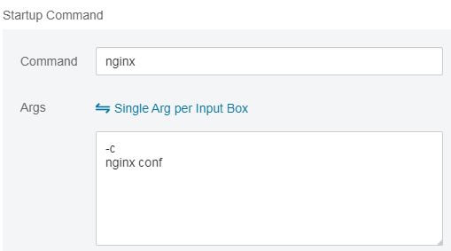
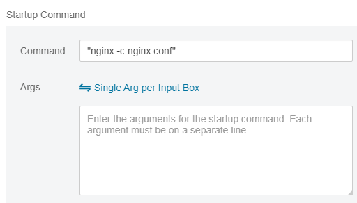
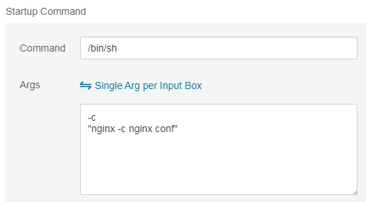

# Setting Container Startup Commands<a name="cce_01_0008"></a>

When creating a workload, you can use an image to specify the processes running in the container.

By default, the image runs the default command. To run a specific command or rewrite the default image value, you must perform the following settings:

-   **Working directory**: Specifies the working directory of the command.

    If the working directory is not specified in the image or on the console, the default value is  **/**.

-   **Command**: Controls the running of an image.
-   **Args**: Parameters transferred to the running command.

> **NOTICE:** 
>After a container is started, do not modify configurations in the container. If configurations in the container are modified \(for example, passwords, certificates, and environment variables of a containerized application are added to the container\), the configurations will be lost after the container restarts and container services will become abnormal. An example scenario of container restart is pod rescheduling due to node anomalies.
>Configurations must be imported to a container as arguments. Otherwise, configurations will be lost after the container restarts.

## Commands and Arguments Used to Run a Container<a name="section913591582414"></a>

The Docker image has metadata that stores image information. If lifecycle commands and parameters are not set, CCE runs the default commands and parameters, that is, Docker native commands  Entrypoint  and  CMD, provided during image creation. For details, see  [Entrypoint Description](https://docs.docker.com/engine/reference/builder/#/entrypoint)  and  [CMD Description](https://docs.docker.com/engine/reference/builder/#/cmd)  in Docker documentation.

If the commands and parameters used to run a container are set during workload creation, the default commands Entrypoint and CMD are overwritten during image building. The rules are as follows:

**Table  1** Commands and parameters used to run a container

<a name="table4833929202611"></a>
<table><thead align="left"><tr id="row1683442952610"><th class="cellrowborder" valign="top" width="20%" id="mcps1.2.6.1.1"><p id="p17834192919269"><a name="p17834192919269"></a><a name="p17834192919269"></a>Image Entrypoint</p>
</th>
<th class="cellrowborder" valign="top" width="20%" id="mcps1.2.6.1.2"><p id="p168345294268"><a name="p168345294268"></a><a name="p168345294268"></a>Image CMD</p>
</th>
<th class="cellrowborder" valign="top" width="20%" id="mcps1.2.6.1.3"><p id="p283416297265"><a name="p283416297265"></a><a name="p283416297265"></a>Command to Run a Container</p>
</th>
<th class="cellrowborder" valign="top" width="20%" id="mcps1.2.6.1.4"><p id="p583412914264"><a name="p583412914264"></a><a name="p583412914264"></a>Args to Run a Container</p>
</th>
<th class="cellrowborder" valign="top" width="20%" id="mcps1.2.6.1.5"><p id="p198341629182620"><a name="p198341629182620"></a><a name="p198341629182620"></a>Command Executed</p>
</th>
</tr>
</thead>
<tbody><tr id="row283622962618"><td class="cellrowborder" valign="top" width="20%" headers="mcps1.2.6.1.1 "><p id="p583642920263"><a name="p583642920263"></a><a name="p583642920263"></a>[touch]</p>
</td>
<td class="cellrowborder" valign="top" width="20%" headers="mcps1.2.6.1.2 "><p id="p128361129162616"><a name="p128361129162616"></a><a name="p128361129162616"></a>[/root/test]</p>
</td>
<td class="cellrowborder" valign="top" width="20%" headers="mcps1.2.6.1.3 "><p id="p15836162952619"><a name="p15836162952619"></a><a name="p15836162952619"></a>Not set</p>
</td>
<td class="cellrowborder" valign="top" width="20%" headers="mcps1.2.6.1.4 "><p id="p18836529172618"><a name="p18836529172618"></a><a name="p18836529172618"></a>Not set</p>
</td>
<td class="cellrowborder" valign="top" width="20%" headers="mcps1.2.6.1.5 "><p id="p1836132922617"><a name="p1836132922617"></a><a name="p1836132922617"></a>[touch /root/test]</p>
</td>
</tr>
<tr id="row283662932612"><td class="cellrowborder" valign="top" width="20%" headers="mcps1.2.6.1.1 "><p id="p3836229172615"><a name="p3836229172615"></a><a name="p3836229172615"></a>[touch]</p>
</td>
<td class="cellrowborder" valign="top" width="20%" headers="mcps1.2.6.1.2 "><p id="p18836142932613"><a name="p18836142932613"></a><a name="p18836142932613"></a>[/root/test]</p>
</td>
<td class="cellrowborder" valign="top" width="20%" headers="mcps1.2.6.1.3 "><p id="p1183602917269"><a name="p1183602917269"></a><a name="p1183602917269"></a>[mkdir]</p>
</td>
<td class="cellrowborder" valign="top" width="20%" headers="mcps1.2.6.1.4 "><p id="p983642982611"><a name="p983642982611"></a><a name="p983642982611"></a>Not set</p>
</td>
<td class="cellrowborder" valign="top" width="20%" headers="mcps1.2.6.1.5 "><p id="p1183612293269"><a name="p1183612293269"></a><a name="p1183612293269"></a>[mkdir]</p>
</td>
</tr>
<tr id="row9836152912618"><td class="cellrowborder" valign="top" width="20%" headers="mcps1.2.6.1.1 "><p id="p167981050113418"><a name="p167981050113418"></a><a name="p167981050113418"></a>[touch]</p>
</td>
<td class="cellrowborder" valign="top" width="20%" headers="mcps1.2.6.1.2 "><p id="p17837142972617"><a name="p17837142972617"></a><a name="p17837142972617"></a>[/root/test]</p>
</td>
<td class="cellrowborder" valign="top" width="20%" headers="mcps1.2.6.1.3 "><p id="p168379292269"><a name="p168379292269"></a><a name="p168379292269"></a>Not set</p>
</td>
<td class="cellrowborder" valign="top" width="20%" headers="mcps1.2.6.1.4 "><p id="p1583702911260"><a name="p1583702911260"></a><a name="p1583702911260"></a>[/opt/test]</p>
</td>
<td class="cellrowborder" valign="top" width="20%" headers="mcps1.2.6.1.5 "><p id="p58371729182613"><a name="p58371729182613"></a><a name="p58371729182613"></a>[touch /opt/test]</p>
</td>
</tr>
<tr id="row16837172972617"><td class="cellrowborder" valign="top" width="20%" headers="mcps1.2.6.1.1 "><p id="p138691301355"><a name="p138691301355"></a><a name="p138691301355"></a>[touch]</p>
</td>
<td class="cellrowborder" valign="top" width="20%" headers="mcps1.2.6.1.2 "><p id="p208371129182610"><a name="p208371129182610"></a><a name="p208371129182610"></a>[/root/test]</p>
</td>
<td class="cellrowborder" valign="top" width="20%" headers="mcps1.2.6.1.3 "><p id="p1283715298267"><a name="p1283715298267"></a><a name="p1283715298267"></a>[mkdir]</p>
</td>
<td class="cellrowborder" valign="top" width="20%" headers="mcps1.2.6.1.4 "><p id="p544733220362"><a name="p544733220362"></a><a name="p544733220362"></a>[/opt/test]</p>
</td>
<td class="cellrowborder" valign="top" width="20%" headers="mcps1.2.6.1.5 "><p id="p20837112917262"><a name="p20837112917262"></a><a name="p20837112917262"></a>[mkdir /opt/test]</p>
</td>
</tr>
</tbody>
</table>

## Setting the Startup Command<a name="section16375562215"></a>

1.  Log in to the CCE console. When creating a workload or job, expand  **Lifecycle**.
2.  Enter the running command and parameters, as shown in  [Table 2](#table15533234825).

    > **NOTE:** 
    >-   The current startup command is provided as a string array and corresponds to the Entrypoint startup command of Docker. The format is as follows: \["executable", "param1", "param2",..\]. For details about how to start Kubernetes containers, click  [here](https://kubernetes.io/docs/tasks/inject-data-application/define-command-argument-container/#running-a-command-in-a-shell).
    >-   The lifecycle of a container is the same as that of the startup command. That is, the lifecycle of the container ends after the command is executed.

    **Table  2**  Container startup command

    <a name="table15533234825"></a>
    <table><thead align="left"><tr id="row85331634326"><th class="cellrowborder" valign="top" width="28.999999999999996%" id="mcps1.2.3.1.1"><p id="p18442342527"><a name="p18442342527"></a><a name="p18442342527"></a>Configuration Item</p>
    </th>
    <th class="cellrowborder" valign="top" width="71%" id="mcps1.2.3.1.2"><p id="p1444519421210"><a name="p1444519421210"></a><a name="p1444519421210"></a>Procedure</p>
    </th>
    </tr>
    </thead>
    <tbody><tr id="row65339348218"><td class="cellrowborder" valign="top" width="28.999999999999996%" headers="mcps1.2.3.1.1 "><p id="p353573415215"><a name="p353573415215"></a><a name="p353573415215"></a>Command</p>
    </td>
    <td class="cellrowborder" valign="top" width="71%" headers="mcps1.2.3.1.2 "><p id="p853515342215"><a name="p853515342215"></a><a name="p853515342215"></a>Enter an executable command, for example, <span class="parmvalue" id="parmvalue131750455817197"><a name="parmvalue131750455817197"></a><a name="parmvalue131750455817197"></a><b>/run/server</b></span>.</p>
    <p id="p2595134133217"><a name="p2595134133217"></a><a name="p2595134133217"></a>If there are multiple commands, separate them with spaces. If the command contains a space, you need to add a quotation mark ("").</p>
    <div class="note" id="note11952193619513"><a name="note11952193619513"></a><a name="note11952193619513"></a><span class="notetitle"> NOTE: </span><div class="notebody"><p id="p1795213665120"><a name="p1795213665120"></a><a name="p1795213665120"></a>If there are multiple commands, you are advised to run the <strong id="b203507453333"><a name="b203507453333"></a><a name="b203507453333"></a>/bin/sh</strong> or other shell commands. Other commands are used as parameters.</p>
    </div></div>
    </td>
    </tr>
    <tr id="row85351342022"><td class="cellrowborder" valign="top" width="28.999999999999996%" headers="mcps1.2.3.1.1 "><p id="p165351342212"><a name="p165351342212"></a><a name="p165351342212"></a>Args</p>
    </td>
    <td class="cellrowborder" valign="top" width="71%" headers="mcps1.2.3.1.2 "><p id="p74728683919"><a name="p74728683919"></a><a name="p74728683919"></a>Enter the argument that controls the container running command, for example, <strong id="b842352706172146"><a name="b842352706172146"></a><a name="b842352706172146"></a>--port=8080</strong>.</p>
    <p id="p10535163420216"><a name="p10535163420216"></a><a name="p10535163420216"></a>If there are multiple arguments, separate them in different lines.</p>
    </td>
    </tr>
    </tbody>
    </table>

    The following uses Nginx as an example to describe three typical application scenarios of the container startup command:

    Example code:

    ```
    nginx -c nginx.conf
    ```

    -   Scenario 1: Both the  **command**  and  **arguments**  are set.

        **Figure  1**  Setting the startup command and parameters<a name="fig12347117203918"></a>  
        

        Example YAML file:

        ```
                  command:
                    - nginx
                  args:
                    - '-c'
                    - nginx.conf
        ```

    -   Scenario 2: Only the  **command**  is set.

        **Figure  2**  Setting the startup command<a name="fig882815173820"></a>  
        

        > **NOTE:** 
        >A command must be enclosed in double quotes. If no double quotes are added, the command is split into multiple commands based on space character.

        Example YAML file:

        ```
                  command:
                    - nginx -c nginx.conf
                  args:
        ```

    -   Scenario 2: Only  **arguments**  are set.

        **Figure  3**  Setting startup arguments<a name="fig24041027134510"></a>  
        

        > **NOTE:** 
        >If the container startup command is not added to the system path, run the  **/bin/sh**  command to execute the container startup command. The container startup command must be enclosed in double quotes.

        Example YAML file:

        ```
                  command:
                    - /bin/sh
                  args:
                    - '-c'
                    - '"nginx -c nginx.conf"'
        ```

3.  Check or modify the YAML file.
    -   When creating a workload, in the  **Configure Advanced Settings**  step, click YAML on the right.

        **Figure  4**  Checking or editing a YAML file<a name="fig114968536485"></a>  
        

    -   After the workload is created, go to the workload list. In the same row as the workload choose  **Operation**  \>  **More**  \>  **Edit YAML**.
    -   After the workload is created, go to the workload details page. On the displayed page, click  **Edit YAML**  in the upper right corner.


## Example YAML for Setting the Container Lifecycle<a name="section151181981167"></a>

This section uses Nginx an example to describe how to set container startup commands using kubectl.

**Prerequisites**

The ECS where the kubectl client runs has been connected to your cluster. For details, see  [Connecting to a Kubernetes Cluster Using kubectl](connecting-to-a-kubernetes-cluster-using-kubectl.md).

**Procedure**

See  [using kubectl to create a Deployment](creating-a-deployment.md#section155246177178)  or  [using kubectl to create a StatefulSet](creating-a-statefulset.md#section113441881214). For details on how to set container startup commands, see  [official Kubernetes documentation](https://kubernetes.io/docs/concepts/workloads/pods/init-containers/).

```
apiVersion: extensions/v1beta1
kind: Deployment
metadata:
  name: nginx
spec:
  replicas: 1
  selector:
    matchLabels:
      app: nginx
  strategy:
    type: RollingUpdate
  template:
    metadata:
      labels:
        app: nginx
    spec:
      containers:
      - image: nginx 
        command:
        - sleep 3600                        #Startup command
        imagePullPolicy: Always
        lifecycle:
          postStart:
            exec:
              command:
              - /bin/bash
              - install.sh                  #Post-start command
          preStop:
            exec:
              command:
              - /bin/bash
              - uninstall.sh                 #Pre-stop command
        name: nginx
      imagePullSecrets:
      - name: default-secret
```

