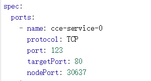

# What Should I Do If a Service Released in a Workload Cannot Be Accessed from Public Networks?

A workload can be accessed from public networks through a load balancer. LoadBalancer provides higher reliability than EIP-based NodePort because an EIP is no longer bound to a single node. The LoadBalancer access type is applicable to the scenario in which a Service exposed to public networks is required.

The LoadBalancer access address consists of the IP address and port number of the public network ELB, for example, 10.117.117.117:80.

## Fault Locating

-   [Check Item 1: Container and Container Port](#en-us_topic_0242566260_section11960929145416)
-   [Check Item 2: Node IP Address and Node Port](#en-us_topic_0242566260_section138152218598)
-   [Check Item 3: ELB IP Address and Port](#en-us_topic_0242566260_section3966114610915)
-   [Check Item 4: NAT Gateway + Port](#en-us_topic_0242566260_section77791227101111)

## Check Item 1: Container and Container Port

Log in to the CCE console or use kubectl to query the IP address of the pod. Then, log in to the node or container in the cluster and run the  **curl**  command to manually call the API. Check whether the expected result is returned.

If <container IP address\>:<port\> cannot be accessed, you are advised to log in to the application container and access <127.0.0.1\>:<port\> to locate the fault.

**Common issues:**

1.  The container port is incorrectly configured \(the container does not listen to the access port\).
2.  The URL does not exist \(no related path exists in the container\).
3.  A Service exception \(a Service bug in the container\) occurs.

## Check Item 2: Node IP Address and Node Port

Only  [NodePort](nodeport.md)  or  [LoadBalancer](loadbalancer.md)  Services can be accessed using the node IP address and node port.

-   **NodePort Services:**

    The access port of a node is the port exposed externally by the node.

-   **LoadBalancer Service:**

    You can view the node port of a LoadBalancer Service by editing the YAML file.

Example:

**nodePort: 30637**  is the port exposed externally by the node,  **targetPort: 80**  is the port exposed by the container, and  **port: 123**  is the port exposed by the ELB.

After finding the node port, access <IP address\>:<port\> of the node where the container is located and check whether the expected result is returned.

**Common issues:**

1.  The service port is not allowed in the inbound rules of the node.
2.  A custom route is incorrectly configured for the node.
3.  The label of the pod does not match that of the Service \(created using kubectl or API\).

## Check Item 3: ELB IP Address and Port

There are several possible causes if <IP address\>:<port\> of the ELB cannot be accessed, but <IP address\>:<port\> of the node can be accessed.

**Possible causes:**

-   The backend server group of the port or URL does not meet the expectation.
-   The security group on the node has not exposed the related protocol or port to the ELB.
-   The health check of the layer-4 load balancing is not enabled.
-   The certificate used for Services of layer-7 load balancing has expired.

**Common issues:**

1.  The health check function is disabled \(enabled by default\) when a layer-4 load balancing Service is released. As a result, a new backend server group fails to be added when you update the backend server groups.
2.  For UDP access, the ICMP port of the node has not been allowed in the inbound rules.
3.  The label of the pod does not match that of the Service \(created using kubectl or API\).

## Check Item 4: NAT Gateway + Port

Generally, no EIP is configured for the backend server of NAT. Otherwise, exceptions such as network packet loss may occur.

