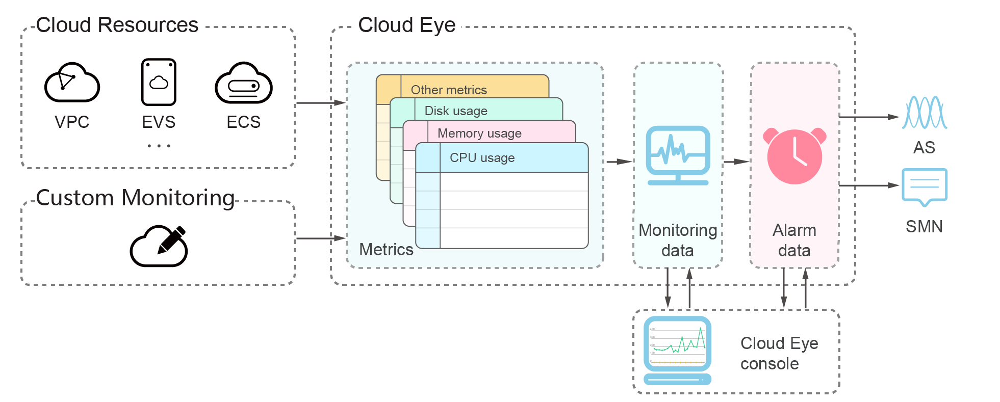

# What Is Cloud Eye?

Cloud Eye is a multi-dimensional resource monitoring platform. You can use Cloud Eye to monitor the utilization of service resources, track the running status of cloud services, configure alarm rules and notifications, and quickly respond to resource changes.  [Figure 1](#fig1135112504519)  shows the Cloud Eye architecture.

**Figure  1**  Cloud Eye architecture  

Cloud Eye provides the following functions:

-   Automatic Monitoring: Monitoring starts automatically after you create Elastic Cloud Servers \(ECSs\) or Auto Scaling \(AS\) groups. After deploying a cloud service, you can view the service running status and set alarm rules on the Cloud Eye console. 
-   Flexible Alarm Rule Configuration: You can create alarm rules for multiple resources at the same time. After an alarm rule is created, you can flexibly manage it, for example at any time you can modify, enable, disable, or delete it. For more information, see  [Alarm Rule Management](alarm-rule-management.md).
-   Real-time Notification: You can enable Simple Message Notification \(SMN\) when creating alarm rules. When the cloud service status changes and the monitoring data of the metric reaches the threshold specified in an alarm rule, Cloud Eye notifies you by text messages, emails, or by sending messages to server addresses. In this way, you can monitor the cloud resource status and changes in real time.
-   Monitoring Panel: The panel enables you to view cross-service and cross-dimension monitoring data. It displays key metrics centrally, providing an overview of the service operating status and allowing monitoring details to be checked when troubleshooting. For more information, see  [Introduction to Monitoring Panels](introduction-to-monitoring-panels.md).

