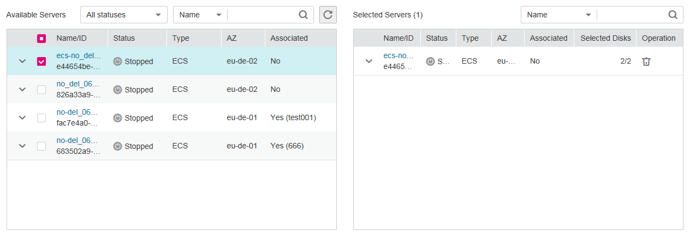

# Associating ECSs with a Backup Policy

After creating a backup policy, you can add ECSs to it so that the ECSs are associated with the backup policy.

## Prerequisites

-   You have created at least one backup policy.
-   At least one ECS in the  **Running**  or  **Stopped**  state is available.
-   A maximum of 64 ECSs can be associated with a backup policy.

## Procedure

1.  Log in to the CSBS management console.
    1.  Log in to the management console.
    2.  Click    in the upper left corner of the management console and select a region and a project.
    3.  Click  . Under  **Storage**, click  **Cloud Server Backup Service**.

2.  Click the  **Policies**  tab.
3.  In the row of the backup policy with which you want to associate ECSs, click  **Associate Server**.

    **Figure  1**  Associating servers  
    

4.  In the server list, select the ECSs you want to associate. After ECSs are selected, they are added to the list of selected servers.

    > **NOTE:**   
    >-   A maximum of 64 ECSs can be associated with a backup policy.  
    >-   If a selected ECS has been associated with another backup policy, it will be disassociated from the original backup policy automatically and then associated with the new backup policy.  
    >-   If EVS disks on an ECS have been associated with a VBS backup policy, disassociate them from the VBS backup policy. Otherwise, two backups are generated for each of the EVS disks.  
    >-   You can only select ECSs that are in the  **Running**  or  **Stopped**  state.  
    >-   CSBS supports backing up ECSs with shared EVS disks.  

5.  Click  **OK**.

