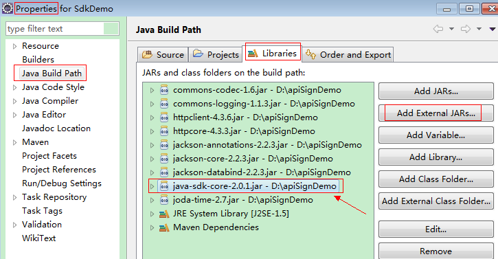
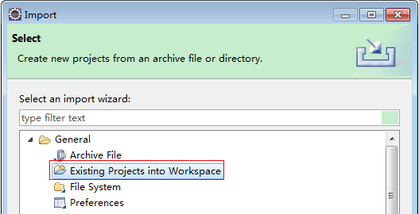
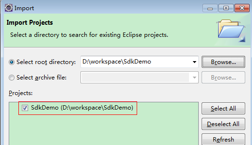
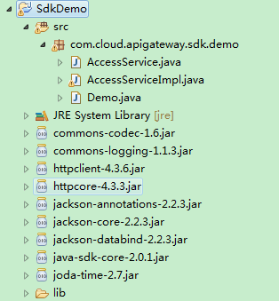

# Obtaining Request Authentication<a name="css_03_0004"></a>

Requests for calling an API can be authenticated using either of the following methods:

-   Authentication using tokens: General requests are authenticated using tokens.
-   Authentication using AK/SK: Requests are encrypted using access key ID \(AK\)/secret access key \(SK\). Authentication using AK/SK is recommended because it is more secure than using tokens.

## Authentication Using Tokens<a name="section13933612275"></a>

If you use a token for authentication, you must obtain the token and add  **X-Auth-Token**  to the request header of the API when making an API call.

1.  Send POST https://**_IAM_** **_endpoint_/v3/auth/tokens**.

    To obtain the Identity and Access Management \(IAM\) endpoint and the region name in the message body. For details, see  [Regions and Endpoints](https://docs.otc.t-systems.com/en-us/endpoint/index.html).

    An example request is as follows:

    > **NOTE:**   
    >Replace the variables in italics in the following example with actual values. For details, see "Obtaining a User Token" in the  _Identity and Access Management API Reference_. The parameters are describes as follows:  
    >-   **username**: indicates the username used for login.  
    >-   **password**: indicates the password used for login.  
    >-   **domainname**: indicates the name of an enterprise account to which a user belongs. If there is no enterprise account, enter the username.  
    >-   **project name**: indicates the project name, for example,  **eu-de**.  

    ```
    {
      "auth": {
        "identity": {
          "methods": [
            "password"
          ],                                                    
          "password": {
            "user": {
              "name": "username",
              "password": "password",
              "domain": {
                "name": "domainname"
              }
            }
          }
        },
        "scope": {
          "project": {
             "name": "eu-de"//Assume that the region name is eu-de.
    
          }
        }
      }
    }
    ```

2.  <a name="li134751663273"></a>Obtain the token. For details about how to obtain the token, see section "Obtaining a User Token" in the  _Identity and Access Management API Reference_. After the request is processed, the value of  **X-Subject-Token**  in the header is the token value.
3.  Call a service API, add  **X-Auth-Token**  to the request header, and set the value of  **X-Auth-Token**  to the token obtained in  [2](#li134751663273).

## Authentication Using AK/SK<a name="section11311162279"></a>

An AK/SK is used to verify the identity of a request sender. In authentication using AK/SK, you are required to obtain a signature through the signature request process and add the signature in a request as its header.

> **NOTE:**   
>AK: access key ID, which is a unique identifier used in conjunction with a secret access key to sign requests cryptographically.  
>SK: secret access key used in conjunction with an AK to sign requests cryptographically. It identifies a request sender and prevents the request from being modified.  

-   Demo code

    Demo download address:  [https://github.com/api-gate-way/SdkDemo](https://github.com/api-gate-way/SdkDemo)


-   API Gateway signing SDK

    If you do not need the demo project, visit the following URL to download the API Gateway signing SDK:

    Decompress the downloaded package and reference the extracted JAR file to the dependent path. See the following figure.

    **Figure  1**  Referencing the JAR file<a name="en-us_topic_0170917208_fig5919641103612"></a>  
    

    The following uses the demo code to show how to sign a request and how to use an HTTP client to send an HTTPS request:


1.  Obtain the AK/SK. \(If an AK/SK file has already been obtained, skip this step and locate the downloaded AK/SK file. Generally, the file name will be  **credentials.csv**.\)
    1.  Register an account and log in to the management console.
    2.  Click the username and select  **My Credential**  from the drop-down list.

    1.  On the  **My Credentials**  page, click  **Access Keys**.
    2.  Click  **Add Access Key**.
    3.  Enter the login password.
    4.  Enter the authentication code received in the email or mobile phone.

        > **NOTE:**   
        >For users created in IAM, if no email address or mobile phone was filled out during user creation, only the login password must be authenticated.  

    5.  Click  **OK**  to download the access key file.

        > **NOTE:**   
        >Keep the access key secure.  


2.  Obtain and decompress the demo to obtain a JAR file.

    Demo download address:  [https://github.com/api-gate-way/SdkDemo](https://github.com/api-gate-way/SdkDemo)

3.  Import the demo project to Eclipse.

    **Figure  2**  Selecting an existing project<a name="en-us_topic_0170917208_en-us_topic_0147924181_fig60890569"></a>  
    

    **Figure  3**  Selecting the demo project<a name="en-us_topic_0170917208_en-us_topic_0147924181_fig3957675"></a>  
    

    **Figure  4**  Structure of the demo project<a name="en-us_topic_0170917208_en-us_topic_0147924181_fig62284798"></a>  
    

4.  Sign a request.

    The signature method is integrated into the imported JAR file. The request needs to be signed before it is sent. The signature will then be added as part of the HTTP header to the request.

    The demo code is classified into the following classes to demonstrate signing and sending the HTTP request:

    -   **AccessService**: indicates the abstract class that converts the GET, POST, PUT, and DELETE methods in to the access method.
    -   **Demo**: indicates the execution entry used to simulate GET, POST, PUT, or DELETE request sending.
    -   **AccessServiceImpl**: indicates the implementation of the access method, which contains the code required for API gateway communication.

    1.  Add a request header.

        In the  **AccessServiceImpl.java**  file, locate the following rows:

        ```
        //TODO: Add special headers. 
        //request.addHeader("X-Project-Id", "xxxxx"); 
        //request.addHeader("X-Domian-Id", "xxxxx");
        ```

        Modify the preceding code as follows:

        ```
        //TODO: Add special headers. 
        request.addHeader("Content-Type", "application/json");
        ```

        -   **Content-Type**: Set this parameter based on the MIME type of the actual sent request body. Currently,  **application/json**  and  **text/xml**  are supported.

    2.  Edit the  **main\(\)**  method in the Demo.java file, and replace the bold text with actual values.

        If you use other methods such as POST, PUT, or DELETE, see the corresponding comment method.

        Replace  **region**,  **serviceName**,  **AK/SK**, and  **URL**. In the demo, the URL for obtaining the VPC is used. Replace it with the required URL. For details about how to obtain the project\_id in the URL, see Obtaining the Project ID. For details about the Endpoint, see  [Regions and Endpoints](https://docs.otc.t-systems.com/en-us/endpoint/index.html).

        ```
        //TODO: Replace region with the name of the region in which the service to be accessed is located.  
        private static final String region = ""; 
         
        //TODO: Replace vpc with the name of the service you want to access. For example, ecs, vpc, iam, and elb. 
        private static final String serviceName = ""; 
         
        public static void main(String[] args) throws UnsupportedEncodingException 
        { 
        //TODO: Replace the AK and SK with those obtained on the My Credential page. 
        String ak = "ZIRRKMTWP******1WKNKB"; 
        String sk = "Us0mdMNHk******YrRCnW0ecfzl"; 
         
        //TODO: To specify a project ID (multi-project scenarios), add the X-Project-Id header. 
        //TODO: To access a global service, such as IAM, DNS, CDN, and TMS, add the X-Domain-Id header to specify an account ID. 
        //TODO: To add a header, find "Add special headers" in the AccessServiceImple.java file. 
         
        //TODO: Test the API 
        String url = "https://{Endpoint}/v1/{project_id}/vpcs"; 
        get(ak, sk, url); 
         
        //TODO: When creating a VPC, replace {project_id} in postUrl with the actual value. 
        //String postUrl = "https://serviceEndpoint/v1/{project_id}/cloudservers"; 
        //String postbody ="{\"vpc\": {\"name\": \"vpc\",\"cidr\": \"192.168.0.0/16\"}}"; 
        //post(ak, sk, postUrl, postbody); 
         
        //TODO: When querying a VPC, replace {project_id} in url with the actual value. 
        //String url = "https://serviceEndpoint/v1/{project_id}/vpcs/{vpc_id}"; 
        //get(ak, sk, url); 
         
        //TODO: When updating a VPC, replace {project_id} and {vpc_id} in putUrl with the actual values. 
        //String putUrl = "https://serviceEndpoint/v1/{project_id}/vpcs/{vpc_id}"; 
        //String putbody ="{\"vpc\":{\"name\": \"vpc1\",\"cidr\": \"192.168.0.0/16\"}}"; 
        //put(ak, sk, putUrl, putbody); 
         //TODO: When deleting a VPC, replace {project_id} and {vpc_id} in deleteUrl with the actual values. 
        //String deleteUrl = "https://serviceEndpoint/v1/{project_id}/vpcs/{vpc_id}"; 
        //delete(ak, sk, deleteUrl); 
        }
        ```

    3.  Compile the code and call the API.

        In the  **Package Explorer**  area on the left, right-click  **Demo.java**, choose  **Run AS \>Java Application**  from the shortcut menu, and click  **Run**.

        You can view the API call logs on the console.


