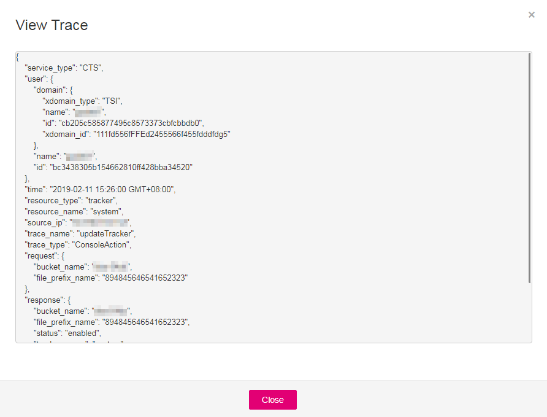

# Querying Real-Time Traces

## Scenarios

After you enable CTS, the system starts recording operations on cloud resources. CTS stores operation records for the last seven days.

This section describes how to query or export the last seven days of operation records on the management console.

## Procedure

1.  Log in to the management console.
2.  Click    in the upper left corner to select the desired region and project.
3.  Click  **Service List**  and choose  **Management & Deployment**  \>  **Cloud Trace Service**.
4.  In the left navigation pane, choose  **Trace List**.
5.  As shown in  [Figure 1](#fig13487330132715), specify filters as needed:

    **Figure  1**  Specifying filters  
    

    -   Region and Global: Filter operation traces of region and global services.

        Region: View operation traces of region services, for example, ECS.

        Global: View operation traces of global services, for example, IAM.

    -   **Trace Source**,  **Resource Type**, and  **Search By**

        Select a filter from the drop-down list.

        After you select  **Trace name**  for  **Search By**, you also need to select a trace name.

        After you select  **Resource ID**  for  **Search By**, you also need to select or enter a resource ID.

        After you select  **Resource name**  for  **Search By**, you also need to select or enter a resource name.

    -   **Operator**: Select a specific operator.
    -   **Trace Status**: Select one of  **All trace statuses**,  **normal**,  **warning**, and  **incident**.
    -   Time range: You can query traces generated during any time range in the last seven days.

6.  On the right of the filter box, click  **Export**. CTS exports traces collected in the past seven days to a CSV file. The CSV file contains all information related to these traces on the management console.
7.  Click    on the left of the required trace to expand its details.

    **Figure  2**  Expanding trace details  
    

8.  Click  **View Trace**  in the  **Operation**  column. On the displayed  **View Trace**  dialog box, the trace structure details are displayed.

    **Figure  3**  Viewing traces  
    

    For details about key fields in the trace structure, see  [Trace Structure](trace-structure.md)  and  [Example Traces](example-traces.md).

