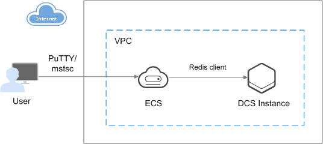

# DCS

Distributed Cache Service \(DCS\) is an online, distributed, in-memory cache service compatible with Redis. It is reliable, scalable, usable out of the box, and easy to manage, meeting your requirements for high read/write performance and fast data access.

Clients can access DCS instances only when they are installed on Elastic Cloud Servers \(ECSs\) and belong to the same virtual private cloud \(VPC\) as the DCS instances.

**Figure  1**  Accessing DCS instances  

> **NOTE:**   
>Like clients, DCS instances are also run on ECSs. A client must belong to the same VPC and subnet as the DCS instance it is attempting to access.  

## DCS Redis

DCS uses Redis 3.0, a storage system that supports multiple types of data structures, including key-value pairs. It can be used in scenarios such as caching, event pub/sub, and high-speed queuing. Redis is networked and written in ANSI C. It supports direct read/write of strings, hashes, lists, queues, and sets. Redis works with in-memory datasets and provides persistence. For more information about Redis, visit  [https://redis.io/](https://redis.io/).

There are three deployment modes for DCS Redis instances:

-   Single-node

    Each DCS instance runs on only one cache node. Such DCS instances are mainly used for temporary data storage but are not suitable for high-reliability service scenarios.

    Single-node DCS instances support intensive concurrent read/write operations, but do not implement data persistence. Data will be deleted after single-node DCS instances are restarted or stopped.

-   Master/standby

    DCS instances run in master/standby mode, providing higher availability than single-node DCS instances:

    -   Each DCS instance runs on two cache nodes \(one master and one standby\), and supports data persistence.
    -   The standby node is invisible to the client and does not provide data read/write services. It is kept synchronized with the master node through data synchronization.
    -   The standby node takes over automatically if the master node fails.

-   Cluster

    DCS instances run in cluster mode, providing higher instance specifications and performance than master/standby DCS instances:

    -   Each DCS instance has at least three master nodes. Compared with master/standby DCS instances, DCS instances in cluster mode support higher instance specifications and concurrency.
    -   Each master node has a redundant node. If a master node is faulty, the redundant node becomes the master node and provides data read/write services for users.
    -   Each redundant node is invisible to Redis clients, and it is kept synchronized with its master node through data synchronization.

