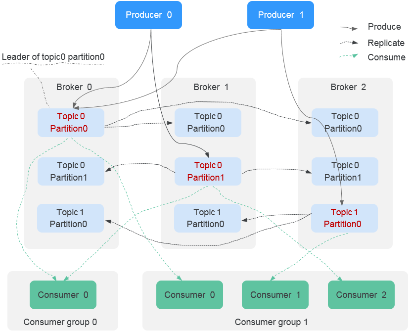

# Basic Concepts

## DMS Queues

DMS queues incorporate the following concepts:

-   Message

    Messages are JavaScript object notation \(JSON\) objects used for transmitting information. They can be sent one by one or in batches. Sending messages in batches can be achieved only through calling DMS application programming interfaces \(APIs\).

    Each message can contain up to 512 KB of data, including the message body and attributes.

-   Attributes \(optional\)

    Each message can optionally have one or more attributes. Each message attribute consists of a name and a value in the key-value format. Attributes are not part of the message body but are sent and retrieved along with it.

    Attributes allow consumers to decide how to process the messages before processing the message body.

-   Message queue

    A message queue is a container that receives and stores message files. By default, 5 queues can be created under a project. Different messages in one queue can be retrieved by multiple consumers at the same time.

-   Message body

    The main information of a message is contained in the message body. Each message has only one message body.

-   Dead letter message

    Dead letter messages are messages that cannot be correctly retrieved.

    DMS can process messages that are not correctly retrieved. If a message fails to be retrieved for a preset number of times, it will be sent to the dead letter queue and retained for 72 hours. You can then retrieve the message from the dead letter queue.

    Messages in the dead letter queue are specific to individual consumer groups, and consumer groups cannot retrieve each other's dead letter messages.

    Dead letter messages from FIFO queues are sent to the dead letter queue in the FIFO order.

    Kafka queues do not support dead letter messages.

-   Producer

    A producer, also called a message sender, is the application component that sends messages to specific queues.

-   Consumer

    A consumer, also called a message receiver, is the application component that retrieves messages from queues. After acknowledging a message, a consumer cannot retrieve the same message again.

-   Consumer group

    A consumer group is used to group consumers. A maximum of three consumer groups can be created in each queue.

    Messages in one queue can be retrieved once by each consumer group. Messages acknowledged by one consumer group are no longer available to that consumer group but still available to other consumer groups.

    Consumers in the same consumer group can retrieve different messages from one queue at the same time.

## Kafka Premium Instance

Kafka premium instances incorporate the following concepts:

-   Topic

    A topic is a stream of messages. Messages are created, retrieved, and managed in the form of topics.

    Topics adopt the publish-subscribe pattern. Producers publish messages into topics. One or more consumers subscribe to the messages in the topics. The producers and consumers are not directly linked to each other.

-   Producer

    A producer publishes messages into topics. The messages are then delivered to other systems or modules for processing as agreed.

-   Consumer

    A consumer subscribes to messages in topics and processes the messages. For example, a monitoring and alarm platform \(a consumer\) subscribing to log messages in certain topics can identify alarm logs and then send SMS or email alarm notifications.

-   Broker

    A broker is a Kafka process in a Kafka cluster. Each process runs on a server, so a broker includes the storage, bandwidth, and other server resources. The connection addresses of a Kafka instance are the IP addresses of the Kafka brokers. The addresses can be obtained on the instance details page on the console.

-   Partition

    Messages in a topic are distributed to multiple partitions to achieve scalability and fault tolerance.

-   Replica

    A replica is a copy of a partition in a topic. Replicas are used for storing messages redundantly. Each partition is replicated to one or multiple brokers for failover.

    Messages in each partition are replicated and synchronized in full, preventing data loss if one replica fails.

    Each partition has one replica as the leader which handles the creation and retrievals of all messages. The rest replicas are followers which replicate the leader.

    Topics are logical concepts, while replicas and brokers are physical concepts. The following diagram shows the relationships between partitions, brokers, and topics in message streaming.

    **Figure  1**  Kafka message streaming  
    

