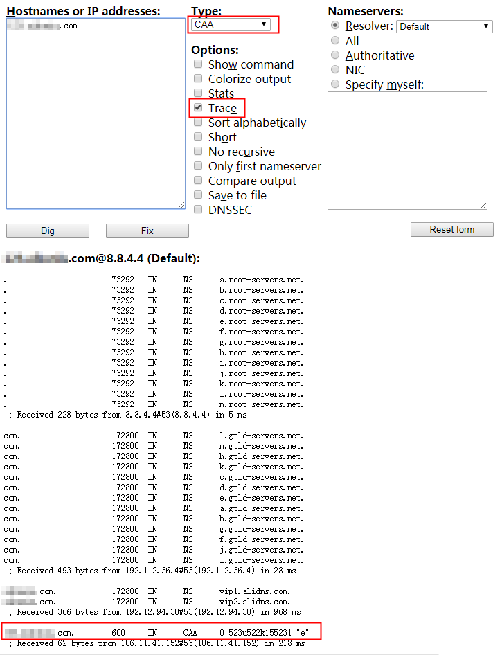

# What Is CAA?

Certification Authority Authorization \(CAA\) is a way to ensure that HTTPS certificates are issued by authorized certificate authorities \(CAs\). It is in compliance with IETF RFC6844 specifications. Since September 8, 2017, all CAs are required to check CAA records before issuing a certificate.

## CAA Specifications

Domain name owners can create CAA records to specify that authorized CAs issue certificates for their domain names.

In the world, hundreds of CAs have the right to issue HTTPS certificates to verify identity of a website. CAA allows you to create a website of specified CAs that are authorized to issue HTTPS certificates for particular domain names to prevent possibly fraudulent certificates. Setting CAA records is a way to enhance security of your websites.

CAs will perform a DNS lookup for CAA records when they issue certificates.

-   If a CA does not find any CAA record, it can issue a certificate for the domain name.

    In this case, any CA is able to issue a certificate for this domain name, and it may be a fraudulent certificate.

-   If the CA finds a CAA record that authorizes it to issue certificates, it will issue a certificate for the domain name.
-   If the CA finds a CAA record but the record does not authorize it to issue certificates, the CA will not be able to issue HTTPS certificate for the domain name. As a result, certificates are not incorrectly issued.

## CAA Record

A CAA record consists of a flag byte **\[flag\]**, a property tag, and a property value **\[tag\]-\[value\]**. You can create multiple CAA records for a domain name.

**Table 1** Configuration of CAA records

<table><thead align="left"><tr id="row187268412211"><th class="cellrowborder" valign="top" width="17%" id="mcps1.2.4.1.1">
Function

</th>
<th class="cellrowborder" valign="top" width="36%" id="mcps1.2.4.1.2">
Example

</th>
<th class="cellrowborder" valign="top" width="47%" id="mcps1.2.4.1.3">
Description

</th>
</tr>
</thead>
<tbody><tr id="row117262041172112"><td class="cellrowborder" rowspan="2" valign="top" width="17%" headers="mcps1.2.4.1.1 ">
Configure a CAA record for one domain name.

</td>
<td class="cellrowborder" valign="top" width="36%" headers="mcps1.2.4.1.2 ">
domain.com.  CAA 0 issue "ca.example.com"

</td>
<td class="cellrowborder" valign="top" width="47%" headers="mcps1.2.4.1.3 ">
Only the specified CA (<strong id="b193760717517189">ca.example.com</strong>) can issue certificates for a particular domain name (<strong id="b110240485517189">domain.com</strong>). Requests to issue certificates for the domain name by other CAs will be rejected.

</td>
</tr>
<tr id="row127268411218"><td class="cellrowborder" valign="top" headers="mcps1.2.4.1.1 ">
domain.com.  CAA 0 issue ";"

</td>
<td class="cellrowborder" valign="top" headers="mcps1.2.4.1.2 ">
No CA is allowed to issue certificates for the domain name (<strong id="b84235270615569">domain.com</strong>).

</td>
</tr>
<tr id="row5726341122120"><td class="cellrowborder" rowspan="2" valign="top" width="17%" headers="mcps1.2.4.1.1 ">
Configure that the CA reports to the domain name holder.

</td>
<td class="cellrowborder" valign="top" width="36%" headers="mcps1.2.4.1.2 ">
domain.com. CAA 0 iodef "mailto:admin@domain.com"

</td>
<td class="cellrowborder" valign="top" width="47%" headers="mcps1.2.4.1.3 ">
When a certificate is requested that violates the CAA record, the CA will notify the domain name holder of the violation.

</td>
</tr>
<tr id="row6726114118217"><td class="cellrowborder" valign="top" headers="mcps1.2.4.1.1 ">
domain.com. CAA 0 iodef "http:// domain.com/log/"

domain.com. CAA 0 iodef "https:// domain.com/log/"

</td>
<td class="cellrowborder" valign="top" headers="mcps1.2.4.1.2 ">
Requests to issue certificates by unauthorized CAs will be recorded.

</td>
</tr>
<tr id="row1091554812514"><td class="cellrowborder" valign="top" width="17%" headers="mcps1.2.4.1.1 ">
Authorize a CA to issue wildcard certificates.

</td>
<td class="cellrowborder" valign="top" width="36%" headers="mcps1.2.4.1.2 ">
domain.com. CAA 0 issuewild "ca.example.com"

</td>
<td class="cellrowborder" valign="top" width="47%" headers="mcps1.2.4.1.3 ">
The specified CA (<strong id="b8423527061622">ca.example.com</strong>) can issue wildcard certificates for the domain name.

</td>
</tr>
<tr id="row6815165112515"><td class="cellrowborder" valign="top" width="17%" headers="mcps1.2.4.1.1 ">
Configuration example

</td>
<td class="cellrowborder" valign="top" width="36%" headers="mcps1.2.4.1.2 ">
domain.com. CAA 0 issue "ca.abc.com"

domain.com. CAA 0 issuewild "ca.def.com"

domain.com. CAA 0 iodef "mailto:admin@domain.com"

</td>
<td class="cellrowborder" valign="top" width="47%" headers="mcps1.2.4.1.3 ">
The example configures a CAA record for the domain name <strong id="b8423527061647">domain.com</strong>.

<ul id="ul2285344104918"><li id="li20765750104917">Only CA <strong id="b84235270616425">ca.abc.com</strong> can issue certificates of all types.</li><li id="li6981012155212">Only CA <strong id="b84235270616454">ca.def.com</strong> can issue wildcard certificates.</li><li id="li12561158144911">Any other CA is not allowed to issue certificates.</li><li id="li92852445491">When a violation occurs, the CA sends a notification to <strong id="b84235270616554">admin@domain.com</strong>.</li></ul>
</td>
</tr>
</tbody>
</table>

## Checking Whether a CAA Record Takes Effect

You can verify a CAA record at [http://www.digwebinterface.com](http://www.digwebinterface.com/).

1.  Access [http://www.digwebinterface.com](http://www.digwebinterface.com/).
2.  Enter the following parameters:
    -   **Hostnames or IP addresses**: domain name of the CAA record to be checked
    -   **Type**: **CAA**
    -   **Options**: **Trace**
3.  Click **Dig**.

    **Figure 1** CAA record resolution result
    

