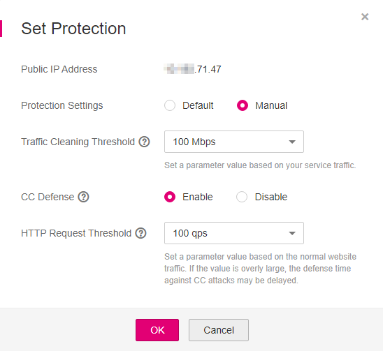

# Adjusting Security Settings

## Scenarios

You can adjust security settings after Anti-DDoS is enabled.

## Prerequisites

You have obtained an account and its password to log in to the management console.

## Procedure

1.  Log in to the management console.
2.  Click    in the upper left corner and select the desired region or project.
3.  Under  **Security**, choose  **Anti-DDoS**. The  **Security Console**  is displayed.
4.  Select the  **Public IP Addresses**  tab, locate the row that contains the IP address for which protection settings need to be modified, and click  **Set Protection**  in the  **Operation**  column, as shown in  [Figure 1](#fig6189986015278).

    **Figure  1**  Public IP address list  
    

5.  In the displayed  **Set Protection**  dialog box, set required parameters, as shown in  [Figure 2](#fig415543111219).

    **Figure  2**  Page for setting protection parameters  
    

    **Table  1**  Parameter description

    
    <table><thead align="left"><tr id="row941711013115"><th class="cellrowborder" valign="top" width="20.3%" id="mcps1.2.3.1.1">
<strong id="b543889356144253">Parameter</strong>

    </th>
    <th class="cellrowborder" valign="top" width="79.7%" id="mcps1.2.3.1.2">
<strong id="b4102827915513">Description</strong>

    </th>
    </tr>
    </thead>
    <tbody><tr id="row296916541259"><td class="cellrowborder" valign="top" width="20.3%" headers="mcps1.2.3.1.1 ">
Protection Settings

    </td>
    <td class="cellrowborder" valign="top" width="79.7%" headers="mcps1.2.3.1.2 "><ul id="ul9262156192818"><li><strong id="b166082315911">Default</strong>: In this mode, <strong id="b11795184613617">Traffic Cleaning Threshold</strong> is fixed at <strong id="b17444122414373">300 Mbps</strong>. When the service UDP traffic is greater than <strong id="b16545192313199">300 Mbps</strong> or the TCP traffic is greater than <b>90000 pps</b>, traffic scrubbing is triggered and Anti-DDoS will automatically intercept the attack traffic.</li><li><strong id="b16494903337">Manual</strong>: In this mode, you can set the value of <strong id="b624112156411">Traffic Cleaning Threshold</strong> based on your service needs and enable <strong id="b774405112416">CC Defense</strong>.</li></ul>
    
 NOTE: 
<ul id="en-us_topic_0204851524_ul5873919185614"><li>Mbps = Mbit/s (short for 1,000,000 bit/s). It is a unit of transmission rate and refers to the number of bits transmitted per second.</li><li>PPS, short for Packets Per Second, is a measure of throughput for network devices. It means the number of packets sent per second.</li></ul>
    

    </td>
    </tr>
    <tr id="row2418805113"><td class="cellrowborder" valign="top" width="20.3%" headers="mcps1.2.3.1.1 ">
Traffic Cleaning Threshold

    </td>
    <td class="cellrowborder" valign="top" width="79.7%" headers="mcps1.2.3.1.2 ">
Anti-DDoS scrubs traffic when detecting that the incoming traffic of an IP address exceeds the threshold.

    <ul id="ul151454553354"><li>The default value of <strong id="b126312003465">Traffic Cleaning Threshold</strong> is fixed at <strong id="b2616153424511">300 Mbps</strong> when <strong id="b195362864513">Protection Settings</strong> is set to <strong id="b1844133914457">Default</strong>.</li><li>If you need to change the value of <strong id="b320665012464">Traffic Cleaning Threshold</strong>, set <strong id="b13766133511488">Protection Settings</strong> to <strong id="b623764354814">Manual</strong>. Then you can set the traffic cleaning threshold based on your service traffic. You are advised to set the threshold to a value closest to the purchased bandwidth but not greater than the purchased bandwidth.
If <strong id="b1727055125118">Traffic Cleaning Threshold</strong> is set to <strong id="b1572825545117">Unlimited</strong>, your public IP addresses get almost no protection from DDoS attacks.

    </li></ul>
    
 NOTE: 

If your service traffic is larger than the value of <strong id="b1393451184618">Traffic Cleaning Threshold</strong> you set, traffic scrubbing is triggered. Only attack traffic is intercepted. If service traffic does not trigger scrubbing, no traffic is intercepted.

    

    </td>
    </tr>
    <tr id="row1941817061112"><td class="cellrowborder" valign="top" width="20.3%" headers="mcps1.2.3.1.1 ">
CC Defense

    </td>
    <td class="cellrowborder" valign="top" width="79.7%" headers="mcps1.2.3.1.2 "><ul id="ul141814011119"><li><strong id="b3849129115210">CC Defense</strong> is set to <strong id="b1714523885218">Disable</strong> automatically when <strong id="b13783251175110">Protection Settings</strong> is set to <strong id="b11373175615112">Default</strong>. Note that only <strong id="b13518263538">CC Defense</strong> rather than Anti-DDoS protection is disabled.</li><li>If <strong id="b7580105612275">Protection Settings</strong> is set to <strong id="b185816565277">Manual</strong>, you can enable <strong id="b358211560273">CC Defense</strong> based on your service needs.
 NOTE: 

CC defense is available only for clients that carry web services and support the full HTTP protocol stack. This is because CC defense works in redirection or redirection+verification code mode. If your client does not support the full HTTP protocol stack, you are advised to disable CC defense.

    

    </li></ul>
    </td>
    </tr>
    <tr id="row399342155012"><td class="cellrowborder" valign="top" width="20.3%" headers="mcps1.2.3.1.1 ">
HTTP Request Threshold

    </td>
    <td class="cellrowborder" valign="top" width="79.7%" headers="mcps1.2.3.1.2 ">
This parameter is required only when <strong id="b1480711115575">CC Defense</strong> is set to <strong id="b2398105316578">Enable</strong>. The unit is qps (short for queries per second). QPS is a common measure of the amount of search traffic an information retrieval system, such as a search engine or a database, receives during one second.

    
This parameter is used to defend against a large number of malicious requests targeting websites. Defense against CC attacks, which aim to exhaust server resources by sending specially crafted GET or POST requests, is triggered when the HTTP request rate on a site reaches the selected value. In EIP protection, the maximum recommended value is <strong id="b173791715195816">5000</strong>. In ELB protection, the value can be larger

    
You are advised to set this parameter to the maximum number of HTTP requests that can be processed by the deployed service. Anti-DDoS will automatically scrub traffic if detecting that the total number of requests exceeds the configured HTTP request threshold. If the value is too large, CC defense will not be triggered promptly.

    <ul id="ul1981412245413"><li>If the actual HTTP request rate is smaller than the configured value, the deployed service is able to process all HTTP requests, and Anti-DDoS does not need to be involved.</li><li>If the actual HTTP request rate is greater than or equal to the configured value, Anti-DDoS triggers CC defense to analyze and check each request, which affects responses to normal requests.</li></ul>
    </td>
    </tr>
    </tbody>
    </table>

6.  Click  **OK**  to save the settings.

