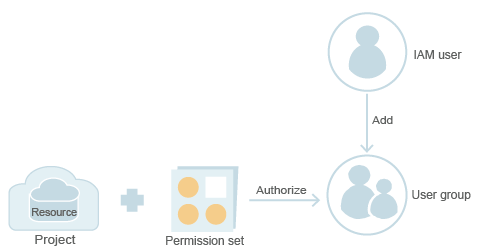
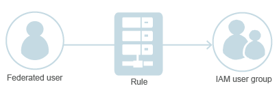

# Permission Management

You can use IAM to grant different users access to different resources.

## Granting Permissions to Users

**Figure  1**  Authorization model  

1.  Plan user groups and grant the permissions to each user group.
2.  Add a user to the user group so that the user has the permissions of the group.

When personnel changes occur, you only need to change individual user permissions by changing their user group. User groups make permission management efficient.

## Granting Permissions to Other Accounts

You \(account A\) can create an agency on IAM to grant required permissions to the delegated account \(account B\). The administrator of account B grants the  **Agent Operator**  permissions to the user of account B to enable the user to manage resources in your account \(account A\).

## Granting Permissions to Federated Users

You can use IAM to create an IdP and create rules for federated users to convert them into identities defined in IAM. This allows IAM to control their permissions to access cloud resources.

**Figure  2**  Principles of identity conversion for federated users  

