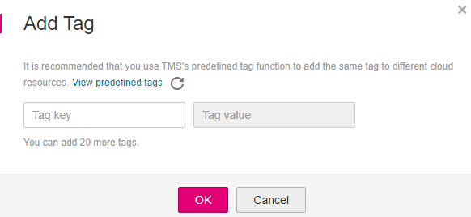

# Configuring Tags

You can add tags to a bucket when creating the bucket. For details, see  [Creating a Bucket](creating-a-bucket-(getting-started).md). Also you can add tags to a bucket after it has been created. This topic describes how to add tags to a bucket after it has been created.

## Procedure

1.  In the bucket list, click the bucket to be operated. The  **Overview**  page of the bucket is displayed.
2.  In the  **Basic Configurations**  area, click the  **Tags**  label. The  **Tags**  page is displayed.

    Alternatively, you can choose  **Basic Configurations**  \>  **Tags**  in the navigation pane on the left.

3.  Click  **Add Tag**. The  **Add Tag**  dialog box is displayed. See  [Figure 1](#fig8687910182820)  for details.

    **Figure  1**  Add Tag  
    

4.  Set the key and value based on  [Table 1](#table13674114016216).

    **Table  1**  Parameter description

    
    <table><thead align="left"><tr id="row1467464018219"><th class="cellrowborder" valign="top" width="18.8%" id="mcps1.2.3.1.1">
Parameter

    </th>
    <th class="cellrowborder" valign="top" width="81.2%" id="mcps1.2.3.1.2">
Description

    </th>
    </tr>
    </thead>
    <tbody><tr id="row1674164010218"><td class="cellrowborder" valign="top" width="18.8%" headers="mcps1.2.3.1.1 ">
Key

    </td>
    <td class="cellrowborder" valign="top" width="81.2%" headers="mcps1.2.3.1.2 ">
Specifies the key of the tag. Each tag of a bucket has a unique key. The value of the key can be self-defined or predefined by TMS.

    
A tag key must comply with the following naming rules:

    <ul id="ul1868918402218"><li>Must contain 1 to 36 characters.</li><li>Only digits, letters, underscores (_), hyphens (-) are allowed.</li></ul>
    </td>
    </tr>
    <tr id="row1668974010210"><td class="cellrowborder" valign="top" width="18.8%" headers="mcps1.2.3.1.1 ">
Value

    </td>
    <td class="cellrowborder" valign="top" width="81.2%" headers="mcps1.2.3.1.2 ">
Specifies the value of the tag. Tags of a bucket can have repetitive or blank values.

    
The tag value must comply with the following naming rules:

    <ul id="ul96891340162118"><li>Must contain 0 to 43 characters.</li><li>Only digits, letters, underscores (_), hyphens (-) are allowed.</li></ul>
    </td>
    </tr>
    </tbody>
    </table>

5.  Click  **OK**.

    It takes approximately 3 minutes for the tag to take effect.

## Related Operations

To modify the tag configuration, edit  **Value**  of the tag. You can also click  **Delete**  next to a tag to delete the tag.

Searching for buckets by tag is not supported by OBS. However, you can use Tag Management Service \(TMS\) to search for buckets by tag. For details, see  [Searching for Cloud Resources](https://docs.otc.t-systems.com/usermanual/tms/en-us_topic_0056266264.html). Select  **OBS-Bucket**  for  **Resource Type**.

