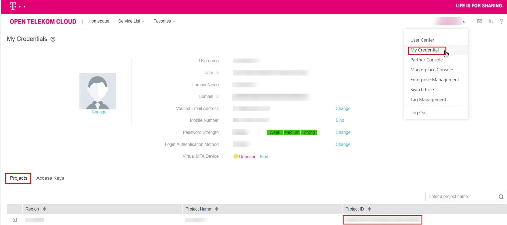

# Obtaining a Project ID<a name="rds_03_0002"></a>

## Scenarios<a name="section236911484369"></a>

When calling APIs, you need to specify the project ID in some URLs. To do so, you need to obtain the project ID first. Two methods are available:

-   [Obtaining the Project ID by Calling an API](#section85791974381)
-   [Obtain a Project ID from the Console](#section196091152113715)

## Obtaining the Project ID by Calling an API<a name="section85791974381"></a>

The API used to obtain a project ID is  **GET https://\{Endpoint\}/v3/projects/**.  **\{Endpoint\}**  is the IAM endpoint and can be obtained from  [Regions and Endpoints](https://docs.otc.t-systems.com/en-us/endpoint/index.html). For details about API authentication, see  [Authentication](authentication.md).

The following is an example response. The value of  **id**  is the project ID.

```
{
    "projects": [
        {
            "domain_id": "65382450e8f64ac0870cd180d14e684b",
            "is_domain": false,
            "parent_id": "65382450e8f64ac0870cd180d14e684b",
            "name": "project_name",
            "description": "",
            "links": {
                "next": null,
                "previous": null,
                "self": "https://www.example.com/v3/projects/a4a5d4098fb4474fa22cd05f897d6b99"
            },
            "id": "a4a5d4098fb4474fa22cd05f897d6b99",
            "enabled": true
        }
    ],
    "links": {
        "next": null,
        "previous": null,
        "self": "https://www.example.com/v3/projects"
    }
}
```

## Obtain a Project ID from the Console<a name="section196091152113715"></a>

1.  Register yourself on the management console and log in to it.
2.  Move your pointer over the username and select My Credentials in the displayed drop-down list.

    On the  **My Credentials**  page, view project IDs in the project list.

    **Figure  1**  Viewing project IDs<a name="fig39324824103512"></a>  
    


