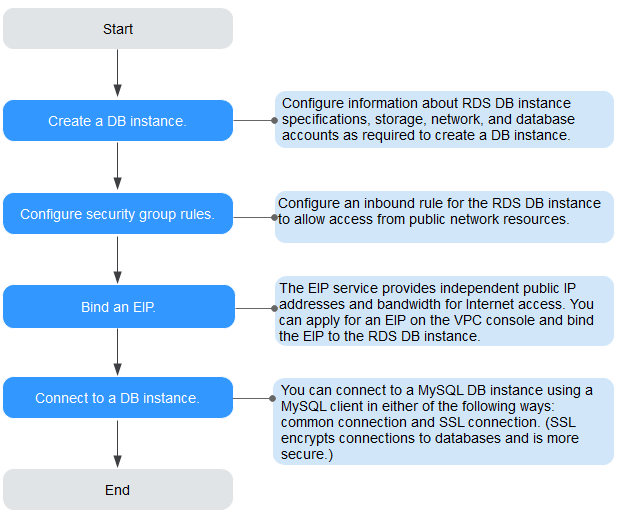

# Overview

## Scenarios

This section describes how to create a MySQL DB instance on the management console and bind an EIP to the DB instance to make the instance publicly accessible.

If you are using RDS for the first time, see the constraints described in section  [MySQL Constraints](mysql-constraints.md).

## Process

[Figure 1](#fig138110377499)  illustrates the process of connecting to a MySQL DB instance through a public network.

**Figure  1**  Connecting to a DB instance through a public network  

-   [Step 1: Create a DB instance.](step-1-create-a-db-instance-MySQL.md)  Confirm the specifications, storage, network, and database account configurations of the MySQL DB instances based on service requirements.
-   [Step 2: Configure security group rules.](step-2-configure-security-group-rules-MySQL.md)  To access an RDS DB instance from resources outside the security group, you need to configure an  **inbound rule**  for the security group associated with the RDS DB instance.
-   [Step 3: Bind an EIP.](step-3-bind-an-eip.md)  The EIP service provides independent public IP addresses and bandwidth for Internet access. You can apply for an EIP on the VPC console and bind the EIP to the RDS DB instance.
-   [Step 4: Connect to a DB instance through a public network.](step-4-connect-to-a-db-instance-through-a-public-network.md)  You can connect to a DB instance through a common connection or an SSL connection. The  SSL connection encrypts data  and is more secure.

