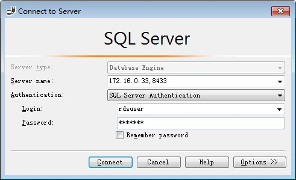
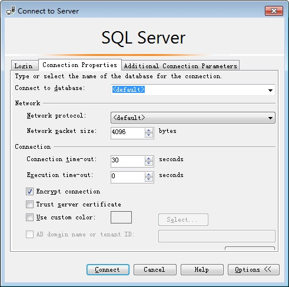

# Step 3: Connect to a DB Instance Through a Private Network

You can connect to a DB instance through a common connection or an SSL connection. The  SSL connection encrypts data  and is more secure.

## **Preparations**

1.  Prepare an ECS.

    To connect to a DB instance through a private network, you must first create an ECS.

    For details about how to create an ECS, see section  [How Can I Create and Connect to an ECS?](how-can-i-create-and-connect-to-an-ecs.md)

    -   The ECS and DB instance must be in the same VPC and subnet.
    -   The ECS must be allowed by the security group to access RDS DB instances.
        -   If the security group to which the target DB instance belongs is the default security group, you do not need to configure security group rules.
        -   If the security group to which the target DB instance belongs is not the default security group, check whether the security group rules allow the ECS to connect to the DB instance.
            1.  Log in to the management console.
            2.  Click    in the upper left corner and select a region and a project.
            3.  Click  **Service List**. Under  **Database**, click  **Relational Database Service**  to go to the RDS console. The RDS console is displayed.
            4.  On the  **Instance Management**  page, click the target DB instance.
            5.  In the  **Connection Information**  area, click the security group to view its rules.

                If the security group rules allow the access from the ECS, the ECS can connect to the DB instance.

                If the security group rules do not allow the access from the ECS, you need to add a security group rule. For details, see section  [Step 2: Configure Security Group Rules](step-2-configure-security-group-rules-(Microsoft-SQL-Server).md).

2.  Install the Microsoft SQL Server client.

    Install the Microsoft SQL Server client on the ECS or device that was prepared in  [step 1](#li532714618279).

    For details, see section  [How Can I Install SQL Server Management Studio?](how-can-i-install-sql-server-management-studio.md)

## Common Connection

1.  Log in to the ECS or device that can access RDS.
2.  Start SQL Server Management Studio.
3.  Choose  **Connect**  \>  **Database Engine**. In the displayed dialog box, enter login information.

    **Figure  1**  Connecting to the server  
    

    -   **Server name**: indicates the IP address and port of the DB instance. Use a comma \(,\) to separate them. For example: x.x.x.x,8080.
        -   The IP address is the floating IP address in the  **Connection Information**  area on the  **Basic Information**  page of the DB instance.
        -   The port is the database port in the  **Connection Information**  area on the  **Basic Information**  page of the DB instance.

    -   **Authentication**: indicates the authentication mode. Select  **SQL Server Authentication**.
    -   **Login**: indicates the RDS database username. The default administrator is  **rdsuser**.
    -   **Password**: indicates the password of the RDS database username.

4.  Click  **Connect**  to connect to the DB instance.

    > **NOTE:**   
    >If the connection fails, ensure that preparations have been correctly made in  [Preparations](#section142821253295)  and try again.  

## SSL Connection

1.  Download the SSL root certificate and then upload it.
    1.  In the  **DB Information**  area on the  **Basic Information**  page, click    in the  **SSL**  field to download the root certificate or certificate bundle.
    2.  Upload the root certificate to the ECS or save it to the device to be connected to the DB instance.
    3.  Import the root certificate to the Windows OS on the ECS. For details, see section  [How Can I Import the Root Certificate to the Windows or Linux OS?](how-can-i-import-the-root-certificate-to-the-windows-or-linux-os.md)

        > **NOTE:**   
        >-   Replace the old certificate before it expires to improve system security.  
        >-   After you bind an EIP to a Microsoft SQL Server DB instance, you must reboot the instance to make the SSL connection work.  

2.  Start SQL Server Management Studio.
3.  Choose  **Connect**  \>  **Database Engine**. In the displayed dialog box, enter login information.

    **Figure  2**  Connecting to the server  
    

    -   **Server name**: indicates the IP address and port of the DB instance. Use a comma \(,\) to separate them. For example: x.x.x.x,8080.
        -   The IP address is the floating IP address in the  **Connection Information**  area on the  **Basic Information**  page of the DB instance.
        -   The port is the database port in the  **Connection Information**  area on the  **Basic Information**  page of the DB instance.

    -   **Authentication**: indicates the authentication mode. Select  **SQL Server Authentication**.
    -   **Login**: indicates the RDS database username. The default administrator is  **rdsuser**.
    -   **Password**: indicates the password of the RDS database username.

4.  On the  **Connection Properties**  page, enter related parameters and select  **Encrypt connection**  to enable SSL encryption. \(By default,  **Encrypt connection**  is not selected. You need to select it manually.\)

    **Figure  3**  Connection properties  
    

5.  Click  **Connect**  to connect to the DB instance.

    > **NOTE:**   
    >If the connection fails, ensure that preparations have been correctly made in  [Preparations](#section142821253295)  and try again.  

