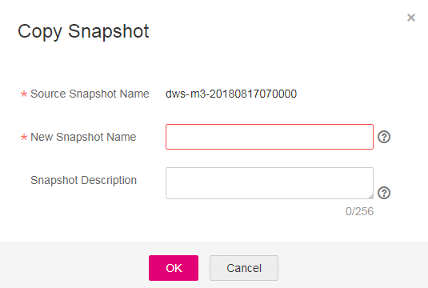

# Copying a Snapshot

This section describes how to copy snapshots that are automatically created to generate manual snapshots for long-term retention.

## Copying an Automated Snapshot

1.  Log in to the DWS management console.
2.  In the navigation tree on the left, click  **Snapshot Management**.

    All snapshots are displayed by default. You can copy the snapshots that are automatically created.

3.  In the  **Operation**  column of the snapshot that you want to copy, click  **Copy**.

    -   **New Snapshot Name**: Enter a new snapshot name.

        The snapshot name must be 4 to 64 characters in length and start with a letter. It is case-insensitive and contains only letters, digits, hyphens \(-\), and underscores \(\_\).

    -   **Snapshot Description**: Enter the snapshot information.

        This parameter is optional. The snapshot description contains 0 to 256 characters and does not support special characters !<\>'=&".

    **Figure  1**  Copying a snapshot  
    

4.  Click  **OK**. The system starts to copy the snapshot for the cluster.

    The system displays a message indicating that the snapshot is successfully copied and delivered. After the snapshot is copied, the status of the copied snapshot is  **Available**.

    > **NOTE:**   
    >If the snapshot size is much greater than that of the data stored in the cluster, it is possible that data is labeled with a deletion tag, but is not cleared and reclaimed. Clear the data and create a snapshot again. For details, see section  [How Can I Clear and Reclaim the Storage Space?](how-can-i-clear-and-reclaim-the-storage-space.md).  

