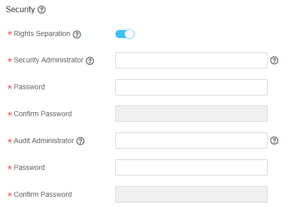

# Separating Rights of Roles

## Scenario

By default, the administrator user created during data warehouse cluster creation is a database system administrator, who can create other users and view the audit logs of the database. The rights separation mode is disabled.

To protect cluster data, DWS supports separation of rights of roles so that different roles have different rights.

For details about the default permission model and the permission model with rights separation enabled, see section  **Separation of Rights**  in the  _Data Warehouse Service Database Developer Guide_.

## Impact on the System

After you have modified the security parameters and the modifications take effect, the cluster may be restarted, which makes the cluster unavailable temporarily.

## Prerequisites

To modify the cluster's security configuration, ensure that the following conditions are met:

-   The  **Cluster Status**  is  **Available**  or  **Low performance**.
-   The  **Task Information**  cannot be  **Creating snapshot**,  **Scaling out**,  **Configuring**, or  **Restarting**.

## Procedure

1.  Log in to the management console at  [https://console.otc.t-systems.com/dws/](https://console.otc.t-systems.com/dws/).
2.  In the navigation tree on the left, click  **Cluster Management**.
3.  In the cluster list, click the name of a cluster. On the page that is displayed, click  **Security Settings**.

    By default,  **Configuration Status**  is  **Synchronized**, which indicates that the latest database result is displayed.

4.  On the  **Security Settings**  page, specify  **Security**.

    **Figure  1**  View of security configurations  
    

    **Table  1**  Security parameters

    
    <table><thead align="left"><tr id="row1625953112519"><th class="cellrowborder" valign="top" width="20%" id="mcps1.2.4.1.1">
<strong id="b7617970162543">Parameter</strong>

    </th>
    <th class="cellrowborder" valign="top" width="59%" id="mcps1.2.4.1.2">
<strong id="b842352706181449">Description</strong>

    </th>
    <th class="cellrowborder" valign="top" width="21%" id="mcps1.2.4.1.3">
<strong id="b60793810112357">Example Value</strong>

    </th>
    </tr>
    </thead>
    <tbody><tr id="row1026135312253"><td class="cellrowborder" valign="top" width="20%" headers="mcps1.2.4.1.1 ">
Rights Separation

    </td>
    <td class="cellrowborder" valign="top" width="59%" headers="mcps1.2.4.1.2 ">
 indicates that <strong id="b18640311446">Rights Separation</strong> is enabled. After <strong id="b11513713112915">Rights Separation</strong> is enabled, set the usernames and passwords of the <b>Security Administrator</b> and <b>Audit Administrator</b>. The system automatically creates the two users. You can use the two users to connect to the databases and perform database-related operations.

    
 indicates that <strong id="b9728317508">Rights Separation</strong> is disabled. By default, <strong id="b1786383994418">Rights Separation</strong> is disabled.

    </td>
    <td class="cellrowborder" valign="top" width="21%" headers="mcps1.2.4.1.3 ">
-

    </td>
    </tr>
    <tr id="row626115316259"><td class="cellrowborder" valign="top" width="20%" headers="mcps1.2.4.1.1 ">
Security Administrator

    </td>
    <td class="cellrowborder" valign="top" width="59%" headers="mcps1.2.4.1.2 ">
The administrator username must:

    <ul id="ul925811254311"><li>Consist of lowercase letters, digits, or underscores.</li><li>Start with a lowercase letter or an underscore.</li><li>Contain 1 to 63 characters.</li><li>Cannot be a keyword of the DWS database. For details about the keywords of the DWS database, see section <b>Keyword</b> in the <em id="i104558519297">Data Warehouse Service Database Developer Guide</em>.</li></ul>
    </td>
    <td class="cellrowborder" valign="top" width="21%" headers="mcps1.2.4.1.3 ">
security_admin

    </td>
    </tr>
    <tr id="row326125322513"><td class="cellrowborder" valign="top" width="20%" headers="mcps1.2.4.1.1 ">
Password

    </td>
    <td class="cellrowborder" valign="top" width="59%" headers="mcps1.2.4.1.2 ">
The password complexity requirements are as follows:<ul id="dws_01_0019_ul13418111318144"><li>Consists of 8 to 32 characters.</li><li>Cannot be the same as the username or the username written in reverse order.</li><li>Must contain at least 3 of the following character types: uppercase letters, lowercase letters, digits, and special characters ~!@#%^&amp;*()-_=+|[{}];:,&lt;.&gt;/?</li><li>Passes the weak password check.</li></ul>
    

    </td>
    <td class="cellrowborder" valign="top" width="21%" headers="mcps1.2.4.1.3 ">
Dws_2018!

    </td>
    </tr>
    <tr id="row82645310256"><td class="cellrowborder" valign="top" width="20%" headers="mcps1.2.4.1.1 ">
Confirm Password

    </td>
    <td class="cellrowborder" valign="top" width="59%" headers="mcps1.2.4.1.2 ">
Enter the password of the security administrator again.

    </td>
    <td class="cellrowborder" valign="top" width="21%" headers="mcps1.2.4.1.3 ">
-

    </td>
    </tr>
    <tr id="row3931218192713"><td class="cellrowborder" valign="top" width="20%" headers="mcps1.2.4.1.1 ">
Audit Administrator

    </td>
    <td class="cellrowborder" valign="top" width="59%" headers="mcps1.2.4.1.2 ">
The administrator username must:

    <ul id="ul615614912298"><li>Consist of lowercase letters, digits, or underscores.</li><li>Start with a lowercase letter or an underscore.</li><li>Contain 1 to 63 characters.</li><li>Cannot be a keyword of the DWS database. For details about the keywords of the DWS database, see section <b>Keyword</b> in the <em id="dws_01_0074_i104558519297">Data Warehouse Service Database Developer Guide</em>.</li></ul>
    </td>
    <td class="cellrowborder" valign="top" width="21%" headers="mcps1.2.4.1.3 ">
audit_admin

    </td>
    </tr>
    <tr id="row16584121102717"><td class="cellrowborder" valign="top" width="20%" headers="mcps1.2.4.1.1 ">
Password

    </td>
    <td class="cellrowborder" valign="top" width="59%" headers="mcps1.2.4.1.2 ">
The password complexity requirements are as follows:<ul id="dws_01_0074_dws_01_0019_ul13418111318144"><li>Consists of 8 to 32 characters.</li><li>Cannot be the same as the username or the username written in reverse order.</li><li>Must contain at least 3 of the following character types: uppercase letters, lowercase letters, digits, and special characters ~!@#%^&amp;*()-_=+|[{}];:,&lt;.&gt;/?</li><li>Passes the weak password check.</li></ul>
    

    </td>
    <td class="cellrowborder" valign="top" width="21%" headers="mcps1.2.4.1.3 ">
Dws_2018!

    </td>
    </tr>
    <tr id="row16526153272717"><td class="cellrowborder" valign="top" width="20%" headers="mcps1.2.4.1.1 ">
Confirm Password

    </td>
    <td class="cellrowborder" valign="top" width="59%" headers="mcps1.2.4.1.2 ">
Enter the password of the audit administrator again.

    </td>
    <td class="cellrowborder" valign="top" width="21%" headers="mcps1.2.4.1.3 ">
-

    </td>
    </tr>
    </tbody>
    </table>

5.  Click  **Apply**.
6.  In the displayed  **Save Configuration**  dialog box, select or deselect  **Restart the cluster**  and click  **OK**.

    -   If you select  **Restart the cluster**, the system saves the settings on the  **Security Settings**  page and restarts the cluster immediately. After the cluster is restarted, the security settings take effect immediately.
    -   If you do not select  **Restart the cluster**, the system only saves the settings on the  **Security Settings**  page. Later, you need to manually restart the cluster for the security settings to take effect.

    After the security settings are complete,  **Configuration Status**  can be one of the following on the  **Security Settings**  page:

    -   **Applying**: The system is saving the settings.
    -   **Synchronized**: The settings have been saved and taken effect.
    -   **Take effect after restart**: The settings have been saved but have not taken effect. Restart the cluster for the settings to take effect.

