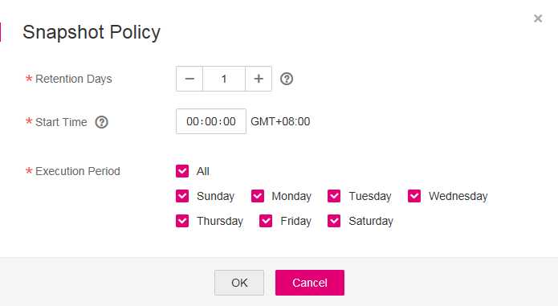

# Setting the Automated Snapshot Policy

This section describes how to set the automated snapshot policy for a cluster. After the automated snapshot policy is enabled, the system automatically creates snapshots based on the preset time and period.

## Setting the Automated Snapshot Policy

1.  Log in to the DWS management console.
2.  In the navigation tree on the left, click  **Cluster Management**.
3.  In the cluster list, click the name of the cluster that you want to view. Then click  **Snapshots**.
4.  On the  **Snapshots**  page, click the  **Automated Snapshot Status**  switch to enable the policy. The  **Snapshot Policy**  page is displayed.
    -     indicates that the policy is enabled.
    -     indicates that the policy is disabled \(default\).

5.  On the  **Snapshot Policy**  page, configure the following parameters:

    **Figure  1**  View of configuring the snapshot policy  
    

      

    **Table  1**  Parameter description

    
    <table><thead align="left"><tr id="row555312181040"><th class="cellrowborder" valign="top" width="28.000000000000004%" id="mcps1.2.3.1.1">
<strong id="b84235270692541">Parameter</strong>

    </th>
    <th class="cellrowborder" valign="top" width="72%" id="mcps1.2.3.1.2">
<strong id="b842352706181449">Description</strong>

    </th>
    </tr>
    </thead>
    <tbody><tr id="row155542181842"><td class="cellrowborder" valign="top" width="28.000000000000004%" headers="mcps1.2.3.1.1 ">
Retention Days

    </td>
    <td class="cellrowborder" valign="top" width="72%" headers="mcps1.2.3.1.2 ">
It is used to set the retention days of the snapshots that are automatically created. The value ranges from 1 to 10 days.

    
 NOTE: 

You cannot delete the snapshots that are automatically created. The system automatically deletes these snapshots when their retention duration expires.

    

    </td>
    </tr>
    <tr id="row7556518248"><td class="cellrowborder" valign="top" width="28.000000000000004%" headers="mcps1.2.3.1.1 ">
Start Time

    </td>
    <td class="cellrowborder" valign="top" width="72%" headers="mcps1.2.3.1.2 ">
It is used to set the time when the automatic snapshot creation begins. The time must be set to an integer. The automatic creation task is triggered within one hour after the creation start time you set. 

    </td>
    </tr>
    <tr id="row35566181148"><td class="cellrowborder" valign="top" width="28.000000000000004%" headers="mcps1.2.3.1.1 ">
Execution Period

    </td>
    <td class="cellrowborder" valign="top" width="72%" headers="mcps1.2.3.1.2 ">
It is used to set the automatic snapshot creation cycle.

    </td>
    </tr>
    </tbody>
    </table>

6.  Click  **OK**.
7.  \(Optional\) Click  **Modify Snapshot Policy**  to modify the automatic creation policy you have enabled.

