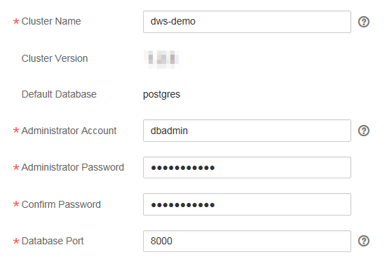
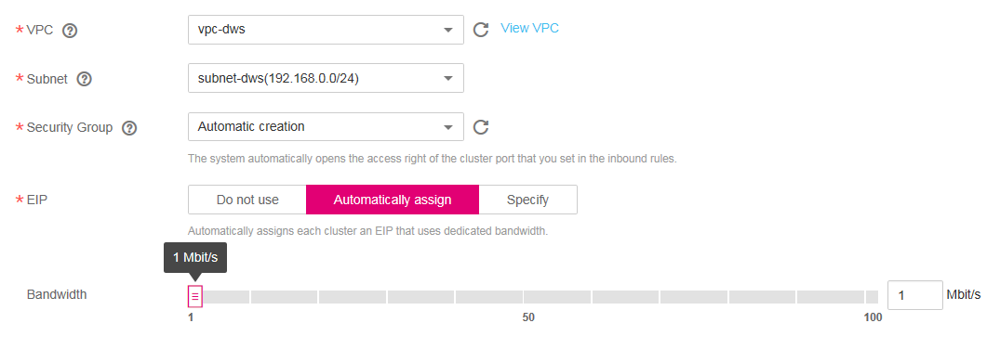

# Step 2: Creating a Cluster

Before using DWS to execute data analysis tasks, you need to create a data warehouse cluster. A cluster consists of multiple nodes in the same subnet. These nodes together provide services. To create a cluster, perform the following steps:

## Creating a Cluster

1.  Log in to the management console at  [https://console.otc.t-systems.com/dws/](https://console.otc.t-systems.com/dws/).
2.  On the  **Cluster Management**  page, click  **Create DWS Cluster**.
3.  Select the region to which the cluster to be created belongs.
    -   **Region**: Select  **eu-de**.
    -   **AZ**: Use the default value.

4.  Configure node-related parameters.

    -   **Node Flavor**: Retain the default value.
    -   **Nodes**: Retain the default value. At least  **3**  nodes are required.

    **Figure  1**  Configuring node-related parameters  
    

      

5.  Configure cluster-related parameters.

    -   **Cluster Name**: Enter  **dws-demo**. 
    -   **Administrator Account**: The default value is  **dbadmin**. Use the default value. After a cluster is created, the client uses this administrator account and its password to connect to the cluster's database.
    -   **Administrator Password**: Set the password.
    -   **Confirm Password**: Enter the administrator password again.
    -   **Database Port**: Use the default port number. This port is used by the client or application to connect to the cluster's database.

    **Figure  2**  Configuring the cluster  
    

      

6.  Configure network parameters.

    -   **VPC**: You can select an existing VPC from the drop-down list. If no VPC has been configured, click  **Create VPC**  to enter the VPC management console to create one, for example,  **vpc-dws**. Then, go back to the page for creating a cluster on the DWS management console, click    next to the  **VPC**  drop-down list, and select the new VPC.

        For details, see the  _Virtual Private Cloud User Guide_.

    -   **Subnet**: When you create a VPC, a subnet is created by default. You can select the corresponding subnet.
    -   **Security Group**: Select  **Automatic creation**.

        The automatically created security group is named  **dws-<_cluster name_\>-<_cluster database port_\>**. The outbound allows all access requests, while the inbound opens only the  **Database Port**  to allow access requests from clients or applications.

    -   **EIP**: Select  **Automatically assign**  to apply for an EIP as the cluster's public network IP address, and set its  **Bandwidth**.

    **Figure  3**  Configuring the network  
    

7.  Select  **Default**  for  **Advanced Settings**  in this example.
    -   **Default**: Indicates that the following advanced settings use the default configurations.
        -   **Parameter Group**: The default database parameter group is associated with the cluster.
        -   **Tag**: By default, no tag is added to the cluster.
        -   **Automated Snapshot**: By default, the policy for automatically generating cluster snapshots is disabled.

    -   **Custom**: If you select this option, the parameter group, tag, and automated snapshot settings are displayed on the page. You can customize these settings.

8.  Click  **Create Now**. The  **Details**  page is displayed.
9.  Click  **Submit**.

    After the submission,  **Cluster Status**  of the newly created cluster is  **Creating**. Wait several minutes. Clusters in the  **Available**  state are ready for use.

