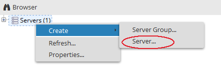
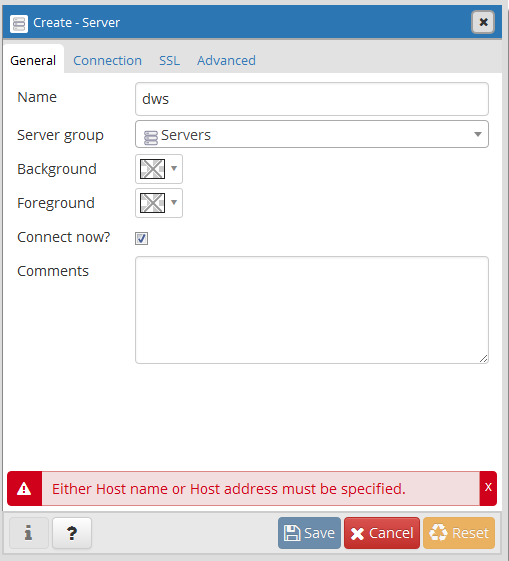
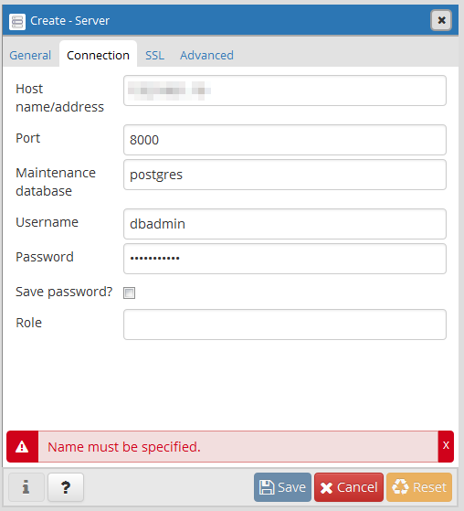
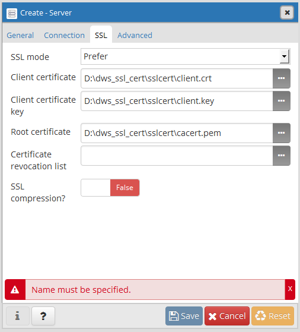
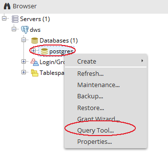
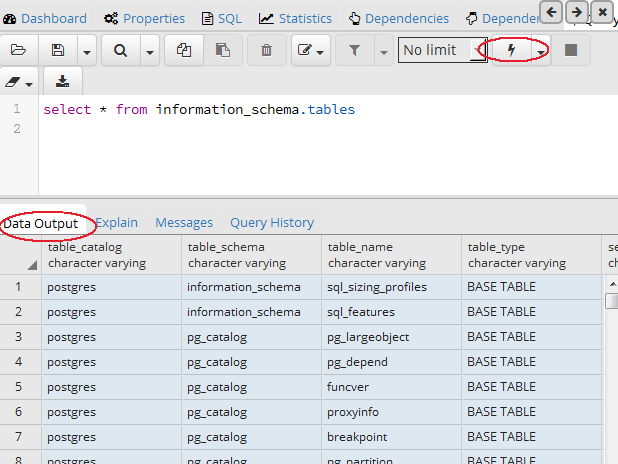

# Using pgAdmin to Connect to a Cluster

PgAdmin is a common open source PostgreSQL client tool. For more open source client tools supported by DWS, see section  [Open Source Clients Supported by DWS](using-pgadmin-to-connect-to-a-cluster.md#section6082040915224).

This section describes how to use the pgAdmin client \(in Windows OS\) to connect to a cluster.

## Open Source Clients Supported by DWS

This section describes how to connect to a database through a database client after you have created a data warehouse cluster and before you use the cluster's database.

DWS supports the open-source PostgreSQL client. 

The following lists compatible open-source clients:

-   PostgreSQL psql 9.2.4 or later

    For more information, see  [https://www.postgresql.org/](https://www.postgresql.org/).

-   pgAdmin

    For more information, see  [https://www.pgadmin.org/](https://www.pgadmin.org/).

-   dbeaver

    For more information, see  [https://dbeaver.jkiss.org/download/](https://dbeaver.jkiss.org/download/).

## Preparations Before Connecting to a Cluster

-   An EIP has been bound to the data warehouse cluster.
-   You have obtained the administrator username and password for logging in to the database in the data warehouse cluster.
-   You have obtained the public network address, including the IP address and port number in the data warehouse cluster. For details, see  [Obtaining the Cluster Connection Address](obtaining-the-cluster-connection-address.md).
-   You have configured the security group to which the data warehouse cluster belongs and added a rule that allows users' IP addresses to access ports using the TCP.

    For details, see section  **Adding a Security Group Rule**  in the  _Virtual Private Cloud User Guide_.

## Using pgAdmin to Connect to a Cluster

On DWS, you can connect to the database in a cluster using pgAdmin over the Internet. In the following operations, the pgAdmin client is used as an example in the Windows operating system.

1.  Visit  [https://www.pgadmin.org/download/](https://www.pgadmin.org/download/)  to download a proper pgAdmin client.

    You are advised to download the latest version of the client. The following uses the pgAdmin 4 English version as an example. 

2.  Install the pgAdmin client.
3.  Open the installed pgAdmin client.
4.  In the navigation tree on the left, choose  **Servers \> Create \> Server**.

    **Figure  1**  Create Server  
    

5.  On the  **General**  tab page of the window for creating a server connection, enter a value in  **Name**.

    **Figure  2**  Create Server - General  
    

6.  On the  **Connection**  tab page, enter the following cluster information.

    -   **Host name/address**: Enter the cluster's access address. Obtain the cluster's  **Public Network Address**  and  **Public Network Domain Name**  or  **Private Network Address**  and  **Private Network Domain Name**. For details, see section  [Obtaining the Cluster Connection Address](obtaining-the-cluster-connection-address.md). In this example, enter the  **Public Network Address**.
    -   **Port**: Enter the cluster's port number.
    -   **Maintenance database**: Enter the name of the database to be connected. If you use the client to connect to the cluster for the first time, enter the default database  **postgres**.
    -   **Username**: Enter the username of the cluster's database. If you use the client to connect to the cluster for the first time, set this parameter to the default administrator configured during cluster creation, for example,  **dbadmin**.
    -   **Password**: Enter the password of the corresponding database user.

    **Figure  3**  Create Server - Connection  
    

7.  \(Optional\) On the  **SSL**  tab page, enter the cluster information. The SSL connection mode delivers higher security than the common mode. You are advised to use the SSL mode on the client.

    Download the SSL certificate. For details, see section  [Downloading the SSL Certificate File](downloading-the-ssl-certificate-file.md). Then, decompress the certificate file to the specified path.

    -   **SSL mode**: Select an SSL mode from the drop-down list. Possible values are  **Allow**,  **Prefer**,  **Require**,  **Disable**, and  **Verify-CA**  \(DWS does not support the  **Verify-Full**  mode\). If  **SSL mode**  is set to  **Verify-CA**, the root certificate is required.
    -   **Client certificate**: Click    and select the  **sslcert\\client.crt**  file in the decompressed directory.
    -   **Client certificate key**: Click    and select the  **sslcert\\client.key**  file in the decompressed directory.
    -   **Root certificate**: Based on the selected  **SSL Mode**, click    and select the  **sslcert\\cacert.pem**  file in the decompressed directory.
    -   \(Optional\)  **Certificate revocation list**: List of revoked digital certificates. It is a list consisting of timestamps of all authentications that are abolished by the authentication center.
    -   **SSL compression**: Whether to enable the certificate compression transmission. Select  **True**  to enable the compression transmission, and select  **False**  to disable the compressed transmission. In this example, select  **False**  \(default value\).

        **Figure  4**  Create Server - SSL  
        

8.  After the connection configuration is complete, click  **Save**.

    The system attempts to connect to the cluster's database. After the connection is successful, the newly created DWS database is displayed in the navigation tree on the left.

9.  Expand the navigation tree on the left to the database node, right-click  **postgres**  and choose  **Query Tool**  from the shortcut menu.

    **Figure  5**  Opening the Query Tool  
    

10. On the Query Tool page, enter the following query command, and then click    or press  **F5**  to check whether the connection is successful.

    **select \* from information\_schema.tables**

    If the connection is successful, the  **Data Output**  tab page displays a series of records.

    **Figure  6**  Checking whether the connection is successful  
    

