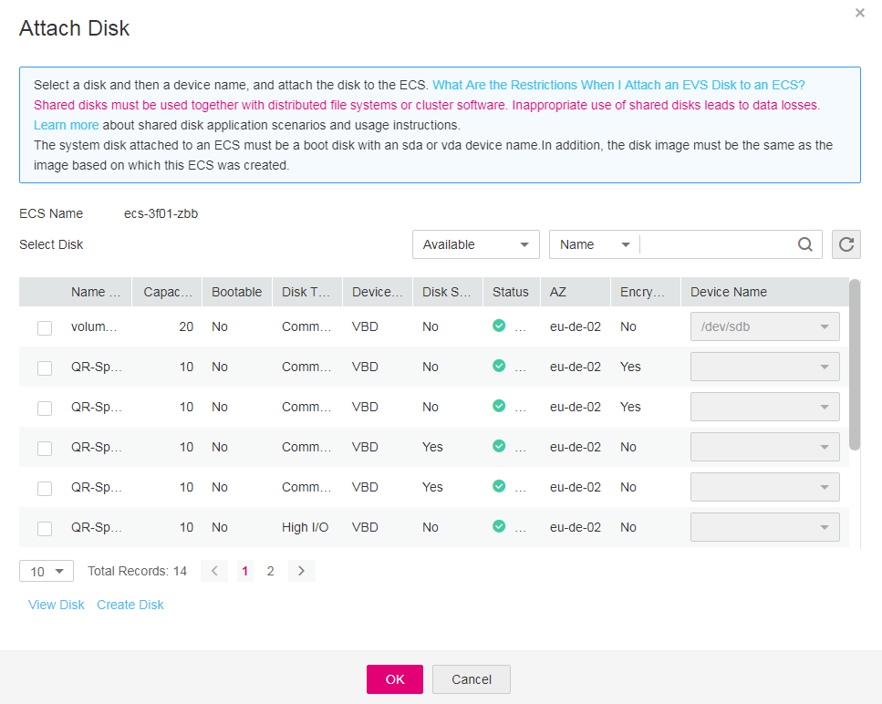

# Attaching an EVS Disk to an ECS

## Scenarios

If the existing disks of an ECS fail to meet service requirements, for example, due to insufficient disk space or poor disk performance, you can attach more available EVS disks to the ECS, or create more disks \(**Storage**  \>  **Elastic Volume Service**\) and attach them to the ECS.

## Prerequisites

-   EVS disks are available.

    For instructions about how to create an EVS disk, see "Creating an EVS Disk" in  _Elastic Volume Service User Guide_.

## Procedure

1.  Log in to the management console.
2.  Click    in the upper left corner and select the desired region and project.
3.  Under  **Computing**, click  **Elastic Cloud Server**.
4.  In the search box above the upper right corner of the ECS list, enter the ECS name, IP address, or ID for search.
5.  Click the name of the target ECS.

    The page providing details about the ECS is displayed.

6.  Click the  **Disks**  tab. Then, click  **Attach Disk**.

    The  **Attach Disk**  dialog box is displayed.

    **Figure  1**  Attach Disk  
    

7.  Select the target disk and set the device name as prompted.

    Device names are as follows:

    -   For Xen ECSs, you can specify the device name of a disk, such as  **/dev/sdb**.
    -   For KVM ECSs, you can specify a disk as a system disk or data disk but cannot specify a device name for the disk.

    > **NOTE:**   
    >-   If no EVS disks are available, click  **Create Disk**  in the lower part of the list.  
    >-   For details about restrictions on attaching a disk, see  [What Are the Restrictions on Attaching an EVS Disk to an ECS?](what-are-the-restrictions-on-attaching-an-evs-disk-to-an-ecs.md)  
    >-   The device names for the local disks and EVS disks mounted to a disk-intensive ECS comply with the following rules:  
    >    -   System disk: Use sda or vda.  
    >    -   Local disk: Use the device name following sda or vda in alphabetical order.  
    >    -   EVS disk: Use the device name added in alphabetical order following those used by local disks.  
    >    An example is provided as follows:  
    >    A D1 ECS has two local disks. The device names of the two local disks are sdb and sdc \(or vdb and vdc\), and the device names of the EVS disks are sdd, sde, ... \(or vdd, vde, ...\).  

8.  Click  **OK**.

    After the disk is attached, you can view the information about it on the  **Disks**  tab.

    **Figure  2**  Viewing the newly attached disk  
    

## Follow-up Procedure

If the attached disk is newly created, the disk can be used only after it is initialized. For instructions about how to initialize a data disk, see  [Scenarios and Disk Partitions](scenarios-and-disk-partitions.md).

