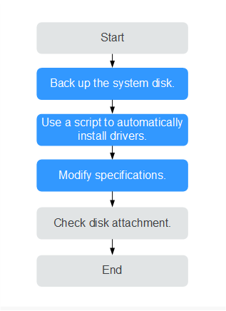
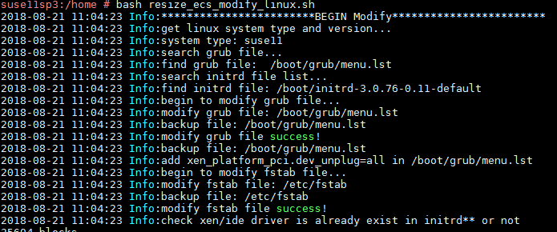

# Automatically Changing a Xen ECS to a KVM ECS \(Linux\)

## Scenarios

Before changing a Xen ECS running Linux to a KVM ECS, make sure that the desired drivers have been installed on the ECS and that the ECS has been configured.

This section describes how to use a script to automatically install drivers on the ECS, configure the device name, and change Xen to KVM.

> **NOTE:**   
>-   Xen ECSs include S1, C1, C2, and M1 ECSs.  
>-   To obtain KVM ECSs, see the  **Virtualization Type**  column in  [ECSs](ecs-specifications.md).  
>-   To support both Xen and KVM, Linux ECSs require the xen-pv and Virtio drivers. Before changing a Xen ECS to a KVM ECS, make sure that the Linux ECS has been configured, including installing drivers and configuring automatic disk attachment.  

## Constraints

-   If a Linux ECS is attached with a logical LVM disk or a RAID disk array consisting of multiple physical disks, the ECS specifications cannot be modified. Otherwise, data may be lost.
-   A Xen ECS with more than 24 VBD disks attached cannot be changed to a KVM ECS.
-   A Xen ECS can be changed to a KVM ECS, but a KVM ECS cannot be changed to a Xen ECS.

## Procedure

[Figure 1](#fig1685151934912)  shows the flowchart for automatically changing a Xen ECS to a KVM ECS.

**Figure  1**  Flowchart for automatically changing a Xen ECS to a KVM ECS  

**Table  1**  OSs that support automatic configuration using a script

<table><thead align="left"><tr id="row1446115171116"><th class="cellrowborder" valign="top" width="41.21%" id="mcps1.2.3.1.1">
OS

</th>
<th class="cellrowborder" valign="top" width="58.79%" id="mcps1.2.3.1.2">
Version

</th>
</tr>
</thead>
<tbody><tr id="row3446155111113"><td class="cellrowborder" valign="top" width="41.21%" headers="mcps1.2.3.1.1 ">
CentOS

</td>
<td class="cellrowborder" valign="top" width="58.79%" headers="mcps1.2.3.1.2 "><ul id="ul1571531819322"><li>CentOS 7</li><li>CentOS 6</li></ul>
</td>
</tr>
<tr id="row04461351201115"><td class="cellrowborder" valign="top" width="41.21%" headers="mcps1.2.3.1.1 ">
Debian

</td>
<td class="cellrowborder" valign="top" width="58.79%" headers="mcps1.2.3.1.2 "><ul id="ul1975518595322"><li>Debian 9</li><li>Debian 8</li></ul>
</td>
</tr>
<tr id="row044655111114"><td class="cellrowborder" valign="top" width="41.21%" headers="mcps1.2.3.1.1 ">
EulerOS

</td>
<td class="cellrowborder" valign="top" width="58.79%" headers="mcps1.2.3.1.2 "><ul id="ul55051414343"><li>EulerOS 2</li></ul>
</td>
</tr>
<tr id="row11446151131118"><td class="cellrowborder" valign="top" width="41.21%" headers="mcps1.2.3.1.1 ">
OpenSUSE

</td>
<td class="cellrowborder" valign="top" width="58.79%" headers="mcps1.2.3.1.2 "><ul id="ul1088512663414"><li>OpenSUSE 42</li><li>OpenSUSE 15</li></ul>
</td>
</tr>
<tr id="row64474513111"><td class="cellrowborder" valign="top" width="41.21%" headers="mcps1.2.3.1.1 ">
SUSE

</td>
<td class="cellrowborder" valign="top" width="58.79%" headers="mcps1.2.3.1.2 "><ul id="ul237783293420"><li>SUSE 15</li><li>SUSE 12</li><li>SUSE 11</li></ul>
</td>
</tr>
<tr id="row37671195362"><td class="cellrowborder" valign="top" width="41.21%" headers="mcps1.2.3.1.1 ">
SUSE-SAP

</td>
<td class="cellrowborder" valign="top" width="58.79%" headers="mcps1.2.3.1.2 "><ul id="ul28601351153411"><li>SUSE-SAP 12</li></ul>
</td>
</tr>
<tr id="row167687194367"><td class="cellrowborder" valign="top" width="41.21%" headers="mcps1.2.3.1.1 ">
Ubuntu

</td>
<td class="cellrowborder" valign="top" width="58.79%" headers="mcps1.2.3.1.2 "><ul id="ul8168132620357"><li>Ubuntu 18.04</li><li>Ubuntu 16.04</li><li>Ubuntu 14.04</li></ul>
</td>
</tr>
<tr id="row1276871910366"><td class="cellrowborder" valign="top" width="41.21%" headers="mcps1.2.3.1.1 ">
Red Hat

</td>
<td class="cellrowborder" valign="top" width="58.79%" headers="mcps1.2.3.1.2 "><ul id="ul747716398357"><li>Red Hat 7</li><li>Red Hat 6</li></ul>
</td>
</tr>
<tr id="row1293153833611"><td class="cellrowborder" valign="top" width="41.21%" headers="mcps1.2.3.1.1 ">
Fedora

</td>
<td class="cellrowborder" valign="top" width="58.79%" headers="mcps1.2.3.1.2 "><ul id="ul78139293613"><li>Fedora 29</li><li>Fedora 28</li><li>Fedora 27</li><li>Fedora 26</li></ul>
</td>
</tr>
<tr id="row19400164913364"><td class="cellrowborder" valign="top" width="41.21%" headers="mcps1.2.3.1.1 ">
Oracle Linux

</td>
<td class="cellrowborder" valign="top" width="58.79%" headers="mcps1.2.3.1.2 "><ul id="ul6707122793617"><li>Oracle Linux 7</li></ul>
</td>
</tr>
</tbody>
</table>

[Table 2](#table128603262223)  describes the operations.

**Table  2**  Procedure for automatically changing a Xen ECS to a KVM ECS using a script

<table><thead align="left"><tr id="row198591826152211"><th class="cellrowborder" valign="top" width="35.4%" id="mcps1.2.3.1.1">
Step

</th>
<th class="cellrowborder" valign="top" width="64.60000000000001%" id="mcps1.2.3.1.2">
Operation

</th>
</tr>
</thead>
<tbody><tr id="row108591226182214"><td class="cellrowborder" valign="top" width="35.4%" headers="mcps1.2.3.1.1 ">
1

</td>
<td class="cellrowborder" valign="top" width="64.60000000000001%" headers="mcps1.2.3.1.2 ">
<a href="#section125278281411">(Optional) Step 1: Back Up System Disk Data</a>

</td>
</tr>
<tr id="row18859122662211"><td class="cellrowborder" valign="top" width="35.4%" headers="mcps1.2.3.1.1 ">
2

</td>
<td class="cellrowborder" valign="top" width="64.60000000000001%" headers="mcps1.2.3.1.2 ">
<a href="#section2599649145513">Step 2: Using a Script to Automatically Install Drivers</a>

</td>
</tr>
<tr id="row19859122619222"><td class="cellrowborder" valign="top" width="35.4%" headers="mcps1.2.3.1.1 ">
3

</td>
<td class="cellrowborder" valign="top" width="64.60000000000001%" headers="mcps1.2.3.1.2 ">
<a href="#section1815152131917">Step 3: Modify Specifications</a>

</td>
</tr>
<tr id="row1186042632210"><td class="cellrowborder" valign="top" width="35.4%" headers="mcps1.2.3.1.1 ">
4

</td>
<td class="cellrowborder" valign="top" width="64.60000000000001%" headers="mcps1.2.3.1.2 ">
<a href="#section2625525131519">(Optional) Step 4: Check Disk Attachment</a>

</td>
</tr>
</tbody>
</table>

## \(Optional\) Step 1: Back Up System Disk Data

Before modifying the specifications, back up the system disk and install the driver on the ECS. Otherwise, the ECS will be unavailable after the modification is performed. If the ECS becomes unavailable, the fault can be rectified by reinstalling the OS, which may cause data loss in your system disk.

For instructions about how to back up the system disk, see "Getting Started \>  [Creating a VBS Backup](https://docs.otc.t-systems.com/en-us/usermanual/vbs/en-us_topic_0015667820.html)" in  _Volume Backup Service User Guide_.

## Step 2: Using a Script to Automatically Install Drivers

Perform the operations described in this section if your ECS supports the configuration using a script. If your ECS does not support this mode, manually configure it. For details, see  [Manually Changing a Xen ECS to a KVM ECS \(Linux\)](manually-changing-a-xen-ecs-to-a-kvm-ecs-(linux).md).

> **NOTE:**   
>For details about the ECSs supporting the configuration using a script, see  [Procedure](#section117911026122211).  

1.  Log in to the ECS.
2.  Run the following command to download the driver installation script to the  **root**  directory:

    **curl** _URL_ **\> \~/resize\_ecs\_modify\_linux.sh**

    In the preceding command,  _URL_  is the address for downloading the specifications modification script.

    URL:  [http://ecs-instance-driver.obs.eu-de.otc.t-systems.com/resize\_ecs\_modify\_linux.sh](http://ecs-instance-driver.obs.eu-de.otc.t-systems.com/resize_ecs_modify_linux.sh)

3.  Run the following command to execute the script which automatically checks and installs the native Xen PV driver and virtio driver:

    **bash resize\_ecs\_modify\_linux.sh**

    **Figure  2**  Executing the script  
    

4.  Wait until the script execution is complete. If the message "\{_Image name_\} already contain xen and virtio driver" is displayed, the driver has been installed.

    Perform the operations described in  [Step 3: Modify Specifications](#section1815152131917). Otherwise, execute the script again or contact customer service for technical support.

    **Figure  3**  Successful script execution  
    

    > **NOTE:**   
    >-   Make sure that the ECS has been configured successfully. Otherwise, the ECS will be unavailable after the modification is performed. If the operation failed, follow the instructions provided in  [Manually Changing a Xen ECS to a KVM ECS \(Linux\)](manually-changing-a-xen-ecs-to-a-kvm-ecs-(linux).md)  for manual operations.  
    >-   FAQs related to a script installation failure:  
    >    -   [What Should I Do If Executing a Driver Installation Script Failed on an ECS Running CentOS 5?](what-should-i-do-if-executing-a-driver-installation-script-failed-on-an-ecs-running-centos-5.md)  
    >    -   [What Should I Do If Executing a Driver Installation Script Failed When I Attempted to Modify the Specifications of a Linux ECS?](what-should-i-do-if-executing-a-driver-installation-script-failed-when-i-attempted-to-modify-the-spe.md)  

## Step 3: Modify Specifications

1.  Log in to management console.
2.  Click    in the upper left corner and select the desired region and project.
3.  Under  **Computing**, click  **Elastic Cloud Server**.
4.  On the  **Elastic Cloud Server**  page, view the status of the target ECS.

    If the ECS is not in  **Stopped**  state, click  **More**  in the  **Operation**  column and select  **Stop**.

5.  Click  **More**  in the  **Operation**  column and select  **Modify Specifications**.

    The  **Modify ECS Specifications**  page is displayed.

6.  Select the new ECS type, vCPUs, and memory as prompted.
7.  \(Optional\) Set  **DeH**.

    If the ECS is created on a DeH, the system allows you to change the DeH.

    To do so, select the target DeH from the drop-down list. If no DeH is available in the drop-down list, remaining DeH resources are insufficient and cannot be used to create the ECS with specifications modified.

8.  Select the check box to confirm the ECS configuration.
9.  Click  **OK**.

## \(Optional\) Step 4: Check Disk Attachment

After a Xen ECS is changed to a KVM ECS, disk attachment may fail. Therefore, check disk attachment after specifications modification. If disks are properly attached, the specifications modification is successful.

-   Linux

    For details, see  [What Should I Do If the Disk of a Linux ECS Becomes Offline After the ECS Specifications Are Modified?](what-should-i-do-if-the-disk-of-a-linux-ecs-becomes-offline-after-the-ecs-specifications-are-modifie.md)

## Follow-up Procedure

If the ECS with specifications modified is displayed in the ECS list but its OS cannot be started after the ECS is remotely logged in, reinstall the ECS OS to rectify this fault. For details, see  [Reinstalling the OS](reinstalling-the-os.md).

