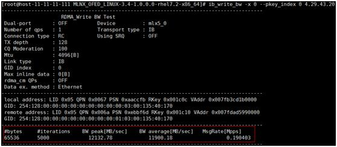

# How Can I Check Whether the Network Communication Between Two ECSs Equipped with an InfiniBand NIC Driver Is Normal?

For high-performance H2 ECSs equipped with an InfiniBand NIC driver \(InfiniBand ECSs for short\), perform the following operations to check whether the driver installation is successful and whether the network communication between the ECSs is normal.

> **NOTE:**   
>During the check, if your ECS has no command tool installed, such as ibstat, obtain the tool from the installation package for the InfiniBand NIC driver and install the tool.  

1.  Check whether the NICs of the InfiniBand ECSs are functional.
    1.  Log in to an ECS.
    2.  Run the following command to check whether the NIC is functional:

        **ibstat**

        -   If yes, go to  [2](#li2420713023281).
        -   If no, contact technical support.

2.  Check whether the network communication between two InfiniBand ECSs is normal.
    1.  Log in to one InfiniBand ECS and run the following command:

        **ib\_write\_bw -x 0 --pkey\_index 0**

    2.  Log in to the other InfiniBand ECS and run the following command:

        **ib\_write\_bw -x 0 --pkey\_index 0**_ip\_addr_

        In the preceding command,  _ip\_addr_  is the NIC IP address of the first InfiniBand ECS.

    3.  Check whether the terminal display is correct.

        **Figure  1**  Normal network communication  
        

        -   If the terminal display is shown in  [Figure 1](#fig13564645028), the network communication between the two InfiniBand ECSs is normal.
        -   If the network communication is abnormal, contact technical support.

