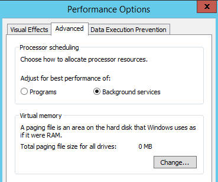
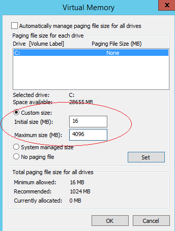

# How Can I Enable Virtual Memory on a Windows ECS?

Enabling ECS virtual memory will deteriorate disk I/O performance. Therefore, the Windows ECSs provided by the platform do not have virtual memory enabled by default. If the memory size of an ECS is insufficient, you are advised to increase its memory size by modifying the ECS specifications. Perform the operations described in this section to enable virtual memory if required.

> **NOTE:**   
>If the memory usage is excessively high and the I/O performance is not as good as expected, you are not suggested to enable virtual memory. The reason is as follows: The excessively high memory usage limits the system performance improvement. Furthermore, frequent memory switching requires massive additional I/O operations, which will further deteriorate the I/O performance and the overall system performance.  

The operations described in this section are provided for the ECSs running Windows Server 2008 or later.

1.  Right-click  **Computer**  and choose  **Properties**  from the shortcut menu.
2.  In the navigation pane on the left, choose  **Advanced system settings**.

    The  **System Properties**  dialog box is displayed.

3.  Click the  **Advanced**  tab and then  **Settings**  in the  **Performance**  pane.

    The  **Performance Options**  dialog box is displayed.

    **Figure  1**  Performance Options  
    

4.  Click the  **Advanced**  tab and then  **Background Services**  in the  **Processor scheduling**  pane.
5.  Click  **Change**  in the  **Virtual memory**  pane.

    The  **Virtual Memory**  dialog box is displayed.

6.  Configure virtual memory based on service requirements.

    -   **Automatically manage paging file size for all drives**: Deselect the check box.
    -   **Drive**: Select the drive where the virtual memory file is stored.

        You are advised not to select the system disk to store the virtual memory.

    -   **Custom size**: Select  **Custom size**  and set  **Initial size**  and  **Maximum size**.

        Considering  **Memory.dmp**  caused by blue screen of death \(BSOD\), you are advised to set  **Initial size**  to  **16**  and  **Maximum size**  to  **4096**.

    **Figure  2**  Virtual Memory  
    

7.  Click  **Set**  and then  **OK**  to complete the configuration.
8.  Restart the ECS for the configuration to take effect.

