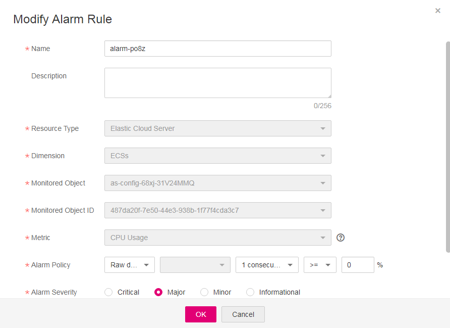

# Setting Alarm Rules

## Scenarios

Setting ECS alarm rules allows you to customize the monitored objects and notification policies and determine the running statuses of your ECSs at any time.

This section describes how to set ECS alarm rules, including alarm rule names, monitoring objects, monitoring metrics, alarm thresholds, monitoring intervals, and notifications.

## Procedure

1.  Log in to the management console.
2.  Click    in the upper left corner and select the desired region and project.
3.  Under  **Management & Deployment**, click  **Cloud Eye**.
4.  In the navigation pane on the left, choose  **Alarm Management**  \>  **Alarm Rules**.
5.  On the  **Alarm Rules**  page, click  **Create Alarm Rule**  to create an alarm rule, or modify an existing alarm rule.

    The following operations use modifying an existing alarm rule as an example.

    1.  Click the target alarm rule.
    2.  Click  **Modify**  in the upper right corner of the page.
    3.  In the  **Modify Alarm Rule**  dialog box shown in  [Figure 1](#fig5398007222382), set the parameters as prompted.

        **Figure  1**  Modifying an alarm rule  
        

    4.  Click  **OK**.

        After an alarm rule is modified, the system automatically notifies you of an alarm when the alarm complying with the alarm rule is generated.

    > **NOTE:**   
    >For more information about ECS alarm rules, see  _Cloud Eye User Guide_.  

