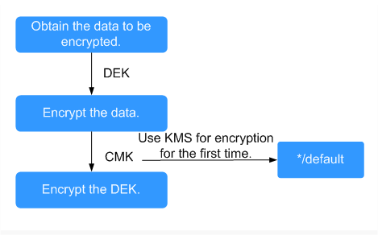

# User Encryption

User encryption allows you to use the encryption feature provided on the public cloud platform to encrypt ECS resources, improving data security. User encryption includes image encryption and EVS disk encryption.

## Image Encryption

Image encryption supports encrypting private images. When creating an ECS, if you select an encrypted image, the system disk of the created ECS is automatically encrypted, improving data security.

Use either of the following methods to create an encrypted image:

-   Use an existing encrypted ECS.
-   Use an external image file.

For more information about image encryption, see  _Image Management Service User Guide_.

## EVS Disk Encryption

EVS disk encryption supports system disk encryption and data disk encryption.

-   When creating an ECS, you can encrypt added data disks.
-   When creating an ECS, if you select an encrypted image, the system disk of the created ECS automatically has encryption enabled, and the encryption mode complies with the image encryption mode.

For more information about EVS disk encryption, see  _Elastic Volume Service User Guide_.

## Impact on AS

If you use an encrypted ECS to create an Auto Scaling \(AS\) configuration, the encryption mode of the created AS configuration complies with the ECS encryption mode.

## About Keys

The key used for encryption relies on the Key Management Service \(KMS\). KMS uses a data encryption key \(DEK\) to encrypt data and a customer master key \(CMK\) to encrypt the DEK.

**Figure  1**  Data encryption process  

[Table 1](#table58453122162120)  describes the keys involved in the data encryption process.

**Table  1**  Keys

<table><thead align="left"><tr id="row6497527162120"><th class="cellrowborder" valign="top" width="19.05%" id="mcps1.2.4.1.1">
Name

</th>
<th class="cellrowborder" valign="top" width="51.190000000000005%" id="mcps1.2.4.1.2">
Description

</th>
<th class="cellrowborder" valign="top" width="29.759999999999998%" id="mcps1.2.4.1.3">
Function

</th>
</tr>
</thead>
<tbody><tr id="row58635137174217"><td class="cellrowborder" valign="top" width="19.05%" headers="mcps1.2.4.1.1 ">
DEK

</td>
<td class="cellrowborder" valign="top" width="51.190000000000005%" headers="mcps1.2.4.1.2 ">
An encryption key that is used for encrypting data.

</td>
<td class="cellrowborder" valign="top" width="29.759999999999998%" headers="mcps1.2.4.1.3 ">
Encrypts specific data.

</td>
</tr>
<tr id="row58688680162120"><td class="cellrowborder" valign="top" width="19.05%" headers="mcps1.2.4.1.1 ">
CMK

</td>
<td class="cellrowborder" valign="top" width="51.190000000000005%" headers="mcps1.2.4.1.2 ">
An encryption key created using KMS for encrypting DEKs.

A CMK can encrypt multiple DEKs.

</td>
<td class="cellrowborder" valign="top" width="29.759999999999998%" headers="mcps1.2.4.1.3 ">
Supports CMK disabling and scheduled deletion.

</td>
</tr>
<tr id="row16784881174432"><td class="cellrowborder" valign="top" width="19.05%" headers="mcps1.2.4.1.1 ">
Default CMK

</td>
<td class="cellrowborder" valign="top" width="51.190000000000005%" headers="mcps1.2.4.1.2 ">
A master key automatically generated by the system when you use KMS for encryption for the first time.

The name extension of a default CMK is <strong id="b842352706112532">/default</strong>, for example, <strong id="b842352706235235">evs/default</strong>.

</td>
<td class="cellrowborder" valign="top" width="29.759999999999998%" headers="mcps1.2.4.1.3 "><ul id="ul1649396175041"><li>Supports viewing details of the default CMK on the KMS console.</li><li>Does not support CMK disabling or scheduled deletion.</li></ul>
</td>
</tr>
</tbody>
</table>

> **NOTE:**   
>After disabling a CMK or scheduling the deletion of a CMK takes effect, the EVS disk encrypted using this CMK can still be used until the disk is detached from and then attached to an ECS again. During this process, the disk fails to be attached to the ECS because the CMK cannot be obtained. Therefore, the EVS disk becomes unavailable.  

For details about KMS, see  _Key Management Service User Guide_.

