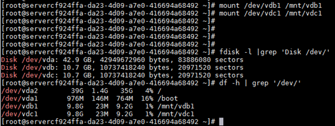

# What Should I Do If the Disk of a Linux ECS Becomes Offline After the ECS Specifications Are Modified?

## Scenarios

After Linux ECS specifications are modified, disk attachment may fail. Therefore, check disk attachment after specifications modification. This section describes how to check disk attachment after ECS specifications are modified.

## Procedure

1.  Log in to the ECS as user  **root**.
2.  Run the following command to view the disks attached before specifications modification:

    **fdisk -l** **| grep 'Disk /dev/'**

    **Figure  1**  Viewing disks attached before specifications modification  
    

    As shown in  [Figure 1](#en-us_topic_0120890833_fig10595124010458), the ECS has three disks attached:  **/dev/vda**,  **/dev/vdb**, and  **/dev/vdc**.

3.  Run the following command to view disks attached after specifications modification:

    **df -h| grep '/dev/'**

    **Figure  2**  Viewing disks attached after specifications modification  
    

    As shown in  [Figure 2](#en-us_topic_0120890833_fig692535712437), only one disk  **/dev/vda**  is attached to the ECS.

4.  Check whether the number of disks obtained in step  [3](#en-us_topic_0120890833_li161843557534)  is the same as that obtained in step  [2](#en-us_topic_0120890833_li218141135312).
    -   If the numbers are the same, the disk attachment is successful. No further action is required.
    -   If the numbers are different, the disk attachment failed. In such a case, go to step  [5](#en-us_topic_0120890833_li1478325211557).

5.  Run the  **mount**  command to attach the affected disks.

    For example, run the following command:

    **mount /dev/vbd1 /mnt/vbd1**

    In the preceding command,  **/dev/vbd1**  is the disk to be attached, and  **/mnt/vbd1**  is the path for disk attachment.

    > **NOTICE:**   
    >Ensure that  **/mnt/vbd1**  is empty. Otherwise, the attachment will fail.  

6.  Run the following commands to check whether the numbers of disks before and after specifications modification are the same:

    **fdisk -l** **| grep 'Disk /dev/'**

    **df -h| grep '/dev/'**

    -   If the numbers are the same, no further action is required.
    -   If the numbers are different, contact customer service.

    **Figure  3**  Checking the number of disks attached  
    

    As shown in  [Figure 3](#en-us_topic_0120890833_fig722411124917), the numbers of disks before and after specifications modification are the same. The disks are  **/dev/vda**,  **/dev/vdb**, and  **/dev/vdc**.

