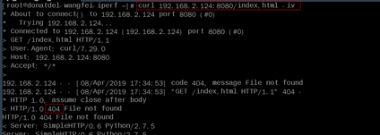
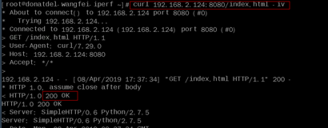

# How Do I Troubleshoot an Unhealthy Backend Server?<a name="EN-US_TOPIC_0091131429"></a>

## Scenarios<a name="section3890132962817"></a>

ELB uses heartbeats to monitor the health of backend servers over the private network. To ensure successful health checks, backend servers must be accessible from the private network. If a backend server is detected unhealthy, either the backend server is abnormal or the health check configuration is incorrect.

> **NOTE:**   
>-   When a backend server is detected unhealthy, the load balancer stops routing requests to this server.  
>-   When the health check function is disabled, the load balancer considers that all backend servers in the associated backend server group are healthy by default and still routes requests to these backend servers.  
>-   ELB uses IP addresses from 100.125.0.0/16 to perform health checks and route requests to backend servers.  

## View the Health Check Result<a name="section193727466285"></a>

-   Enhanced load balancer

    On the  **Load Balancers**  page, click the name of the target load balancer to view its details. On the displayed page, click  **Backend Server Groups**  and locate the target server group. In the  **Basic Information**  area, view the health check result in the list.

-   Classic Load Balancer

    On the  **Load Balancers**  page, click  **Classic**, click the name of the target load balancer to view its details. On the displayed page, click  **Listeners**, locate the target listener, and view the health check result.

    > **NOTE:**   
    >Traffic is not routed to a backend server with a weight of 0, and the health check result is meaningless.  


## Troubleshooting Procedure<a name="section9938957113014"></a>

If a backend server whose health check result is  **Unhealthy**, perform the following steps to locate the fault: 

1.  Check inbound security group rules.

    -   If a TCP, HTTP, or HTTPS listener is added, ensure that inbound rules of the security groups containing the backend servers to allow access from 100.125.0.0/16 and to allow TCP traffic from the health check port.

        You can check the protocol and port in the  **Configure Health Check**  dialog box.

        -   If no health check port is specified, allow traffic from the ports of backend servers.
        -   If a health check port different from the ports of backend servers is specified, allow traffic from both the health check port and backend server ports.

        **Figure  1**  Example inbound rule<a name="fig197011592098"></a>  
        

    -   For a UDP listener, configure an inbound rule for the health check protocol, port, and 100.125.0.0/16, and an inbound rule that allows ICMP traffic.

        **Figure  2**  Example inbound rule for ICMP traffic<a name="fig17524203061316"></a>  
        

    -   For classic load balancers working on a private network, add an inbound rule that allows TCP traffic from the health check port in the VPC CIDR block.

        **Figure  3**  Example inbound rule for TCP traffic within the VPC<a name="fig799111915411"></a>  
        

    > **NOTE:**   
    >-   Load balancers communicate with backend servers over 100.125.0.0/16. After traffic is routed to backend servers, source IP addresses are converted to IP addresses starting with 100.125, and the IP address of the node that initiates the health check is allocated from 100.125.0.0/16. Therefore, access to backend servers from this IP address range must be allowed.  
    >-   If you are not sure whether security group rules are correct, you can change the protocol and port range to  **All**  for testing.  

2.  Configure firewall rules.

    A firewall is an optional subnet-class security configuration. You can associate one or more subnets with a firewall for controlling traffic in and out of the subnets. Similar to security groups, firewalls provide access control functions, but add an additional layer of defense to your VPC. Default firewall rules reject all inbound and outbound traffic. If a firewall and load balancer reside in the same subnet, or the firewall and backend servers associated with the load balancer reside in the same subnet, the load balancer cannot receive traffic from the public or private network, or backend servers become unhealthy.

    You can configure an inbound firewall rule to permit access from 100.125.0.0/16.

    1.  Log in to the management console.
    2.  In the upper left corner of the page, click    and select the desired region and project.
    3.  On the console homepage, under  **Network**, click  **Virtual Private Cloud**.
    4.  In the navigation pane on the left, choose  **Access Control**  \>  **Firewalls**.
    5.  Locate the target firewall, and click the firewall name to switch to the page showing details of that particular firewall.
    6.  On the  **Inbound Rules**  or  **Outbound Rules**  tab page, click  **Add Rule**  to add an inbound or outbound rule.
        -   **Action**: Select  **Allow**.
        -   **Protocol**: The protocol must be the same as the frontend protocol set when the listener is added.
        -   **Source**: Set the value to  **100.125.0.0/16**.
        -   **Source Port Range**: Select the port range of the service.
        -   **Destination**: Enter default value  **0.0.0.0/0**, which indicates that traffic from all IP addresses is permitted.
        -   **Destination Port Range**: Select the port range of the service.
        -   **Description**: provides supplementary information about the firewall rule. This parameter is optional.

    7.  Click  **OK**.

3.  Check backend servers.
    -   Check the health check configuration on the management console.

        Classic load balancers: In the  **Listeners**  area of the target load balancer, locate the listener with an unhealthy health check and click  **View**  in the  **Health Check**  column. The  **Health Check**  dialog box is displayed. Check the following parameters:

        -   **Health Check Protocol/Port**
        -   **Check Path**. If HTTP is used for health checks, you must check this parameter. A simple static HTML file is recommended.

        Enhanced load balancers: Click the name of the target load balancer to view its details. Click  **Backend Server Groups**  and then click the name of the target server group. On the  **Basic Information**  page, click  **Configure**  on the right of  **Health Check**. Check the following parameters:

        -   **Protocol**
        -   **Port**
        -   **Check Path**. You must check this parameter if HTTP is used for health checks. A simple static HTML file is recommended.

    -   Alternatively, run the following command on the backend server to check whether its port is listened on:

        ```
        netstat -anlp | grep port
        ```

        If the command output contains the health check port and  **LISTEN**, the backend server port is listened on. If no health check port is specified, backend server ports are used by default.

        **Figure  4**  Backend server being listened on<a name="fig427134323510"></a>  
        

        **Figure  5**  Backend server not listened on<a name="fig1827264323517"></a>  
        

    -   For HTTP health checks, run the following command on the backend server to check the status code:

        ```
        curl Private IP address of the backend server:Health check port/Health check path -iv
        ```

        To perform an HTTP health check, the load balancer initiates a GET request to the backend server. If the following response status codes are displayed, the backend server is considered healthy:

        TCP listeners: 200

        Public network classic load balancers: 2xx or 3xx

        Enhanced load balancers: 200, 202, or 401

        **Figure  6**  Unhealthy backend server<a name="fig580175572317"></a>  
        

        **Figure  7**  Healthy backend server<a name="fig18012550238"></a>  
        

    -   If the HTTP health check is abnormal, configure a TCP health check.

        On the  **Listeners**  tab page, modify the target listener, select the backend server group for which TCP health check has been configured, or add a backend server group and select TCP as the health check protocol. After the configuration is complete, wait for a while and check the health check result.

4.  Check the firewall.

    The firewall or other security protection software on the backend servers may mask IP addresses in 100.125.0.0/16. Ensure that access from 100.125.0.0/16 is allowed in the security groups containing the backend servers.

5.  Check the route.

    Check whether the default route configured on the primary NIC \(for example, eth0\) is manually modified. If the default route is modified, health check packets may fail to reach the backend server.

    Run the following command on the backend server to check whether your default route points to the gateway. \(For Layer 3 communication, the default route must be configured to point to the gateway.\)

    ```
    ip route
    ```

    Alternatively, run the following command:

    ```
    route -n
    ```

    If the command output does not contain the highlighted route information or the IP address to which the route points is not the gateway address of the VPC subnet, change the route to the default one.

    **Figure  8**  Example that the default route points to the gateway<a name="fig918215421490"></a>  
    

    **Figure  9**  Example that the default route does not point to the gateway<a name="fig1818123519587"></a>  
    

6.  Check the application workloads on the backend servers. If the workloads are high, connections or requests for health check may time out.
7.  Verify that the  **/etc/hosts.deny**  file of the backend server contains IP addresses in 100.125.0.0/16.
8.  For UDP listeners, see  [What Are the Precautions of Using UDP?](what-are-the-precautions-of-using-udp.md)
9.  If the health check configuration is correct but the backend server is still detected unhealthy, contact customer service.

    > **NOTE:**   
    >It takes a while for the modification to take effect after you change the health check configuration. The required time depends on health check interval and timeout duration. You can view the health check result in the backend server list of target load balancer.  


