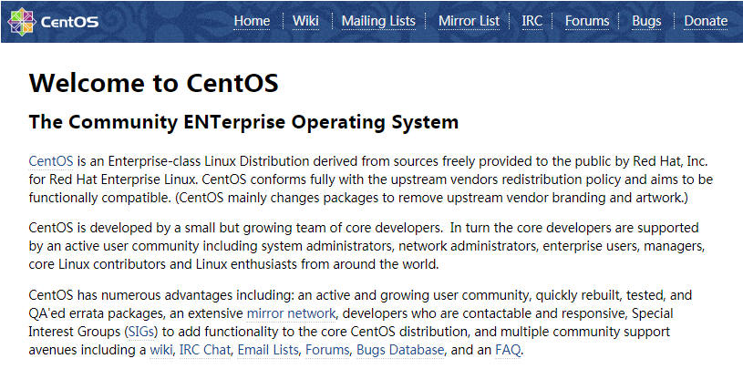
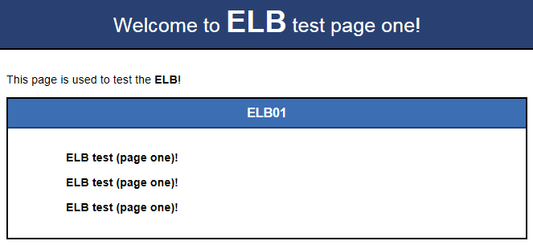
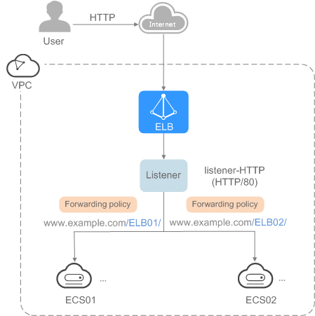
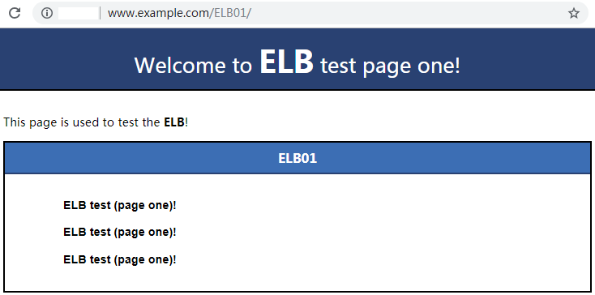

# Using Enhanced Load Balancers — Advanced Level<a name="EN-US_TOPIC_0166358908"></a>

## Scenarios<a name="section18950295143553"></a>

You have two web applications that are deployed on separated ECSs but use the same domain name for access. You can set different URLs to process requests.

To forward requests based on URLs, you need to create an HTTP or HTTPS listener and add forwarding policies to specify the URLs.

An HTTP listener is used as an example here describe how to route requests from two URLs \(**/ELB01**  and  **/ELB02**\) of the same domain name \(www.example.com\).

## Prerequisites<a name="section3453061616119"></a>

-   You have to create two ECSs with each having an EIP bound.
-   The ports used by the two ECSs have been configured in the security group. \(You can enable all ports first and then disable the ports that are not used after service deployment.\)
-   To ensure normal health checks, the security group for the two ECSs allows traffic from 100.125.0.0/16.

## Create ECSs<a name="section29839590578"></a>

In this topic, ECSs are used as backend servers. Perform the following operations to create two ECSs:

1.  Log in to the management console.
2.  In the upper left corner of the page, click    and select the desired region and project.
3.  Click  **Service List**. Under  **Computing**, click  **Elastic Cloud Server**.
4.  Click  **Create ECS**. On the displayed page, set the parameters and click  **Create Now**.
5.  The following table lists the specifications of the two ECSs.

**Table  1**  ECS specifications

<a name="table169305003620"></a>
<table><thead align="left"><tr id="row1926804361"><th class="cellrowborder" valign="top" width="46.949999999999996%" id="mcps1.2.3.1.1"><p id="p1892518019366"><a name="p1892518019366"></a><a name="p1892518019366"></a><strong id="b19953103985013"><a name="b19953103985013"></a><a name="b19953103985013"></a>Item</strong></p>
</th>
<th class="cellrowborder" valign="top" width="53.05%" id="mcps1.2.3.1.2"><p id="p992515013615"><a name="p992515013615"></a><a name="p992515013615"></a><strong id="b173134916507"><a name="b173134916507"></a><a name="b173134916507"></a>Example Value</strong></p>
</th>
</tr>
</thead>
<tbody><tr id="row1592617014367"><td class="cellrowborder" valign="top" width="46.949999999999996%" headers="mcps1.2.3.1.1 "><p id="p6926904361"><a name="p6926904361"></a><a name="p6926904361"></a>Name</p>
</td>
<td class="cellrowborder" valign="top" width="53.05%" headers="mcps1.2.3.1.2 "><p id="p11926180193617"><a name="p11926180193617"></a><a name="p11926180193617"></a>ECS01 and ECS02</p>
</td>
</tr>
<tr id="row1692618015368"><td class="cellrowborder" valign="top" width="46.949999999999996%" headers="mcps1.2.3.1.1 "><p id="p99262003618"><a name="p99262003618"></a><a name="p99262003618"></a>OS</p>
</td>
<td class="cellrowborder" valign="top" width="53.05%" headers="mcps1.2.3.1.2 "><p id="p4926180103613"><a name="p4926180103613"></a><a name="p4926180103613"></a>CentOS 7.2 64bit</p>
</td>
</tr>
<tr id="row192710163612"><td class="cellrowborder" valign="top" width="46.949999999999996%" headers="mcps1.2.3.1.1 "><p id="p892618033614"><a name="p892618033614"></a><a name="p892618033614"></a>CPU</p>
</td>
<td class="cellrowborder" valign="top" width="53.05%" headers="mcps1.2.3.1.2 "><p id="p5927180103614"><a name="p5927180103614"></a><a name="p5927180103614"></a>2 vCPUs</p>
</td>
</tr>
<tr id="row1592812043617"><td class="cellrowborder" valign="top" width="46.949999999999996%" headers="mcps1.2.3.1.1 "><p id="p129271407366"><a name="p129271407366"></a><a name="p129271407366"></a>Memory</p>
</td>
<td class="cellrowborder" valign="top" width="53.05%" headers="mcps1.2.3.1.2 "><p id="p9927301368"><a name="p9927301368"></a><a name="p9927301368"></a>4 GB</p>
</td>
</tr>
<tr id="row392816093610"><td class="cellrowborder" valign="top" width="46.949999999999996%" headers="mcps1.2.3.1.1 "><p id="p139281709369"><a name="p139281709369"></a><a name="p139281709369"></a>System disk</p>
</td>
<td class="cellrowborder" valign="top" width="53.05%" headers="mcps1.2.3.1.2 "><p id="p199287015363"><a name="p199287015363"></a><a name="p199287015363"></a>40 GB</p>
</td>
</tr>
<tr id="row159291018368"><td class="cellrowborder" valign="top" width="46.949999999999996%" headers="mcps1.2.3.1.1 "><p id="p1992870163612"><a name="p1992870163612"></a><a name="p1992870163612"></a>Data disk</p>
</td>
<td class="cellrowborder" valign="top" width="53.05%" headers="mcps1.2.3.1.2 "><p id="p3929207369"><a name="p3929207369"></a><a name="p3929207369"></a>100 GB</p>
</td>
</tr>
<tr id="row2092917063616"><td class="cellrowborder" valign="top" width="46.949999999999996%" headers="mcps1.2.3.1.1 "><p id="p13929906362"><a name="p13929906362"></a><a name="p13929906362"></a>Bandwidth</p>
</td>
<td class="cellrowborder" valign="top" width="53.05%" headers="mcps1.2.3.1.2 "><p id="p1892918013619"><a name="p1892918013619"></a><a name="p1892918013619"></a>5 Mbit/s</p>
</td>
</tr>
</tbody>
</table>

6.  Click  **Submit**.

## Deploy the Backend Service<a name="section12375217165718"></a>

Deploy Nginx on the two ECSs and edit two HTML pages for the web applications so that a page with message "Welcome to ELB test page one!" is returned when ECS01 is accessed, and the other page with message "Welcome to ELB test page two!" is returned when ECS02 is accessed.

1.  Log in to the ECSs.
2.  Install Nginx.
    1.  Run the following command to install Nginx:

        **yum -y install nginx**

    2.  Run the following command to start Nginx:

        **systemctl start nginx.service**

    3.  Enter  **http://**_ECS IP address_  in the browser address bar.

        If the following page is displayed, Nginx has been installed.

        **Figure  1**  Nginx installed successfully<a name="fig1633814561812"></a>  
        

3.  Modify the HTML page of ECS01.

    The default root directory of Nginx is  **/usr/share/nginx/html**. Move the  **index.html**  file from  **/usr/share/nginx/html**  to the  **ELB01**  directory and modify the file to identify access to ECS01.

    1.  Run the following commands in sequence to create the  **ELB01**  directory and copy the  **index.html**  file to the  **ELB01**  directory:

        **mkdir /usr/share/nginx/html/ELB01**

        **cp  **/usr/share/nginx/html/**index.html ELB01**

    2.  Run the following command to open the  **index.html**  file:

        **vim /usr/share/nginx/html**/ELB01**/index.html**

    3.  Press  **i**  to enter editing mode.
    4.  Modify the  **index.html**  file.

        The following displays the content to be modified:

        ```
         ...
            <body>
                <h1>Welcome to <strong>ELB</strong> test page one!</h1>
        
                <div class="content">
                    <p>This page is used to test the <strong>ELB</strong>!</p>
        
                    <div class="alert">
                        <h2>ELB01</h2>
                        <div class="content">
                            <p><strong>ELB test (page one)!</strong></p>
                            <p><strong>ELB test (page one)!</strong></p>
                            <p><strong>ELB test (page one)!</strong></p>
                        </div>
                    </div>
                </div>
            </body>
        ```

    5.  Press  **Esc**  to exit editing mode. Then, enter  **:wq**  to save the settings and exit the file.

4.  Modify the HTML page of ECS02.

    The default root directory of Nginx is  **/usr/share/nginx/html**. Move the  **index.html**  file from  **/usr/share/nginx/html**  to the  **ELB02**  directory and modify the file to identify access to ECS02.

    1.  Run the following commands in sequence to create the  **ELB02**  directory and copy the  **index.html**  file to the  **ELB02**  directory:

        **mkdir /usr/share/nginx/html/ELB02**

        **cp  **/usr/share/nginx/html/**index.html ELB02**

    2.  Run the following command to open the  **index.html**  file:

        **vim /usr/share/nginx/html**/ELB02**/index.html**

    3.  Press  **i**  to enter editing mode.
    4.  Modify the  **index.html**  file.

        The following displays the content to be modified:

        ```
        ...
            <body>
                <h1>Welcome to <strong>ELB</strong> test page two!</h1>
        
                <div class="content">
                    <p>This page is used to test the <strong>ELB</strong>!</p>
        
                    <div class="alert">
                        <h2>ELB02</h2>
                        <div class="content">
                            <p><strong>ELB test (page two)!</strong></p>
                            <p><strong>ELB test (page two)!</strong></p>
                            <p><strong>ELB test (page two)!</strong></p>
                        </div>
                     </div>
                </div>
            </body>
        ```

    5.  Press  **Esc**  to exit editing mode. Then, enter  **:wq**  to save the settings and exit the file.

5.  Use a browser to access  **http://**_ECS01 EIP_**/ELB01/**  and  **http://**_ECS02 EIP_**/ELB02/**  to verify the Nginx service.

    If the modified HTML pages are displayed, Nginx has been deployed.

    -   HTML page of ECS01

        **Figure  2**  Nginx service successfully deployed on ECS01<a name="fig1823119513251"></a>  
        

    -   HTML page of ECS02

        **Figure  3**  Nginx service successfully deployed on ECS02<a name="fig17457132212516"></a>  
        


## Create a Load Balancer<a name="section15436447172917"></a>

1.  Log in to the management console.
2.  In the upper left corner of the page, click    and select the desired region and project.
3.  Click  **Service List**. Under  **Network**, click  **Elastic Load Balancing**.
4.  Click  **Create Enhanced Load Balancer**. On the displayed page, set the parameters as needed.
5.  Click  **Create Now**.
6.  Confirm the configuration and click  **Submit**. 
7.  View the newly created load balancer in the load balancer list.

## Add a Listener<a name="section184861920245"></a>

A listener is a set of configurations that specify the protocol and port to receive requests from the clients, and the protocol, port, and load balancing algorithm to forward requests to one or more backend server groups. A listener also defines the health check configuration, through which the load balancer automatically checks running statuses of backend servers. If a backend server becomes faulty, the load balancer automatically forwards traffic to other healthy ones. Traffic forwarding to this server resumes once it recovers.

For example, configure two forwarding policies to forward HTTP requests to the two ECSs, one forwarding policy for each ECS. Requests from  **www.example.com/ELB01/**  are routed to ECS01, and those from  **www.example.com/ELB02/**  to ECS02.

**Figure  4**  Traffic forwarding<a name="fig1585611052513"></a>  


1.  Log in to the management console.
2.  In the upper left corner of the page, click    and select the desired region and project.
3.  Click  **Service List**. Under  **Network**, click  **Elastic Load Balancing**.
4.  Locate the created load balancer and click its name \(**elb-mq01**\).
5.  Under  **Listeners**, click  **Add Listener**.
6.  Configure the listener and click  **Next**.
    -   **Name**: specifies the listener name, for example,  **listener-HTTP**.
    -   **Frontend Protocol/Port**: specifies the protocol and port number the load balancer uses to receive requests. For example, set it to  **HTTP**  and  **80**.

7.  Add the backend server group and configure the health check, and click  **Finish**.
    -   Backend server group
        -   **Name**: specifies the backend server group name, for example,  **server\_group-ELB**.
        -   **Load Balancing Algorithm**: specifies the algorithm the load balancer uses to route requests. Select  **Weighted round robin**.

    -   Health check
        -   **Protocol**: specifies the protocol the load balancer uses to perform health checks on backend servers. If the load balancer uses TCP, HTTP, or HTTPS to receive requests, the health check protocol can be TCP or HTTP. Set it to  **HTTP**, which cannot be changed after being set.
        -   **Domain Name**: specifies the domain name in the health check request, for example, www.example.com.
        -   **Port**: specifies the port number the load balancer uses to perform health checks on backend servers, for example,  **80**.

            If no port is specified, the port of each backend server is used for health checks by default.


## Add Forwarding Policies<a name="section6778123018276"></a>

1.  <a name="li1279175813279"></a>Locate the newly added listener and click  **Add**  next to  **Forwarding Policies**.
2.  Configure the forwarding policy and click  **Next**.
    -   **Name**: specifies the forwarding policy name, for example,  **forwarding\_policy-ELB01**.
    -   **Domain Name**: specifies the domain name for triggering the forwarding policy, for example, www.example.com. Only exact match is supported.
    -   **URL**: specifies the URL for triggering the forwarding policy, for example,  **/ELB01/**.
    -   **URL Matching Rule**: specifies the rule for matching specified URL string with the requested RUL. Three options are available,  **Exact match**,  **Prefix match**, and  **Regular expression match**.  **Exact match**  enjoys the highest priority, and  **Regular expression match**  the lowest priority. Select  **Exact match**  here.

3.  Add the backend server group and configure the health check, and click  **Finish**.
    -   Backend server group
        -   **Name**: specifies the backend server group name, for example,  **server\_group-ELB01**.
        -   **Load Balancing Algorithm**: specifies the algorithm the load balancer uses to route requests. Select  **Weighted round robin**.

    -   Health check configuration
        -   **Protocol**: specifies the protocol the load balancer uses to perform health checks on backend servers. If the load balancer uses TCP, HTTP, or HTTPS to receive requests, the health check protocol can be TCP or HTTP. Set it to  **HTTP**, which cannot be changed after being set.
        -   **Domain Name**: specifies the domain name in the health check request, for example, www.example.com.
        -   **Port**: specifies the port number the load balancer uses to perform health checks on backend servers, for example,  **80**.

            If no port is specified, the port of each backend server is used for health checks by default.


4.  Locate the newly added forwarding policy. On the  **Backend Server Groups**  tab page on the right, click  **Add**.
5.  <a name="li19903154544217"></a>Set the backend port, select the server \(ECS01\) to be added, and click  **OK**.

    **Backend Port**: specifies the port number used by the servers, for example,  **80**.

6.  Repeat  [1](#li1279175813279)  to  [5](#li19903154544217)  to add the other forwarding policy based on the configurations shown in the following figures. This time, select  **ECS02**  as the backend server.

## Verify Load Balancing<a name="section164467272278"></a>

After the load balancer is configured, you can access the domain name or the specified URL to check whether the two ECSs are accessible.

1.  Modify the  **C:\\Windows\\System32\\drivers\\etc\\hosts**  file on your PC to map the domain name to the load balancer EIP.

    You can view the load balancer EIP on the basic information page of the load balancer.

    **Figure  5** **hosts**  file on your PC<a name="fig9717114412612"></a>  
    

2.  In the CLI of the PC, run the following command to check whether the domain name is mapped to the load balancer EIP:

    **ping www.example.com**

    If data packets are returned, the domain name has been mapped to the load balancer EIP.

3.  Use a browser to access  **http://www.example.com/ELB01/**. If the following page is displayed, the load balancer has routed the request to ECS01.

    **Figure  6**  Accessing ECS01<a name="fig174313116258"></a>  
    

    > **NOTE:**   
    >**ELB01/**  indicates that the default directory named  **ECS01**  is accessed, while  **ELB01**  indicates the file whose name is  **ELB01**. Therefore, the slash \(/\) following  **ELB01**  must be reserved.  

4.  Use a browser to access  **http://www.example.com/ELB02/**. If the following page is displayed, the load balancer has routed the request to ECS02.

    **Figure  7**  Accessing ECS02<a name="fig897020534220"></a>  
    


