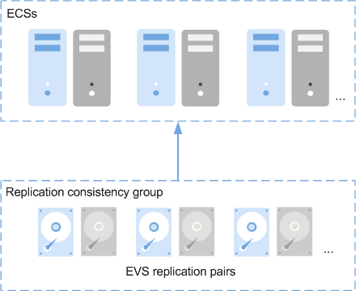

# Creating a Replication Consistency Group \(Deprecated\)

## Scenarios

Currently, users need to make API calls to create replication consistency groups and add EVS replication pairs to the groups. For details, see  **Replication Consistency Group**  in the  _Elastic Volume Service API Reference_.

A replication consistency group is composed of EVS replication pairs from a group of servers. These servers may run applications that are strongly correlated with each other and require unified management and application consistency. In this case, you can first create EVS replication pairs using the disks attached to these servers, then add these EVS replication pairs to a replication consistency group to facilitate management and consistency.  [Figure 1](#fig1732359921243)  shows the relationship between EVS replication pairs and replication consistency groups. If you have performed an operation to a replication consistency group, all EVS replication pairs in this group are affected.

**Figure  1**  Relationship between EVS replication pairs and replication consistency groups  

Existing EVS replication pairs can be added to a replication consistency group upon the group creation. To add EVS replication pairs to or remove them from a replication consistency group after the group creation, see  [Updating a Replication Consistency Group \(Deprecated\)](updating-a-replication-consistency-group-(deprecated).md).

> **NOTE:**   
>EVS replication APIs have been deprecated. If you need to use the replication function, see  [Storage Disaster Recovery Service User Guide](https://docs.otc.t-systems.com/en-us/usermanual/sdrs/en-us_topic_0125068221.html)  and  [Storage Disaster Recovery Service API Reference](https://docs.otc.t-systems.com/en-us/api/sdrs/en-us_topic_0108184470.html).  

## Procedure

1.  Create a replication consistency group and add all EVS replication pairs of a server to the group.

    For details, see  **Creating a Replication Consistency Group**  in the  _Elastic Volume Service API Reference_.

2.  Query the details about the replication consistency group.

    For details, see  **Querying Details About a Replication Consistency Group**  in the  _Elastic Volume Service API Reference_.

    When the consistency group status changes to  **available**, the creation is successful.

3.  Take note of the production server ID, DR server ID, replication consistency group ID, EVS replication pair IDs in the replication consistency group, and primary site of the replication consistency group, which is the AZ containing production disks.

    > **NOTE:**   
    >For details about how to obtain the production server ID and DR server ID, see  [Collecting ECS Information \(Deprecated\)](collecting-ecs-information-(deprecated).md).  

4.  Synchronize the data of a replication consistency group, which means that the data of all EVS replication pairs within the group is synchronized.

    For details, see  **Synchronizing a Replication Consistency Group**  in the  _Elastic Volume Service API Reference_.

5.  Query the data synchronization status of the replication consistency group.

    For details, see  **Querying Details About a Replication Consistency Group**  in the  _Elastic Volume Service API Reference_.

    When the replication status of the replication consistency group changes to  **active**, the data in all EVS replication pairs of this group has been synchronized.

    > **NOTE:**   
    >The time required for the initial data synchronization within a replication consistency group varies depending on the number of the EVS replication pairs in the group, EVS disk capacity, and actual data amount. Normally, the initial data synchronization takes a relative long period of time. Please wait patiently.  

