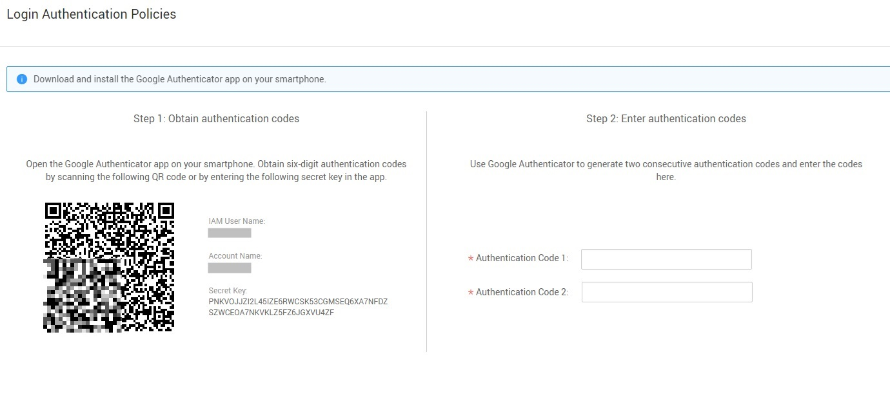

# How Do I Bind a Virtual MFA Device?

Multi-Factor Authentication \(MFA\) is a simple best practice that adds an extra layer of protection on top of your username and password. With MFA enabled, when a user logs in to the cloud system, they will be prompted for their username and password \(the first factor\), as well as for an authentication code from their MFA device \(the second factor\). Taken together, these multiple factors provide increased security for your account settings and resources.

There are hardware and virtual MFA devices. Currently, the cloud system supports only virtual MFA devices.

A virtual MFA device is an application that can generate 6-digit authentication codes. The codes comply with the Time-based One-time Password Algorithm \(TOTP\). Such applications can run on mobile devices \(including smartphones\) and are easy to use.

## Prerequisites

You have installed a virtual MFA application \(for example, Google Authenticator\) on your smartphone.

## Procedure

1.  On the console page, click the username in the upper right corner and select  **My Credential**  from the drop-down list.
2.  On the  **My Credential**  page, click  **Bind**  following the  **Virtual MFA Device**  field.
3.  Go to the  **Login Authentication Policies**  page.

    **Figure  1**  Login authentication policies  
    

    > **NOTE:**   
    >A secret key is the credential for obtaining the MFA authentication code. The key will become invalid after being used once. To ensure your account security, do not share this key with anyone.  

4.  Add a user to your MFA application.
    -   Scanning a QR code

        Open the MFA application smartphone, tap  **+**  in the lower right corner, and select  **Scan a barcode**  to scan the QR code on the  **Login Authentication Policies**  page. After the scan is successful, the system automatically adds a user to the application. Your account and secret key are displayed on the application.

    -   Manually entering a secret key

        Open the MFA application on your smartphone, tap  **+**  in the lower right corner, and select  **Enter a provided key**  to enter the secret key on the  **Login Authentication Policies**  page.

        > **NOTE:**   
        >If you add a user by manually entering a secret key, the mobile device and the cloud system must both use Greenwich Mean Time \(GMT\) and the time on the mobile device and that in the cloud system must be the same. It is recommended that you configure the mobile device to enable it to automatically set the time, thereby ensuring time consistency.  

5.  After the user is added, return to the homepage of the MFA application, and view the authentication codes generated by the application.

    The authentication codes are automatically updated every 30 seconds.

6.  On the  **Login Authentication Policies**  page, enter two consecutive authentication codes and click  **OK**  to bind the virtual MFA device.

