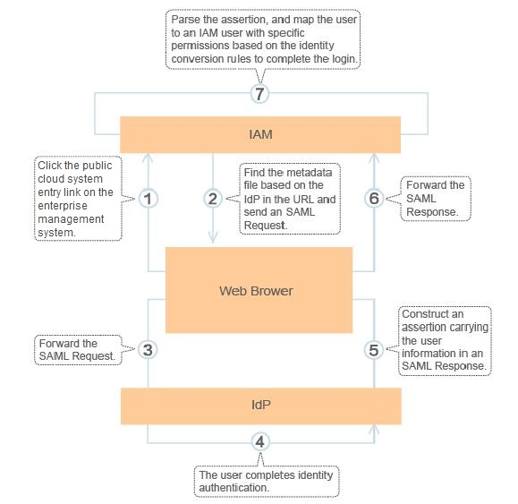

# SSO Process

After federated identity authentication is configured, federated users can access the cloud system directly and manage resources in the system by logging in to the enterprise IdP. This section describes how IAM authenticates a federated user after the user is authenticated by the IdP.

**Figure  1**  Login process model  

## Description

> **NOTE:**   
>To view the interactive requests and assertion information more easily, you are advised to use the Google Chrome web browser and install the SAML Message Decoder plug-in.  

1.  Open the login link generated after an IdP is created in a web browser. The web browser initiates SSO.
2.  IAM finds the metadata file of the enterprise IdP based on the account and IdP carried in the link and constructs a SAML Request to respond to the web browser.
3.  The web browser responds and forwards the SAML Request to the enterprise IdP.
4.  Users enter a username and password on the IdP server for identity authentication.
5.  The IdP server constructs an assertion in a SAML Response to respond to the web browser.
6.  The web browser responds and forwards the SAML Response to IAM.
7.  IAM extracts the assertion from the SAML Response and parses the assertion. Based on the configured rules, IAM generates a token to implement the login.

    > **NOTE:**   
    >The assertion must carry a signature or the login will fail.  

