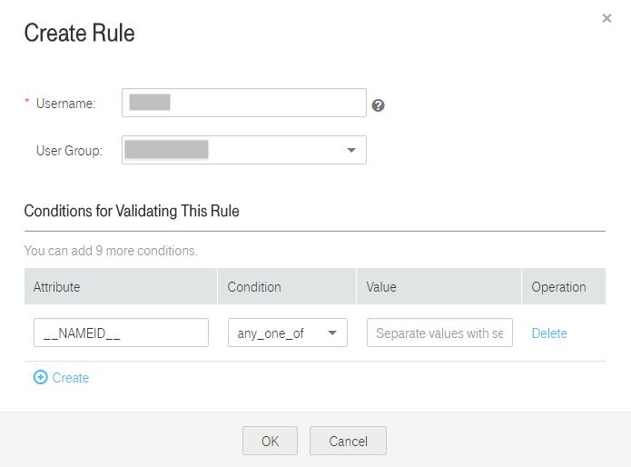

# Using Rules to Control Federated User Access to the Cloud System

The enterprise administrator uses the enterprise IdP to manage the identities and permissions of federated users. An identity conversion rule is used to map the identities and permissions of federated users to those in the cloud system. The cloud system uses the rule to control which operations federated users can perform and which resources they can access.

> **NOTE:**   
>Modifications to identity conversion rules will take effect only after federated users log in to the cloud system again.  

## Prerequisites

-   An IdP has been created, and its login link is available.
-   You have a preliminary understanding of the SAML 2.0 protocol and are familiar with metadata files.
-   You have learned the assertion structure displayed after successful SAML 2.0 authentication.

## Procedure

1.  In the navigation pane, choose  **Identity Providers**.
2.  In the identity provider list, click  **Modify**  in the row that contains the IdP you have created.

    The  **Modify Identity Provider**  page is displayed.

3.  In the  **Identity Conversion Rule**  area, click  **Create Rule**  to add an identity conversion rule.

    > **NOTE:**   
    >After an IdP is created successfully, the cloud system will preconfigure a default rule. This rule converts the usernames of federated users to  **FederationUser**, which is displayed in the cloud system. This rule only allows the federated users in the current IdP to access certain resources. If this default rule does not meet your requirements, you can click  **Edit Rule**  to modify it.  

    

    -   **Username**: indicates the username displayed in the cloud system after a federated user logs in. You are advised to enter a username that starts with  **FederationUser\_**  to differentiate between users in the cloud system and federated users. You can also enter a simple expression, such as  **FederationUser**\_\{email\}. After this rule is created successfully, the system automatically replaces \{email\} with the email address of the federated user. The username displayed in the cloud system is  **FederationUser\_**_XXX@XXX_.  _XXX@XXX_  indicates the email address of the federated user. This rule only takes effect if the assertion contains an email address.

        > **NOTICE:**   
        >The federated user name must be unique in the same domain. Identical usernames under one or multiple identity providers will be identified as the same user.  

    -   **User Group**: indicates the user group to which the federated user belongs after logging in to the cloud system. The user's permissions are determined by their user group.
    -   **Conditions for Validating This Rule**: indicates the conditions under which the federated user has the permissions of the selected user groups. When these conditions are met, the federated user has the permissions of their user group. If these conditions are not met, the rule does not take effect, and users who do not meet these conditions are not allowed to access the cloud system.

        For example, set a rule for an enterprise system administrator:

        -   **Username**: FederationUser\_admin\_\{email\}
        -   **User Group**: admin
        -   **Conditions for Validating This Rule**  \(**Attribute**: \_NAMEID\_;  **Condition**: any\_one\_of;  **Value**: ID1;ID2;ID3\): The rule takes effect only for the users of the specified IDs. Only the users whose user IDs are ID1, ID2, or ID3 have the permissions of the  **admin**  user group in the cloud system. The other users of this IdP do not have these permissions.

            > **NOTE:**   
            >-   Multiple effective conditions can be set for a rule. The rule will take effect as long as any of these conditions is met.  
            >-   Multiple rules can be created for an IdP. These rules take effect at the same time. If none of the created rules take effect for a federated user, the user is not allowed to access the cloud system.  

4.  In the  **Create Rule**  area, click  **OK**.
5.  On the  **Identity Providers**  page, click  **OK**  for the settings to take effect.

## Related Operations

-   Viewing rules: In the  **Identity Conversion Rule**  area, click  **View Rule**. The newly created identity conversion rule is displayed in a JSON file. For details about its content, see section  [Identity Conversion Rule for Federated Users](identity-conversion-rule-for-federated-users.md).
-   Editing rules: In the  **Identity Conversion Rule**  area, click  **Edit Rule**. This function provides flexible syntax for editing rules to meet the federated identity authentication requirements. For examples of rules, see section  [Identity Conversion Rule for Federated Users](identity-conversion-rule-for-federated-users.md).

    > **NOTE:**   
    >After the rules are edited, you can click  **Verify Rule**  in the lower left corner of the page to verify that they are correct.  

