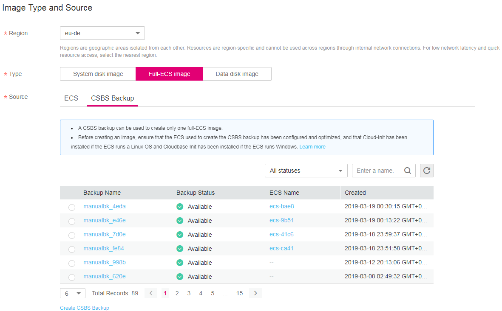

# Creating a Full-ECS Image from a CSBS Backup

## Scenarios

You can use a  CSBS backup  to create a  full-ECS  image, which can be used to create ECSs.

> **NOTE:**   
>-   For how to create a CSBS backup, see  _Cloud Server Backup Service User Guide_.  
>-   After a full-ECS image is deleted, the associated CSBS backup will not be deleted. To delete the associated backup, go to the CSBS console.  

## Constraints

-   When creating a full-ECS image from a CSBS backup, ensure that the ECS corresponding to the CSBS backup has been properly configured. Otherwise, creating ECSs using the full-ECS image may fail.
-   A CSBS backup used to create a full-ECS image cannot have shared disks.
-   Only an available CSBS backup can be used to create a full-ECS image. A CSBS backup can be used to create only one full-ECS image.
-   A full-ECS image cannot be shared with other tenants.
-   A full-ECS image cannot be published as a Marketplace image.
-   A full-ECS image cannot be exported or replicated.

## Procedure

1.  Log in to the management console.
2.  Under  **Computing**, click  **Image Management Service**.

    The IMS console is displayed.

3.  In the upper right corner, click  **Create Image**.
4.  In the  **Image Type and Source**  area, select  **Full-ECS image**  for  **Type**.
5.  Select  **CSBS Backup**  for  **Source**  and then select a backup from the list.

    **Figure  1**  Creating a full-ECS image using a CSBS backup  
    

6.  In the  **Image Information**  area, set basic information, such as the image name and description.
7.  Click  **Create Now**.
8.  Confirm the parameters and click  **Submit**.

    When the image status changes to  **Normal**, the creation is successful.

9.  Switch back to the  **Image Management Service**  page to view the image status.

    When the image status changes to  **Normal**, the creation is successful.

## Follow-up Operations

-   If you want to use the full-ECS image to create ECSs, click  **Apply for Server**  in the  **Operation**  column. On the displayed page, create ECSs by following the instructions in  _Elastic Cloud Server User Guide_.

    > **NOTE:**   
    >If the full-ECS image contains one or more data disks, the system automatically configures data disk parameters when you use the image to create ECSs.  

