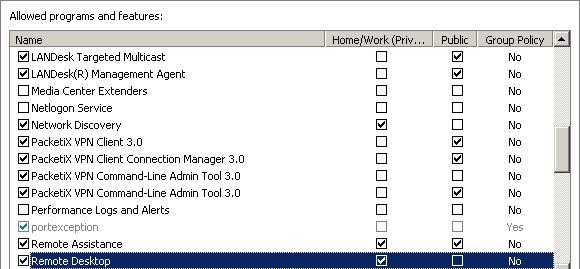

# Enabling Remote Desktop Connection

## Scenarios

If you want to remotely access the ECS, you must enable  remote desktop connection  when creating the private image. This function must be enabled for the GPU-optimized ECS.

> **NOTE:**   
>When registering an external image file as a private image, enable remote desktop connection on the VM where the external image file is located. You are advised to enable this function on the VM and then export the image file.  

## Prerequisites

You have logged in to the ECS used to create a Windows private image.

For details about how to log in to the ECS, see  _Elastic Cloud Server User Guide_.

## Procedure

1.  Before enabling this function, you are advised to set the resolution of the ECS to 1920×1080.

    On the ECS, choose  **Start**  \>  **Control Panel**. Under  **Appearance and Personalization**, click  **Adjust screen resolution**. Then select a proper value from the  **Resolution**  drop-down list box.

2.  Choose  **Start**, right-click  **Computer**, and choose  **Properties**  from the shortcut menu.
3.  Click  **Remote settings**.
4.  In the  **Remote**  tab, select  **Allow connections from computers running any version of Remote Desktop \(less secure\)**.
5.  Click  **OK**.
6.  Choose  **Start**  \>  **Control Panel**  and navigate to  **Windows Firewall**.
7.  Choose  **Allow a program or feature through Windows Firewall**  in the left pane.
8.  Select programs and features that are allowed by the Windows firewall for  **Remote Desktop**  based on your network requirements and click  **OK**  in the lower part.

    **Figure  1**  Configuring remote desktop  
    

