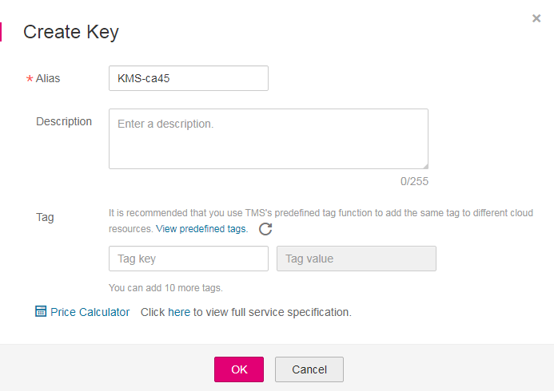

# Creating a Key

## Scenario

This section describes how to create a CMK on the KMS management console. You can create up to 100 CMKs, excluding Default Master Keys.

The CMK is perfectly suited for but not limited to the following scenarios:

-   Server-side encryption on OBS
-   Encryption of data on EVS disks
-   Encryption of private images on IMS
-   File system encryption on SFS
-   Disk encryption for database instances in RDS
-   DEK encryption and decryption for user applications

> **NOTE:**   
>Aliases of Default Master Keys end with  **/default**. Therefore, in choosing aliases for your CMKs, do not use aliases ending with  **/default**.  

## Prerequisites

You have obtained an account and its password for logging in to the management console.

## Procedure

1.  Log in to the management console.
2.  Click    in the upper left corner of the management console and select a region or project.
3.  Choose  **Security**  \>  **Key Management Service**. The  **Key Management Service**  page is displayed.
4.  Click  **Create Key**  in the upper right corner of the page. In the dialog box that is displayed, enter the alias and description of the key.

    **Figure  1**  Create Key dialog box  
    

5.  \(Optional\) Add tags as needed, and enter the tag key and tag value.

    > **NOTE:**   
    >-   When a CMK has been created without any tag, you can add a tag to the CMK later as necessary. Click the alias of the CMK. The page with key details is displayed. Then you can add tags to the CMK.  
    >-   The same tag \(including tag key and tag value\) can be used for different CMKs. However, under the same CMK, one tag key can have only one tag value.  
    >-   A maximum of 10 tags can be added for one CMK.  
    >-   If you want to delete a tag to be added when adding multiple tags, you can click  **Delete**  in the row where the tag to be added is located to delete the tag.  

6.  Click  **OK**. The  **Key** _**Key**_ _**alias**_ **created** **successfully**  message is displayed in the upper right corner of the  **Key Management Service**  page.

    In the CMK list, you can view created CMKs. The default status of a CMK is  **Enabled**.

## Related Operations

-   For details about how to upload objects with server-side encryption, see section  **Uploading a File with Server-Side Encryption**  in the  _Object Storage Service User Guide_.
-   For details about how to encrypt data on EVS disks, see section  **Creating an EVS Disk**  in the  _Elastic Volume Service User Guide_.
-   For details about how to encrypt private images, see section  **Encrypting an Image**  in the  _Image Management Service User Guide_.
-   For details about how to encrypt the file system on SFS, see section  **Creating a File System**  in the  _Scalable File Service User Guide_.
-   For details about how to encrypt disks for a database instance in RDS, see section  **Creating an RDS MySQL DB Instance**  in the  _Relational Database Service User Guide_.
-   For details about how to create a DEK and a plaintext-free DEK, see sections  **Creating a DEK**  and  **Creating a Plaintext-Free DEK**  in the  _Key Management Service API Reference_.
-   For details about how to encrypt and decrypt a DEK for a user application, see sections  **Encrypting a DEK**  and  **Decrypting a DEK**  in the  _Key Management Service API Reference_.

