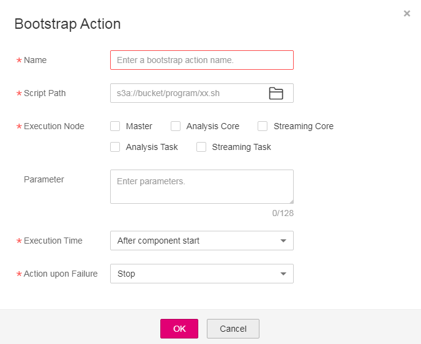

# Adding a Bootstrap Action

## Adding a Bootstrap Action When Creating a Cluster

1.  Log in to the MRS management console.
2.  Click  **Create Cluster**. The  **Create Cluster**  page is displayed.
3.  On the  **Advanced Settings**  tab page, select  **Configure**. The  **Bootstrap Action**  tab page is displayed.
4.  On the  **Bootstrap Action**  tab page, click  **Add**. The page is displayed, as shown in the following figure.

    **Figure  1**  Adding a bootstrap action  
    

    **Table  1**  Parameters

    
    <table><thead align="left"><tr id="row1574783017401"><th class="cellrowborder" valign="top" width="27%" id="mcps1.2.3.1.1">
Parameter

    </th>
    <th class="cellrowborder" valign="top" width="73%" id="mcps1.2.3.1.2">
<strong id="b842352706134712">Description</strong>

    </th>
    </tr>
    </thead>
    <tbody><tr id="row77471830174011"><td class="cellrowborder" valign="top" width="27%" headers="mcps1.2.3.1.1 ">
Name

    </td>
    <td class="cellrowborder" valign="top" width="73%" headers="mcps1.2.3.1.2 ">
Name of a bootstrap action script

    
The value can contain only digits, letters, spaces, hyphens (-), and underscores (_) and cannot start with a space.

    
The value can contain 1 to 64 characters.

    
 NOTE: 

A name must be unique in the same cluster. You can set the same name for different clusters.

    

    </td>
    </tr>
    <tr id="row374783034013"><td class="cellrowborder" valign="top" width="27%" headers="mcps1.2.3.1.1 ">
Script Path

    </td>
    <td class="cellrowborder" valign="top" width="73%" headers="mcps1.2.3.1.2 ">
Script path. The value can be an OBS bucket path or a local VM path.

    <ul id="ul107475303406"><li>An OBS bucket path must start with <strong id="b842352706112621">s3a://</strong> and end with <strong id="b842352706112629">.sh</strong>. For example, the path of the example script for installing Zeppelin is as follows: s3a://mrs-samples-bootstrap-eu-de/zeppelin/zeppelin_install.sh</li><li>A local VM path must start with a slash (/) and end with <strong id="b842352706112916">.sh</strong>. For example, the path of the example script for installing Zeppelin is as follows: /opt/bootstrap/zeppelin/zeppelin_install.sh</li></ul>
    </td>
    </tr>
    <tr id="row274823064014"><td class="cellrowborder" valign="top" width="27%" headers="mcps1.2.3.1.1 ">
Execution Node

    </td>
    <td class="cellrowborder" valign="top" width="73%" headers="mcps1.2.3.1.2 ">
Select a type of the node where the bootstrap action script is executed.

    
 NOTE: 
<ul id="ul7461220103311"><li>If you select <strong id="b842352706113232">Master</strong>, you can choose whether to run the script only on the active Master nodes by enabling or disabling the switch .</li><li>If you enable it, the script runs only on the active Master nodes. If you disable it, the script runs on all Master nodes. This switch is disabled by default.</li></ul>
    

    </td>
    </tr>
    <tr id="row27481330124012"><td class="cellrowborder" valign="top" width="27%" headers="mcps1.2.3.1.1 ">
Parameters

    </td>
    <td class="cellrowborder" valign="top" width="73%" headers="mcps1.2.3.1.2 ">
Bootstrap action script parameters

    </td>
    </tr>
    <tr id="row15749153054013"><td class="cellrowborder" valign="top" width="27%" headers="mcps1.2.3.1.1 ">
Execution Time

    </td>
    <td class="cellrowborder" valign="top" width="73%" headers="mcps1.2.3.1.2 ">
Select the time when the bootstrap action script is executed. Currently, the following two options are available: <strong id="b842352706114015">Before component start</strong> and <strong id="b842352706114018">After component start</strong>

    </td>
    </tr>
    <tr id="row474917307402"><td class="cellrowborder" valign="top" width="27%" headers="mcps1.2.3.1.1 ">
Action upon Failure

    </td>
    <td class="cellrowborder" valign="top" width="73%" headers="mcps1.2.3.1.2 ">
Whether to continue to execute subsequent scripts and create a cluster after the script fails to be executed.
 NOTE: 

You are advised to set this parameter to <strong id="b842352706114220">Continue</strong> in the debugging phase so that the cluster can continue to be installed and started no matter whether the bootstrap action is successful.

    

    

    </td>
    </tr>
    </tbody>
    </table>

5.  Click  **OK**.

    > **NOTE:**   
    >After the bootstrap action is successfully added, you can edit or delete it in the  **Operation**  column.  

## Adding an Automation Script on the Auto Scaling Page

1.  Log in to the MRS management console.
2.  Click  in the upper left corner on the management console and select  **Region**  and  **Project**.
3.  Choose  **Clusters**  \>  **Active Clusters**, select a running cluster, and click its name to switch to the cluster details page.
4.  On the  **Nodes**  tab page, click  **Auto Scaling**  in the  **Operation**  column of the Task node group. The  **Auto Scaling**  page is displayed.
5.  Configure a resource plan.

    You can configure the resource plan to adjust the number of nodes, which affects the actual price. Therefore, exercise caution when performing this operation.

    Configuration procedure:

    1.  On the  **Auto Scaling**  page, enable  **Auto Scaling**.
    2.  Set  **Default Range**  to  **2-2**  for  **Node Range**.****  This indicates that the number of Task nodes is fixed to 2 beyond the time range specified in the resource plan.
    3.  Click  **Configure Node Range in a Specified Time Range**  under  **Default Range**.
    4.  Configure  **Time Range**  to  **07:00-13:00**, and  **Node Range**  to  **5-5**. This indicates that the number of Task nodes is fixed to 5 in the specified time range. For details about the parameters, see  [Table 2](using-auto-scaling-in-a-cluster.md#table1846575414619).

        You can click  **Configure Node Range in a Specified Time Range**  to configure multiple resource plans.

6.  \(Optional\) Configure an automation script.
    1.  In  **Automation Script**  of  **Advanced Settings**, click  **Add**. The  **Automation Script**  page is displayed.

    1.  Set the following parameters:  **Name**,  **Script Path**,  **Execution Node Type**,  **Parameter**,  **Execution Time**, and  **Action upon Failure**. For details about the parameters, see  [Table 3](using-auto-scaling-in-a-cluster.md#table15644113520578).
    2.  Click  **OK**  to save the automation script configurations.

7.  Select  **I agree to authorize MRS to scale out or in nodes based on the above policy**.
8.  Click  **OK**.

