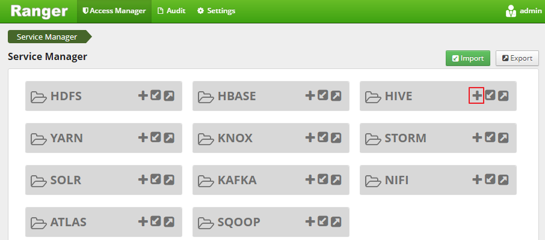
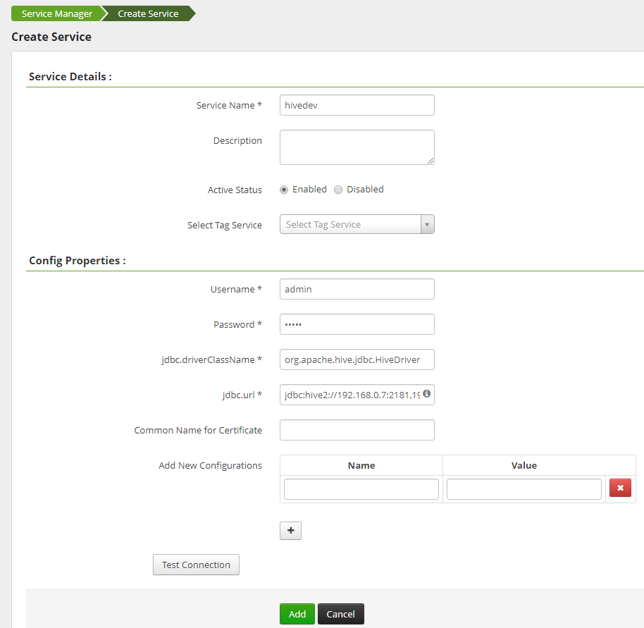
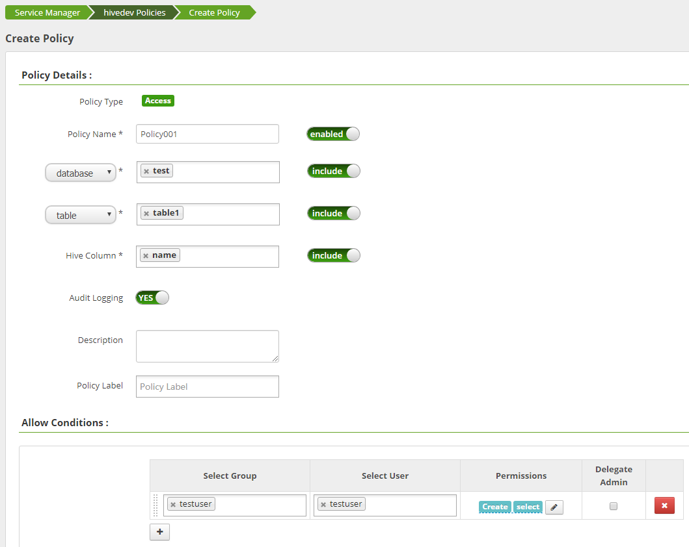
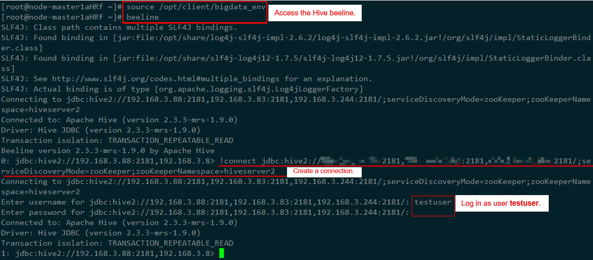
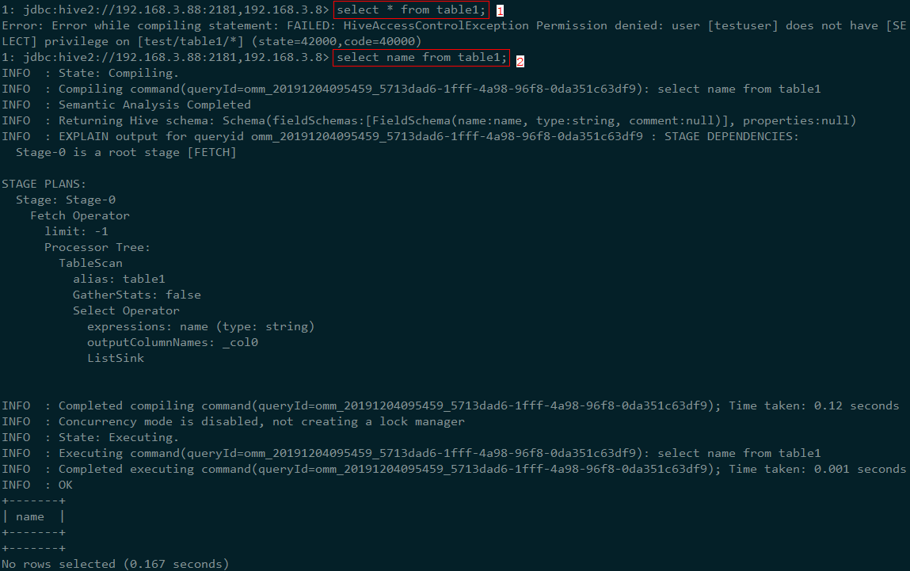

# Configuring Hive Access Permissions in Ranger

After an MRS cluster with Ranger installed is created, Hive access control is not integrated into Ranger. This section describes how to integrate Hive into Ranger.

1.  Log in to the Ranger web UI.
2.  In the  **Service Manager**  area, click    next to  **HIVE**  to add a Hive service.

    **Figure  1**  Adding a Hive service  
    

3.  Set the parameters for adding a Hive service according to  [Table 1](#table54444329411). Use the default values for the parameters that are not listed in the table.

    **Table  1**  Parameter description

    
    <table><thead align="left"><tr id="row1844243264112"><th class="cellrowborder" valign="top" width="33.33333333333333%" id="mcps1.2.4.1.1">
Parameter

    </th>
    <th class="cellrowborder" valign="top" width="33.33333333333333%" id="mcps1.2.4.1.2">
Description

    </th>
    <th class="cellrowborder" valign="top" width="33.33333333333333%" id="mcps1.2.4.1.3">
Example Value

    </th>
    </tr>
    </thead>
    <tbody><tr id="row644393284112"><td class="cellrowborder" valign="top" width="33.33333333333333%" headers="mcps1.2.4.1.1 ">
Service Name

    </td>
    <td class="cellrowborder" valign="top" width="33.33333333333333%" headers="mcps1.2.4.1.2 ">
Name of the service to be created. The value is fixed to <strong id="b6448272528">hivedev</strong>.

    </td>
    <td class="cellrowborder" valign="top" width="33.33333333333333%" headers="mcps1.2.4.1.3 ">
hivedev

    </td>
    </tr>
    <tr id="row34433328419"><td class="cellrowborder" valign="top" width="33.33333333333333%" headers="mcps1.2.4.1.1 ">
Username

    </td>
    <td class="cellrowborder" valign="top" width="33.33333333333333%" headers="mcps1.2.4.1.2 ">
You can set this parameter to any value.

    </td>
    <td class="cellrowborder" valign="top" width="33.33333333333333%" headers="mcps1.2.4.1.3 ">
admin

    </td>
    </tr>
    <tr id="row74431532164110"><td class="cellrowborder" valign="top" width="33.33333333333333%" headers="mcps1.2.4.1.1 ">
Password

    </td>
    <td class="cellrowborder" valign="top" width="33.33333333333333%" headers="mcps1.2.4.1.2 ">
You can set this parameter to any value.

    </td>
    <td class="cellrowborder" valign="top" width="33.33333333333333%" headers="mcps1.2.4.1.3 ">
-

    </td>
    </tr>
    <tr id="row144353274113"><td class="cellrowborder" valign="top" width="33.33333333333333%" headers="mcps1.2.4.1.1 ">
jdbc.driverClassName

    </td>
    <td class="cellrowborder" valign="top" width="33.33333333333333%" headers="mcps1.2.4.1.2 ">
Driver class for connecting to Hive. The value is fixed to <strong id="b8102631115313">org.apache.hive.jdbc.HiveDriver</strong>.

    </td>
    <td class="cellrowborder" valign="top" width="33.33333333333333%" headers="mcps1.2.4.1.3 ">
org.apache.hive.jdbc.HiveDriver

    </td>
    </tr>
    <tr id="row104441332194110"><td class="cellrowborder" valign="top" width="33.33333333333333%" headers="mcps1.2.4.1.1 ">
jdbc.url

    </td>
    <td class="cellrowborder" valign="top" width="33.33333333333333%" headers="mcps1.2.4.1.2 ">
URL for connecting to Hive. The format is ZooKeeper mode:

    
<strong id="b136610246548">jdbc:hive2://&lt;host&gt;:2181/;serviceDiscoveryMode=zooKeeper;zooKeeperNamespace=hiveserver2</strong>

    
<strong id="b743982811548">&lt;host&gt;</strong> indicates a ZooKeeper address. To obtain the ZooKeeper address, log in to MRS Manager, choose <strong id="b14494144916543">Services</strong> &gt; <strong id="b88704510546">ZooKeeper</strong> &gt; <strong id="b912545413542">Instance</strong>, and view the management IP address of the ZooKeeper instance.

    </td>
    <td class="cellrowborder" valign="top" width="33.33333333333333%" headers="mcps1.2.4.1.3 ">
jdbc:hive2://xx.xx.xx.xx:2181,xx.xx.xx.xx:2181,xx.xx.xx.xx:2181/;serviceDiscoveryMode=zooKeeper;zooKeeperNamespace=hiveserver2

    </td>
    </tr>
    </tbody>
    </table>

    **Figure  2**  Create Service  
    

4.  Click  **Add**  to add the service.
5.  Start the Ranger Hive plugin to authorize Ranger to manage Hive.
    1.  Log in to MRS Manager.
    2.  Choose  **Services**  \>  **Hive**  \>  **Service Configuration**, and set  **Type**  to  **All**.
    3.  Search for  **hive.security.authorization**  and modify the following configurations:
        -   hive.security.authorization.enabled = true
        -   hive.security.authorization.manager = org.apache.ranger.authorization.hive.authorizer.RangerHiveAuthorizerFactory

    4.  Click  **Save Configuration**  and select  **Restart the affected services or instances**  to restart the Hive service.

6.  Add an access control policy.
    1.  Log in to the Ranger web UI.
    2.  In the  **HIVE**  area, click the added service  **hivedev**.
    3.  Click  **Add New Policy**  to add an access control policy.
    4.  Set the parameters according to  [Table 2](#table116322231534). Use the default values for the parameters that are not listed in the table.

        **Table  2**  Parameter description

        
        <table><thead align="left"><tr id="row11633152314316"><th class="cellrowborder" valign="top" width="33.33333333333333%" id="mcps1.2.4.1.1">
Parameter

        </th>
        <th class="cellrowborder" valign="top" width="33.33333333333333%" id="mcps1.2.4.1.2">
Description

        </th>
        <th class="cellrowborder" valign="top" width="33.33333333333333%" id="mcps1.2.4.1.3">
Example Value

        </th>
        </tr>
        </thead>
        <tbody><tr id="row1163310231234"><td class="cellrowborder" valign="top" width="33.33333333333333%" headers="mcps1.2.4.1.1 ">
Policy Name

        </td>
        <td class="cellrowborder" valign="top" width="33.33333333333333%" headers="mcps1.2.4.1.2 ">
Policy name

        </td>
        <td class="cellrowborder" valign="top" width="33.33333333333333%" headers="mcps1.2.4.1.3 ">
Policy001

        </td>
        </tr>
        <tr id="row9633142318314"><td class="cellrowborder" valign="top" width="33.33333333333333%" headers="mcps1.2.4.1.1 ">
database

        </td>
        <td class="cellrowborder" valign="top" width="33.33333333333333%" headers="mcps1.2.4.1.2 ">
Name of the database that the policy allows to access

        </td>
        <td class="cellrowborder" valign="top" width="33.33333333333333%" headers="mcps1.2.4.1.3 ">
test

        </td>
        </tr>
        <tr id="row863372320317"><td class="cellrowborder" valign="top" width="33.33333333333333%" headers="mcps1.2.4.1.1 ">
table

        </td>
        <td class="cellrowborder" valign="top" width="33.33333333333333%" headers="mcps1.2.4.1.2 ">
Name of the table corresponding to the database that the policy allows to access

        </td>
        <td class="cellrowborder" valign="top" width="33.33333333333333%" headers="mcps1.2.4.1.3 ">
table1

        </td>
        </tr>
        <tr id="row1663420237318"><td class="cellrowborder" valign="top" width="33.33333333333333%" headers="mcps1.2.4.1.1 ">
Hive Column

        </td>
        <td class="cellrowborder" valign="top" width="33.33333333333333%" headers="mcps1.2.4.1.2 ">
Column name of the table corresponding to the database that the policy allows to access

        </td>
        <td class="cellrowborder" valign="top" width="33.33333333333333%" headers="mcps1.2.4.1.3 ">
name

        </td>
        </tr>
        <tr id="row463413231318"><td class="cellrowborder" valign="top" width="33.33333333333333%" headers="mcps1.2.4.1.1 ">
Allow Conditions

        </td>
        <td class="cellrowborder" valign="top" width="33.33333333333333%" headers="mcps1.2.4.1.2 "><ul id="ul291972075620"><li><strong id="b375917178217">Select Group</strong>: user group that the policy allows to access</li><li><strong id="b291717191610">Select User</strong>: user in the user group that the policy allows to access</li><li><strong id="b11552113913610">Permissions</strong>: permissions that the policy allows the user to use</li></ul>
        </td>
        <td class="cellrowborder" valign="top" width="33.33333333333333%" headers="mcps1.2.4.1.3 "><ul id="ul11428874228"><li>Select Group: <strong id="b4790438473">testuser</strong></li><li>Select User: <strong id="b12144183717717">testuser</strong></li><li>Permissions: <strong id="b19928193317712">Create</strong> and <strong id="b10441153518712">select</strong></li></ul>
        </td>
        </tr>
        </tbody>
        </table>

        **Figure  3**  Adding an access control policy  
        

    5.  Click  **Add**  to add the policy. According to the preceding policy, user  **testuser**  in the  **testuser**  user group has the  **Create**  and  **select**  permissions on the  **name**  column of  **table1**  in the  **test**  database of Hive, but no permission to access other columns.

7.  Log in to the Hive client by referring to  [Using Hive from Scratch](using-hive-from-scratch.md), and check whether Hive has been integrated into Ranger.
    1.  Run the following command to access the Hive beeline:

        **source /opt/client/bigdata\_env**

        **beeline**

    2.  Run the following command to set up a connection and log in as user  **testuser**:

        **!connect jdbc:hive2://xx.xx.xx.xx:2181,xx.xx.3.81:2181,192.168.3.153:2181/;serviceDiscoveryMode=zooKeeper;zooKeeperNamespace=hiveserver2**

        **Figure  4**  Logging in to Hive  
        

    3.  Query data and check whether Ranger is integrated.

        **Figure  5**  Verifying Ranger integration  
        

